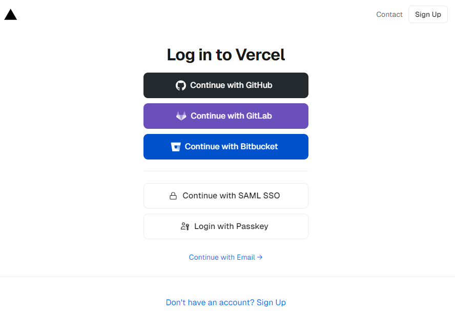
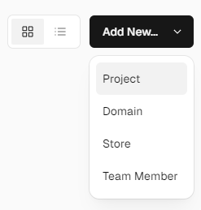
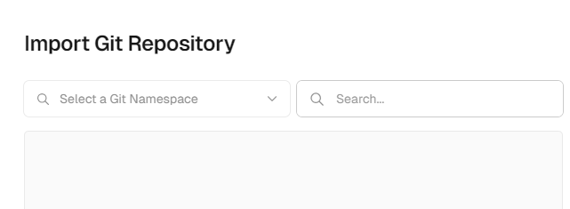
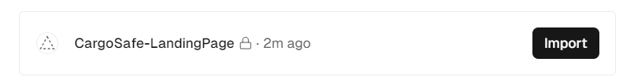
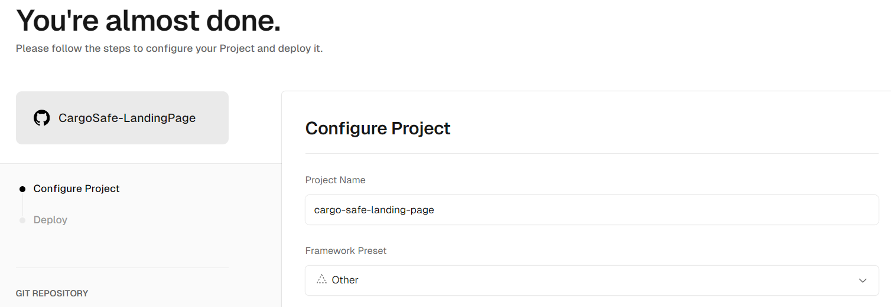

<h1 style="text-align: center;"> Informe del Trabajo Final </h1>
<h3 style="text-align: center;"> Universidad Peruana de Ciencias Aplicadas </h3>


<h5 style="text-align: center"> Ingeniería de Software </h5>

<h5 style="text-align: center"> Desarrollo de Aplicaciones Open Source - SW57 </h5>

<h5 style="text-align: center"> Docente: Angel Augusto Velasquez Nuñez </h5>

<h5 style="text-align: center"> Startup: DynoWare </h5>

<h5 style="text-align: center"> Producto: Greenhouse </h5>


## Team members:
| Nombre |Código|
|:-------:|:----------:|
|Boronda Heidinger, Astrid Jimena|U202215823|
|Cortez Flores, Ely Rivaldo|U202215313|
|Ramos Argüelles, Alexandra Belen|U202215164|
|Silva Morales, Renzo Cesar|U20221c362|
|Quiroz Zambrano, Fabrizio Javier|U202213406|

<h5 style="text-align: center"> Ciclo 2024-02 </h5>

## Registro de versiones del informe


|Versión|Fecha|Autor|Descripción de modificación|
|:-:|:-:|:-:|-|
|1.0|15/08/2024|Boronda, Cortez, Ramos, Silva, Quiroz|Creación del documento de trabajo en formato markdown|
|1.1|20/08/2024|Boronda, Cortez, Ramos, Silva, Quiroz|Redacción del startup profile y solution profile, delimitación de segmentos objetivo, redacción de preguntas para el diseño de entrevistas |
|1.2|23/08/2024|Boronda, Cortez, Ramos, Silva, Quiroz|Elaboración y registro de entrevistas a segmentos objetivo, análisis de entrevistas|
|1.3|25/08/2024|Boronda, Cortez, Ramos, Silva, Quiroz|Elaboración de user personas, impact mapping, as-is y to-be|
|1.4|26/08/2024|Boronda, Cortez, Ramos, Silva, Quiroz|Elaboración de user stories, product backlog|
|1.5|28/08/2024|Boronda, Cortez, Ramos, Silva, Quiroz|Elaboración de prototipos de wireframes y mockups|
|1.6|31/08/2024|Boronda, Cortez, Ramos, Silva, Quiroz|Redacción de style guidelines e information architecture|
|1.7|03/09/2024|Boronda, Cortez, Ramos, Silva, Quiroz|Elaboración de diagrama de base de datos, diagrama de clases, diccionario de clases, diagramas de contenedores, diagramas de contexto, diagramas de componentes|
|1.8|03/09/2024|Boronda, Cortez, Ramos, Silva, Quiroz|Registro de evidencias del Sprint 1|
|1.9|04/09/2024|Boronda, Cortez, Ramos, Silva, Quiroz|Rediseño de mockups. Elaboración de wireflows y user-flows|
|1.10|07/09/2024|Boronda, Cortez, Ramos, Silva, Quiroz|Redacción de software configuration management y conclusiones|
|2.1|22/09/2024|Nombre|Redacción de Collaboration Insights|


## Project Report Collaboration Insights

URL del repositorio para el reporte del proyecto: https://github.com/upc-pre-202402-si729-sw57-dynoware/CargoSafe-report

**TB1**

Para el desarrollo del informe perteneciente a la entrega TB1, se dividió la implementación de secciones de la siguiente forma para cada integrante del equipo:

|Integrante|Tareas Asignadas|
|-|-|
|Ely Cortez|Diseño de entrevistas. Diagrama de clases. Diagrama de contexto, componentes y contenedores. User Personas. Information Architecture. User Stories. Diagrama de base de datos.|
|Fabrizio Quiroz|Diseño de mockups y wireframes. Descripción de user flows. Capítulo V, Software Development Environment Configuration, Source Code Management, Style Guide & Conventions. User Stories. Product Backlog|
|Nombre1|Impact Mapping, registro y análisis de entrevistas. User Task Matrix. As-Is To-be Scenarios. Empathy Mapping. Technical User Stories. User Stories. Product Backlog. Bibliografía.|
|Nombre1|Antecedentes y problemática 5W y 2H. Lean UX Process, Problem Statement, Assumptions e Hypothesis statements. Lean UX Canvas. Segmentos Objetivos. Análisis de competidores. Diseño de entrevistas. Conclusiones y recomendaciones.|
|Nombre1|General Style Guidelines. Landing Page, Services & Applications implementation. Software Deployment Configuration.|


El proceso de colaboración en el informe se realizó mediante commits constantes al repositorio de la organización DynoWare.

**Github Collaboration Insights**

Github también presenta un timeline de las ramas principales y los procesos de merge a los que se han sometido. Todas las ramas se crearon tomando en cuenta el diseño de GitFlow para una buena organización cuando se usa un software de control de versiones.

Los integrantes son:

* Astrid  Boronda  (AstridBH)
* Alexandra  Ramos  (AleRamosA)
* Ely  Cortez  (rivacortez)
* Fabrizio  Quiroz   (Relycloud)
* Renzo  Silva (rrenzosilva)

Se explican las ramas más prominentes:

**main**: Es representada por el color negro. Se trata de la rama principal del proyecto y se actualiza para cada entregable.
**develop**: Es representada por el color azul. Se trata de la rama principal para el proceso del desarrollo del proyecto.
**feature-product-design**: Es representado por el color verde. Incluye el contenido de user flows y wireframes.
**feature-sprint1**: Es representada por el color amarillo. Esta rama incluye los artefactos relacionados al sprint 1 en el informe.


Los siguientes gráficos representan analíticos de commits en el repositorio del informe. En los gráficos se incluye la cantidad de lineas de texto añadidas por cada integrante del equipo. 

**TB1**


El siguiente gráfico incluye la cantidad de commits realizados en la semana con más actividad durante el desarrollo del informe. 

**TB1**


## Student Outcomes
|Criterio especifico|Acciones realizadas|Conclusiones|
|-|:-|-|
|Comunica en forma escrita ideas y/o resultados con objetividad a público de diferentes especialidades y niveles jerarquicos, en el marco del desarrollo de un proyecto en ingeniería|**Astrid Boronda** <br> TB1: En esta entrega se realizaron los diagramas C4, diagramas involucrados en el proceso de DDD o Domain Driven Design. Una característica de esta metodología es el uso del lenguaje ubicuo que permite a todos los stakeholders internos y externos del proyecto entender detalles técnicos a un alto nivel mediante la visualización de los diagramas. <br>  <br> <br> **Ely Cortez** <br> TB1: Realizó la seccion de header en el landing page, además de su correspondiente codigo en javascript para cumplir funcionalidades. Adicionalmente se encargo de documentar los commits realizados por el equipo. <br> <br> <br>  <br> **Alexandra  Ramos** <br> TB1: Para el trabajo se hizo uso de github para documentar el trabajo de modo que se aprendió a utilizar conventional commits y gitflow de modo que se pueda tener una correcta comunicación escrita en lo que corresponde a la documentación del proyecto, además de aprender a utiizar el lenguaje markdown para comunicarlo mediante github en un archivo README.md <br>  <br>  <br>  <br> **Renzo  Silva** <br> TB1: En el informe se comunicaron las herramientas a utilizar, su utilidad y las convenciones típicas, esto con el objetivo de documentar el proceso de elaboración y de explicar a un público ajeno al entorno de desarrollo de software los pasos necesarios para diseñar a la aplicación. <br> <br> <br> **Fabrizio  Quiroz** <br> TB1: Se llevó a cabo el proceso de entrevistas con los segmentos objetivos para realizar el proceso de _requirements elicitation_, se comunicó la propuesta de solución a los clientes esperados del proyecto y se dirigió el diseño de la solución a una opción que cumple con los requisitos solicitados. <br>  <br>  <br>| **Astrid Boronda** <br> TB1: Se llevó a cabo el proceso de entrevistas con los segmentos objetivos para realizar el proceso de _requirements elicitation_, se comunicó la propuesta de solución a los clientes esperados del proyecto y se dirigió el diseño de la solución a una opción que cumple con los requisitos solicitados. <br>  <br>  <br>   <br> **Ely Cortez** <br> TB1: Encargado de realizar la sección de sprint donde se incluye el sprint backlog y sprint planning. De la mismas forma trabajo en el figma diseñando la landing page y su versión responsive al igual que la versión responsive de la aplicación web.<br> <br> <br> <br> **Alexandra  Ramos** <br> TB1: A lo hora de realizar el trabajo se tuvo que mantener un constate contacto con nuestros segmento objetivo para poder delimitar correctamente nuestra solución, asímismo mantener una buena comunicación y organización mediante reuniones. <br>  <br> <br> <br> **Renzo  Silva** <br> TB1: Para culminar la entrega de esta primera versión del trabajo final, resultó necesario realizar exposiciones grabadas dentro de las cuales se expresan los requisitos del proyecto, cómo estos fueron implementados y cuál fue el ciclo de vida del desarrollo del software a elaborar. <br>  <br> <br> **Fabrizio  Quiroz** <br> TB1: Para culminar la entrega de esta primera versión del trabajo final, resultó necesario realizar exposiciones grabadas dentro de las cuales se expresan los requisitos del proyecto, cómo estos fueron implementados y cuál fue el ciclo de vida del desarrollo del software a elaborar. <br>  <br> <br> |


## Contenido
1. [**Capítulo I: Introducción.**](#1.) <br>
1.1. [Startup Profile.](#1.1.) <br>
1.1.1. [Descripción del startup.](#1.1.1.)<br>
1.1.2.[Perfiles de los integrantes del equipo.](#1.1.2.)<br>
1.2. [Solution Profile.](#1.2.)<br>
1.2.1. [Antecedentes y Problemática.](#1.2.1.)<br>
1.2.2. [Lean UX Process.](#1.2.2.)<br>
1.2.3. [Lean UX Problem Statements.](#1.2.3.)<br>
1.2.4. [Lean UX Assumptions.](#1.2.4.)<br>
1.2.5. [Lean UX Hypothesis Statements.](#1.2.5.)<br>
1.2.6. [Lean UX Canvas.](#1.2.5.)<br>
1.3. [Segmentos objetivo.](#1.2.6.)<br>
2. [**Capítulo II: Requirements Elicitation & Analysis.**](#2.)<br>
2.1. [Competidores.](#2.1.)<br>
2.1.1. [Análisis competitivo.](#2.1.1.)<br>
2.1.2. [Estrategias y tácticas frente a competidores.](#2.1.2.)<br>
2.2. [Entrevistas.](#2.2.)<br>
2.2.1. [Diseño de entrevistas.](#2.2.1.)<br>
2.2.2. [Registro de entrevistas.](#2.2.2.)<br>
2.2.3. [Análisis de entrevistas.](#2.2.3.)<br>
2.3. [Needfinding.](#2.3.)<br>
2.3.1. [User Personas.](#2.3.1.)<br>
2.3.2. [User Task Matrix.](#2.3.2.)<br>
2.3.3. [User Journey Mapping.](#2.3.3.)<br>
2.3.4. [Empathy Mapping.](#2.3.4.)<br>
2.3.5. [As-is Scenario Mapping.](#2.3.5.)<br>
3. [**Capítulo III: Requirements Specification.**](#3.)<br>
4.1. [To-Be Scenario Mapping.](#3.1.)<br>
4.2. [User Stories.](#3.2.)<br>
4.3. [Impact Mapping.](#3.3.)<br>
4.4. [Product Backlog.](#3.4.)<br>
4. [**Capítulo IV: Product Design.**](#4.)<br>
4.1. [Style Guidelines.](#4.1.)<br>
4.1.1. [General Style Guidelines.](#4.1.1.)<br>
4.1.2. [Web Style Guidelines.](#4.1.2.)<br>
4.2. [Information Architecture.](#4.2.)<br>
4.2.1. [Organization Systems.](#4.2.1.)<br>
4.2.2. [Labeling Systems.](#4.2.2.)<br>
4.2.3. [SEO Tags and Meta Tags](#4.2.3.)<br>
4.2.4. [Searching Systems.](#4.2.4.)<br>
4.2.5. [Navigation Systems.](#4.2.5.)<br>
4.3. [Landing Page UI Design.](#4.3.)<br>
4.3.1. [Landing Page Wireframe.](#4.3.1.)<br>
4.3.2. [Landing Page Mock-up.](#4.3.2.)<br>
4.4. [Web Applications UX/UI Design.](#4.4.)<br>
4.4.1. [Web Applications Wireframes.](#4.4.1.)<br>
4.4.2. [Web Applications Wireflow Diagrams.](#4.4.2.)<br>
4.4.3. [Web Applications Mock-ups.](#4.4.3.)<br>
4.4.4. [Web Applications User Flow Diagrams.](#4.4.4.)<br>
4.5. [Web Applications Prototyping.](#4.5.)<br>
4.6. [Domain-Driven Software Architecture.](#4.6.)<br>
4.6.1. [Software Architecture Context Diagram.](#4.6.1.)<br>
4.6.2. [Software Architecture Container Diagrams.](#4.6.2.)<br>
4.6.3. [Software Architecture Components Diagrams.](#4.6.3.)<br>
4.7. [Software Object-Oriented Design.](#4.7.)<br>
4.7.1. [Class Diagrams.](#4.7.1.)<br>
4.7.2. [Class Dictionary.](#4.7.2.)<br>
4.8. [Database Design.](#4.8.)<br>
4.8.1. [Database Diagram.](#4.8.1.)<br>
5. [**Capítulo V: Product Implementation, Validation & Deployment.**](#5.)<br>
5.1. [Software Configuration Management.](#5.1.)<br>
5.1.1. [Software Development Environment Configuration.](#5.1.1.)<br>
5.1.2. [Source Code Management.](#5.1.2.)<br>
5.1.3. [Source Code Style Guide & Conventions.](#5.1.3.)<br>
5.1.4. [Software Deployment Configuration.](#5.1.4.)<br>
5.2. [Landing Page, Services & Applications Implementation.](#5.2.)<br>
5.2.1. [Sprint 1.](#5.2.1.)<br>
5.2.1.1. [Sprint Planning 1.](#5.2.1.1.)<br>
5.2.1.2. [Sprint Backlog 1.](#5.2.1.2.)<br>
5.2.1.3. [Development Evidence for Sprint Review.](#5.2.1.3.)<br>
5.2.1.4. [Testing Suite Evidence for Sprint Review.](#5.2.1.4.)<br>
5.2.1.5. [Execution Evidence for Sprint Review.](#5.2.1.5.)<br>
5.2.1.6. [Services Documentation Evidence for Sprint Review.](#5.2.1.6.)<br>
5.2.1.7. [Software Deployment Evidence for Sprint Review.](#5.2.1.7.)<br>
5.2.1.8. [Team Collaboration Insights during Sprint.](#5.2.1.8.)<br>
6. [**Conclusiones.**](#6.)<br>
7. [**Bibliografía.**](#7.)<br>
8. [**Anexos.**](#8.)<br>

<div id='5.'><h2> Capítulo V: Product Implementation, Validation & Deployment. </h2></div>

<div id='5.1.'><h3> 5.1. Software Configuration Management.</h3></div>

En la sección presentada a continuación, vamos a detallar las herramientas, referencias y configuraciones empleadas a lo largo del desarrollo del proyecto, las cuales nos ayudaron a mantener la consistencia del trabajo realizado.

<div id='5.1.1'><h4> 5.1.1. Software Development Environment Configuration.</h4></div>

En el presente apartado, vamos a describir los productos de software que hemos utilizado durante el desarrollo del proyecto y el propósito por el cual han sido empleados.

**Project Management**
* Google Docs: [https://docs.google.com/](https://docs.google.com/)

    Google Docs es una plataforma que permite crear documentos que se pueden compartir con otros usuarios para trabajar de manera colaborativa a tiempo real. Se ha empleado esta plataforma para organizar las diferentes secciones del informe y realizar una revisión previa antes de actualizar la información del informe en el repositorio de GitHub del equipo.

**Requirements Management**
* Trello: [https://trello.com/](https://trello.com/)

    Trello es una plataforma que permite realizar gestión de proyectos. Por esto, se ha empleado para poder gestionar las tareas y organizar el flujo de trabajo del proyecto.
Las tareas están ubicadas en cada lista indicando el integrante encargado de realizar dicha tarea.

**Product UX/UI Design**
* Figma: [https://www.figma.com/](https://www.figma.com/)

    Figma es una plataforma de edición gráfica, en la que se pueden crear diseños y prototipos de páginas web de manera colaborativa. Esta plataforma nos fue de utilidad para desarrollar los wireframes, mockups y los desktop and mobile application prototype del proyecto.
  
* Miro: [https://miro.com/es/](https://miro.com/es/)

    Miro es una plataforma que permite crear pizarras virtuales para el trabajo colativo en tiempo real. La cual posee distintas herramientas y plantillas que nos ayudaron a realizar los As-Is Scenario Mapping y To-Be Scenario Mapping para cada segemento objetivo.
  
* UXPressia: [https://uxpressia.com/](https://uxpressia.com/)

    UXPressia es una plataforma que brinda diferentes plantillas que nos ayudan a comprender la problemática, conocer las necesidades de los segmentos objetivos en relación con la solución de software. Las plantillas de la plataforma fueron empleadas para la creación de los User Personas, Empathy Maps, Journey Maps e Impact Maps.

**Software Development**
* Landing Page
  
    Para el desarrollo de la Landing Page se ha hecho empleo de las siguientes tecnologías de desarrollo web: HTML5, CSS y JavaScript. 

* Fronted Web Applications

    Para el desarrollo de la aplicación web frontend, se empleó HTML, CSS y JavaScript. En este caso utilizaremos Angular Material para la creación de componentes. Nuestro Stack tecnológico incluye el uso del lenguaje Java con Spring Boot como framework, junto con HTML, Angular, JavaScript, CSS y una base de datos en MySQL Workbench. 

**Software Testing**

* Para las pruebas funcionales del software de la Landing page y de la aplicación web, se han utilizado las herramientas de desarrollo de los siguientes navegadores web: Google Chrome ( [https://www.google.com/chrome/](https://www.google.com/chrome/) ) , Microsoft Edge ( [https://www.microsoft.com/en-us/edge](https://www.microsoft.com/en-us/edge) ) y Mozilla Firefox ( [https://www.mozilla.org/en-US/firefox/browsers/](https://www.mozilla.org/en-US/firefox/browsers/) ). 
  
  **Software Deployment**
* Vercel: [https://vercel.com/](https://vercel.com/)

    Para implementar el despliegue utilizamos Vercel que es una plataforma de páginas y aplicaciones web, con los repositorios en GitHub. Esto permite que Vercel maneje automáticamente la implementación de la Landing Page cada vez que se realice una actualización en el repositorio.

**Software Documentation**
* GitHub: [https://github.com/](https://github.com/)
  
    GitHub fue empleado para la creación de la documentación y de la Landing Page. En ambos casos se creo un repositorio. Además, nuestro grupo eligió esta plataforma para trabajar de manera colaborativa.

<div id='5.1.2.'><h4> 5.1.2. Source Code Management.</h4></div>

Se creó una organización en GitHub para el desarrollo y la gestión del proyecto. En dicha organización se registraban todas las modificaciones que se realizaron durante su ciclo de desarrollo. Nuestra organización se estructuró de la siguiente manera:

Organización:
[https://github.com/upc-pre-202402-si729-sw57-dynoware](https://github.com/upc-pre-202402-si729-sw57-dynoware)

Repositorio del Landing Page: 
[https://github.com/upc-pre-202402-si729-sw57-dynoware/CargoSafe-LandingPage](https://github.com/upc-pre-202402-si729-sw57-dynoware/CargoSafe-LandingPage)

Repositorio del Informe: 
[https://github.com/upc-pre-202402-si729-sw57-dynoware/CargoSafe-report](https://github.com/upc-pre-202402-si729-sw57-dynoware/CargoSafe-report)

Por otro lado, con el objetivo de mejorar el control sobre la creación de ramas y la implementación de cambios en el código fuente, se ha implementado GitFlow.

De esta manera, se establecieron 2 ramas principales: main y develop.

Ramas principales:

* Main: También denominada “master”, en esta rama se almacenan las versiones oficiales de nuestro repositorio antes de pasarlas a producción.
* Develop: Es la rama que se va a emplear como punto de integración de las ramas “feature”. Una vez que el “head” sea estable y el equipo considere que esta listo para ser lanzadose unirá a la rama release.
  
Ramas auxiliares:

* Feature: En esta rama se desarrollan las funcionalidades del proyecto solicitadas por los usuarios tanto en la página de inicio como en la aplicación web. Al completarlas se integrarán en la rama “develop”. 
* Release: Esta rama se utiliza para la preparación de la próxima versión del programa. Aquí se realizan pruebas finales y se pueden solucionar errores menores antes del lanzamiento definitivo. Por último, los cambios se fucionan con la rama develop, y luego la rama main.

    Se empleó el formato “Semantic Versioning 2.0.0” para la nomenclatura de versiones del proyecto. Dónde las versiones siguen el formato de (X.Y.Z). En dónde:

  *  X, Y y Z son números enteros positivos, donde cada uno incrementa de manera numérica.

  * X: Es la que representa una versión mayor. Aquí se encuentran aquellos cambios que no son compatibles con las versiones anteriores. Esto implica reiniciar a 0 las versiones Y(menores) y Z(parche).  
  * Y: Es la versión menor. Aquí se encuentran los cambios que si son compatibles con las versiones anteriores. Esto implica que cada vez que Y se incremente, la versión Z(parche) se reiniciará a 0.
  * Z: Parches y correcciones de errores menores. Solo se incrementa cuando se realizan correcciones que son compatible con versiones anteriores.

**Commit Convention**

El formato de los commits siguen la estructura de “Conventional Commits” en la versión 1.0.0, la cual tiene la siguiente estructura:

```
  <type>[optional scope]: <description>
  
  [optional body]
  
  [optional footer(s)]
``` 

Donde:
*	type: Precisa el tipo de cambio realizado. Entre los tipos de cambios encontramos: fix, feat, build, chore, etc.
*   scope: Permite dar el alcance y contexto del cambio.
*   description: Indica de manera breve un resumen de los cambios del código.

<div id='5.1.3.'><h4> 5.1.3. Source Code Style Guide & Conventions.</h4></div>

Utilizaremos el lenguaje de etiquetas HTML y CSS se empleará la convención de Google HTML/CSS Style Guide. 

Entre todas las convenciones destacamos:

*   Se debe declarar el tipo de documento con <!DOCTYPE.html>.
*   Evitar líneas de códigos extensas.
*   Utilizar meta tags al inicio.
* 	Utilizar siempre las letras minúsculas para los nombres de los elementos HTML, atributos, propiedades, valores y selectores CSS (como ```<p>```, ```<h1>```, ```<section>```, etc.).
* 	Cada elemento de HTML debe tener una etiqueta de cierre (por ejemplo ```<p></p>```).
* 	Siempre encerrar entre comillas los atributos dentro de un elemento HTML (```<p class=”name”></p>```).
* 	Especificar el ancho y alto de las imágenes, así como el texto alternativo (*alt*).

Para el desarrollo de código en TypeScript, se optó por utilizar la convención Google TypeScript Style Guide. Algunas convenciones son las siguientes:

*   Usar el punto y coma a l final de cada sentencia “;”.
*   Tanto las variables como las funciones deben estar nombradas en CamelCase.
*   Utilizar comillas simples en los valores string.
*   Evitar declarar variables con la sentencia var. En su lugar, se debería usar let o const para evitar errores en variables y valores.

Para el desarrollo de los aceptance test con el lenguaje de Gherkin se eligió emplear las convenciones mencionadas en “Gherkin Conventions for Readable Specifications”. Entre ellas encontramos:

*	Emplear lasas palabras “Given”, “When”, “Then” y “And” para describir los pasos de los escenarios.
*	Evitar que la descripción de los pasos de cada escenario sea redundante.
*	Agregar líneas entre pasos.
*	En cada escenario, utilizar formato y estilo consistente en toda la especificación.
*	Encerrar los parámetros en comillas simples.

<div id='5.1.4.'><h4> 5.1.4. Software Deployment Configuration.</h4></div>

En esta sección, explicaremos los pasos realizados para el despliegue de la Landing Page empleando el servicio Vercel.

1. Ingresar a [https://vercel.com/](https://vercel.com/), iniciar sesión o crear cuenta.

<div align=center>
    
</div>


2. Al ingresar, seleccionar la opción "Add New Project".
  
<div align=center>
    
</div>

3. Luego de haber seleccionado esa opción, nos dirgimos a la sección de "Import Git Repository" e importamos el repositorio.

<div align=center>
    
</div>

<div align=center>
    
</div>

4. Por último realizamos las últimas configuraciones y seleccionamos la opción "Deploy".

<div align=center>
    
</div>

<div align=center>
    
</div>

<div id='5.2.'><h3> 5.2.	Landing Page, Services & Applications Implemetation.</h3></div>

<div id='5.2.1.'><h4> 5.2.1.	Sprint 1.</h4></div>

<div id='5.2.1.1.'><h5> 5.2.1.1.	Sprint Planning 1.</h5></div>

<table>
     <tr> 
        <th>  Sprint #  </th>
        <th> Sprint 1 </th>
     </tr>
     <tr> 
        <td style="font-weight: bold;" colspan="7"> Sprint Planing Background</td>
     </tr>
     <tr>
       <td style="font-weight: bold;"> Date </td>
       <td> 28/08/2024 </td>
     </tr>
     <tr>
       <td style="font-weight: bold;"> Time </td>
       <td> 16:00 horas (GMT-5) </td>
     </tr>
     <tr>
       <td style="font-weight: bold;"> Location </td>
       <td> Modalidad remota a través de la plataforma Zoom <td>
     </tr>
      <tr>
        <td style="font-weight: bold;"> Prepared By </td>
        <td> Ramos Argüelles, Alexandra Belen <td>
     </tr>
        <tr>
        <td style="font-weight: bold;"> Attendees (to planning meeting) </td>
        <td> Ramos Argüelles, Alexandra Belen
        <br>
         Cortez Flores, Ely Rivaldo
           <br>
         Boronda Heidinger, Astrid Jimena 
          <br>
         Quiroz Zambrano, Fabrizio Javier
         <br>
         Silva Morales, Renzo Cesar
         <td>
     </tr>
     <tr>
        <td style="font-weight: bold;"> Sprint 0 Review Summary </td>
        <td> Debido a que es nuestro primer sprint de desarrollo, no existe un review summary del sprint. <td>
     </tr>
     <tr>
        <td style="font-weight: bold;"> Sprint 0 Retrospective Summary </td>
        <td> Debido a que es nuestro primer sprint de desarrollo, no existen planes de mejora.<td>
     </tr>
     <tr> 
        <td style="font-weight: bold;" colspan="7"> Sprint Goal & User Stories</td>
     </tr>
       <tr>
          <td style="font-weight: bold;"> Sprint 1 Goal</td>
          <td>  texto <td>
      </tr>
       <tr>
          <td style="font-weight: bold;"> Sprint 1 Velocity </td>
          <td>  19  <td>
      </tr>
      <tr>
          <td style="font-weight: bold;"> Sum of Story Points </td>
          <td> 19 <td>
      </tr>

  </table>

  <div id='5.2.1.2.'><h5> 5.2.1.2.	Sprint Backlog 1.</h5></div>

  En esta sección mostramos las tareas que se realizaron en este sprint.

  Link: [https://trello.com/b/QaWCIjk0/sprint-backlog-1-cargosafe](https://trello.com/b/QaWCIjk0/sprint-backlog-1-cargosafe)

  <div id='5.2.1.3.'><h5> 5.2.1.3.	Development Evidence for Sprint Review.</h5></div>

  <div id='5.2.1.4.'><h5> 5.2.1.4.	Testing Suite Evidence for Sprint Review.</h5></div>

  <div id='5.2.1.5.'><h5> 5.2.1.5.	Execution Evidence for Sprint Review.</h5></div>

  Para este entregable, como primera fase de este producto final, logramos desarrollar exitosamente la landing page haciendo uso de HTML y CSS, teniendo en cuenta el desarrollo responsive y brindando información específica acerca de los servicios que ofrecemos en nuestra aplicación web.

  Enlace del deploy de la Landing Page mediante Vercel: 

  <div id='5.2.1.6.'><h5> 5.2.1.6.	Services Documentation Evidence for Sprint Review.</h5></div>

  En el alcance del aprint 1 se priorizó el desarrollo de la Landing Page, por lo que no se evidencia empleo de web services.

  <div id='5.2.1.7.'><h5> 5.2.1.7.	Software Deployment Evidence for Sprint Review.</h5></div>

  Durante el presente sprint se ha desarrollado la Landing Page del proyecto. El despliegue de esta página fue realizado por Ely Rivaldo, uno de los integrantes del equipo, ya que el proceso no tomaba mucho tiempo.

  Hemos utilizado Vercel como plataforma para el despliegue. Para esto, fue necesario crear una cuenta e iniciar sesión en esta plataforma. Antes de desplegar la rama "main", llevamos a cabo varias pruebas en la rama "develop" para garantizar que no hubiera inconvenientes.

  **Pasos para este Sprint:**

  1. Creación de cuenta en Vercel
   
   <div align=center>
    
</div>

  2. Nos dirgimos a la sección de "Import Git Repository" e importamos el repositorio.
   
<div align=center>
    
</div>

<div align=center>
    
</div>

  3. Finalmente, dentro de las últimas configuraciones elegimos nuestra rama a desplegar y hacemos click en "Deploy".
   
<div align=center>
    
</div>

<div align=center>
    
</div>

  <div id='5.2.1.8.'><h5> 5.2.1.8.	Team Colaboration Insights during Sprint.</h5></div>

  Distribución de aportes en el infotme:

  URL del repositorio para el Project Report en la organización de GitHub del equipo: 
