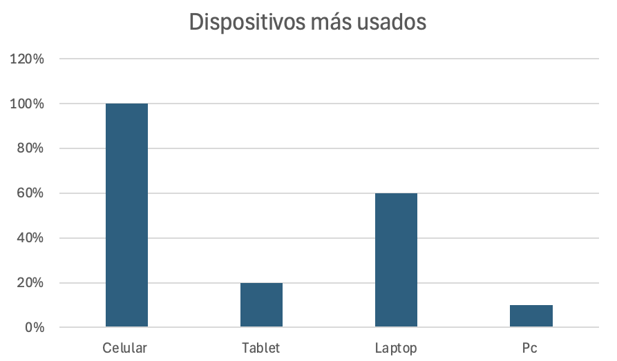
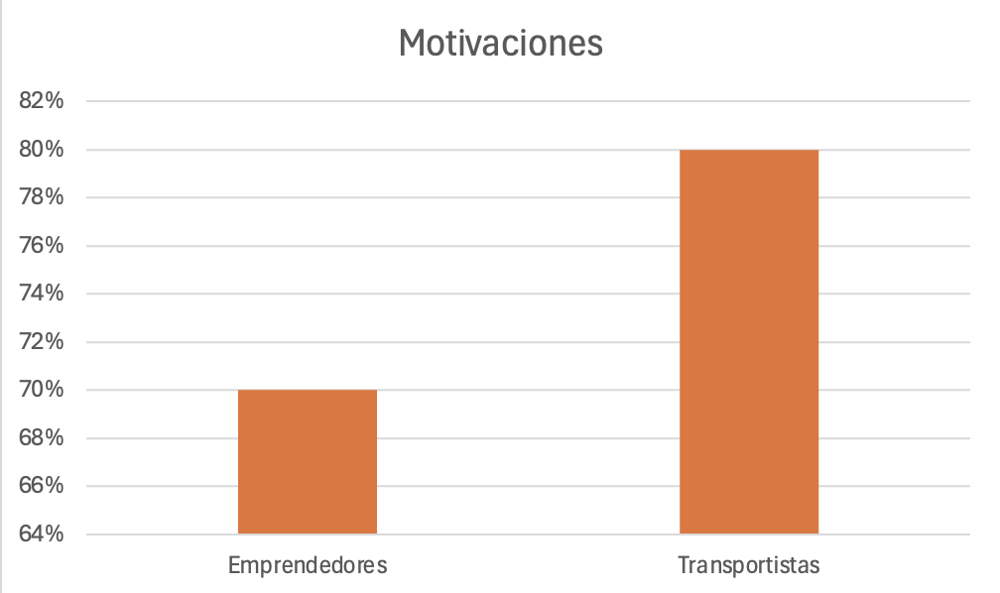
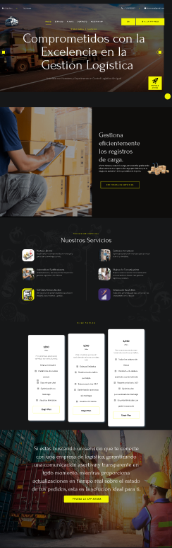
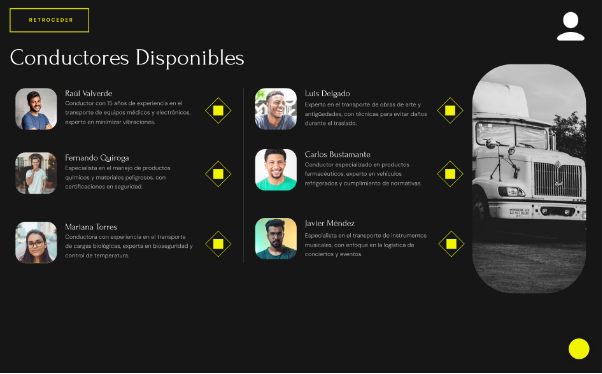
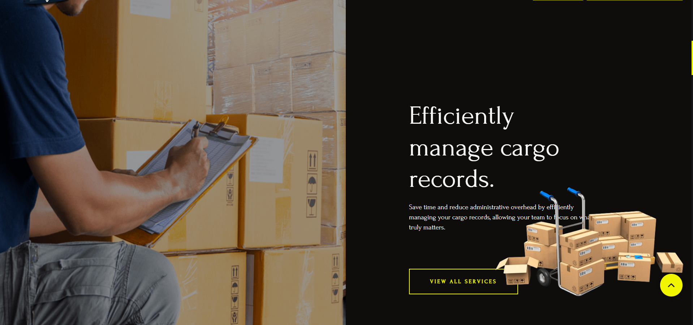

<div align="center">
  <h1> Informe del Trabajo Final </h1>
  <h3> Universidad Peruana de Ciencias Aplicadas </h3>

  

  <h5> Ingeniería de Software </h5>

  <h5> Desarrollo de Aplicaciones Open Source - SW57 </h5>

  <h5> Docente: Angel Augusto Velasquez Nuñez </h5>

  <h5> Startup: DynoWare </h5>

  <h5> Producto: CargoSafe </h5>
</div>

<div align="center">
    <h3>Team Members:</h3>
</div>

<div>
     <table align="center">
        <tr>
            <th style="text-align:center;">Member</th>
            <th style="text-align:center;">Code</th>
        </tr>
        <tr>
            <td>Boronda Heidinger, Astrid Jimena</td>
            <td>U202215823</td>
        </tr>
        <tr>
            <td>Cortez Flores, Ely Rivaldo</td>
            <td>U202215313</td>
        </tr>
        <tr>
            <td>Ramos Argüelles, Alexandra Belen</td>
            <td>U202215164</td>
        </tr>
        <tr>
            <td>Silva Morales, Renzo Cesar</td>
            <td>U20221c362</td>
        </tr>
         <tr>
            <td>Quiroz Zambrano, Fabrizio Javier</td>
            <td>U202213406</td>
        </tr>
    </table>
</div>

<div align="center">
<h5> Ciclo 2024-02 </h5>
</div>

## Registro de versiones del informe

| Versión |   Fecha    |                 Autor                 | Descripción de modificación                                                                                                                                     |
| :-----: | :--------: | :-----------------------------------: | --------------------------------------------------------------------------------------------------------------------------------------------------------------- |
|   1.0   | 15/08/2024 | Boronda, Cortez, Ramos, Silva, Quiroz | Creación del documento de trabajo en formato markdown                                                                                                           |
|   1.1   | 20/08/2024 | Boronda, Cortez, Ramos, Silva, Quiroz | Redacción del startup profile y solution profile, delimitación de segmentos objetivo, redacción de preguntas para el diseño de entrevistas                      |
|   1.2   | 23/08/2024 | Boronda, Cortez, Ramos, Silva, Quiroz | Elaboración y registro de entrevistas a segmentos objetivo, análisis de entrevistas                                                                             |
|   1.3   | 25/08/2024 | Boronda, Cortez, Ramos, Silva, Quiroz | Elaboración de user personas, impact mapping, as-is y to-be                                                                                                     |
|   1.4   | 26/08/2024 | Boronda, Cortez, Ramos, Silva, Quiroz | Elaboración de user stories, product backlog                                                                                                                    |
|   1.5   | 28/08/2024 | Boronda, Cortez, Ramos, Silva, Quiroz | Elaboración de prototipos de wireframes y mockups                                                                                                               |
|   1.6   | 31/08/2024 | Boronda, Cortez, Ramos, Silva, Quiroz | Redacción de style guidelines e information architecture                                                                                                        |
|   1.7   | 03/09/2024 | Boronda, Cortez, Ramos, Silva, Quiroz | Elaboración de diagrama de base de datos, diagrama de clases, diccionario de clases, diagramas de contenedores, diagramas de contexto, diagramas de componentes |
|   1.8   | 03/09/2024 | Boronda, Cortez, Ramos, Silva, Quiroz | Registro de evidencias del Sprint 1                                                                                                                             |
|   1.9   | 04/09/2024 | Boronda, Cortez, Ramos, Silva, Quiroz | Rediseño de mockups. Elaboración de wireflows y user-flows                                                                                                      |
|  1.10   | 07/09/2024 | Boronda, Cortez, Ramos, Silva, Quiroz | Redacción de software configuration management y conclusiones                                                                                                   |
|   2.1   | 22/09/2024 |                Nombre                 | Redacción de Collaboration Insights                                                                                                                             |

## Project Report Collaboration Insights

URL del repositorio para el reporte del proyecto: https://github.com/upc-pre-202402-si729-sw57-dynoware/CargoSafe-report

<div align=center>
    
</div>


**TB1**

Para el desarrollo del informe perteneciente a la entrega TB1, se dividió la implementación de secciones de la siguiente forma para cada integrante del equipo:

| Integrante      | Tareas Asignadas                                                                                                                                                                                                                    |
| --------------- | ----------------------------------------------------------------------------------------------------------------------------------------------------------------------------------------------------------------------------------- |
| Ely Cortez      | Diseño de entrevistas. Diagrama de clases. Diagrama de contexto, componentes y contenedores. User Personas. Information Architecture. User Stories. Diagrama de base de datos.                                                      |
| Fabrizio Quiroz | Diseño de mockups y wireframes. Descripción de user flows. Capítulo V, Software Development Environment Configuration, Source Code Management, Style Guide & Conventions. User Stories. Product Backlog                             |
| Nombre1         | Impact Mapping, registro y análisis de entrevistas. User Task Matrix. As-Is To-be Scenarios. Empathy Mapping. Technical User Stories. User Stories. Product Backlog. Bibliografía.                                                  |
| Nombre1         | Antecedentes y problemática 5W y 2H. Lean UX Process, Problem Statement, Assumptions e Hypothesis statements. Lean UX Canvas. Segmentos Objetivos. Análisis de competidores. Diseño de entrevistas. Conclusiones y recomendaciones. |
| Nombre1         | General Style Guidelines. Landing Page, Services & Applications implementation. Software Deployment Configuration.                                                                                                                  |

El proceso de colaboración en el informe se realizó mediante commits constantes al repositorio de la organización DynoWare.

**Github Collaboration Insights**

Github también presenta un timeline de las ramas principales y los procesos de merge a los que se han sometido. Todas las ramas se crearon tomando en cuenta el diseño de GitFlow para una buena organización cuando se usa un software de control de versiones.

Los integrantes son:

- Astrid Boronda (AstridBH)
- Alexandra Ramos (AleRamosA)
- Ely Cortez (rivacortez)
- Fabrizio Quiroz (Relycloud)
- Renzo Silva (rrenzosilva)

Se explican las ramas más prominentes:

**main**: Es representada por el color negro. Se trata de la rama principal del proyecto y se actualiza para cada entregable.
**develop**: Es representada por el color azul. Se trata de la rama principal para el proceso del desarrollo del proyecto.
**feature-product-design**: Es representado por el color verde. Incluye el contenido de user flows y wireframes.
**feature-sprint1**: Es representada por el color amarillo. Esta rama incluye los artefactos relacionados al sprint 1 en el informe.


Los siguientes gráficos representan analíticos de commits en el repositorio del informe. En los gráficos se incluye la cantidad de lineas de texto añadidas por cada integrante del equipo.

**TB1**


El siguiente gráfico incluye la cantidad de commits realizados en la semana con más actividad durante el desarrollo del informe.

**TB1**


## Student Outcome

|Criterio específico|Acciones realizadas|Conclusiones|
| - | - | - |
|Comunica oralmente con efectividad a diferentes rangos de audiencia.| **Astrid Boronda** <br> TB1: En esta entrega se realizaron los diagramas C4, diagramas involucrados en el proceso de DDD o Domain Driven Design. Una característica de esta metodología es el uso del lenguaje ubicuo que permite a todos los stakeholders internos y externos del proyecto entender detalles técnicos a un alto nivel mediante la visualización de los diagramas. <br> <br> <br> **Ely Cortez** <br> TB1: Realizó la seccion de header en el landing page, además de su correspondiente codigo en javascript para cumplir funcionalidades. Adicionalmente se encargo de documentar los commits realizados por el equipo. <br> <br> <br> <br> **Alexandra Ramos** <br> TB1: Para el trabajo se hizo uso de github para documentar el trabajo de modo que se aprendió a utilizar conventional commits y gitflow de modo que se pueda tener una correcta comunicación escrita en lo que corresponde a la documentación del proyecto, además de aprender a utiizar el lenguaje markdown para comunicarlo mediante github en un archivo README.md <br> <br> <br> <br> **Renzo Silva** <br> TB1: En el informe se comunicaron las herramientas a utilizar, su utilidad y las convenciones típicas, esto con el objetivo de documentar el proceso de elaboración y de explicar a un público ajeno al entorno de desarrollo de software los pasos necesarios para diseñar a la aplicación. <br> <br> <br> **Fabrizio Quiroz** <br> TB1: Se llevó a cabo el proceso de entrevistas con los segmentos objetivos para realizar el proceso de _requirements elicitation_, se comunicó la propuesta de solución a los clientes esperados del proyecto y se dirigió el diseño de la solución a una opción que cumple con los requisitos solicitados. <br> <br> <br>|<p>**TB1:**</p><p>Desarrollamos las entrevistas necesarias para la validación de la idea de nuestro proyecto.</p><p>**TP:**</p><p>Hemos desarrollado un video explicando el desarrollo progresivo del proyecto</p>|
|Comunica por escrito con efectividad a diferentes rangos de audiencia|<p>**Astrid Boronda** <br> TB1: Me enfoqué en realizar un análisis competitivo, identificando a los competidores y transmitiendo la información encontrada sobre sus ventajas competitivas. Estas ventajas se pueden aprovechar para el desarrollo del producto. De manera similar, utilicé herramientas como User Personas, Task Matrix y Empathy Map para conocer mejor a los segmentos objetivo. <br> <br> <br> **Ely Cortez** <br> TB1: La creación de Historias de Usuario ayudó a comprender las características del software desde la perspectiva del usuario, permitiendo definir las funciones necesarias para la construcción de la aplicación. stas historias permitieron establecer claramente qué funcionalidades eran prioritarias para satisfacer las necesidades del usuario final. Además, se complementó el análisis con la elaboración de un diagrama de clases, que ayudó a estructurar y organizar los componentes clave del sistema, mostrando las relaciones entre ellos y asegurando que la lógica del negocio estuviera bien definida desde una perspectiva técnica. <br> <br> <br> <br> **Alexandra Ramos** <br> TB1: Además, creé esquemas narrativos y diagramas de casos de uso que ayudaron a ilustrar las posibles interacciones de los usuarios con la aplicación. Estos materiales no solo facilitaron la comprensión del equipo, sino que también sirvieron como referencia para la toma de decisiones durante las etapas de diseño y desarrollo. <br> <br> <br> <br> **Renzo Silva** <br> TB1: En la realización de este proyecto, consideré importante comprender la problemática que rodea la solución propuesta, tomando en cuenta los antecedentes que permitieran profundizar en el escenario y contexto. Además, se delimitó el segmento objetivo afectado directamente por el problema. Utilicé la herramienta Lean UX Canvas para recopilar toda la información relevante y redactar una guía del proceso de desarrollo del producto. <br> <br> <br> **Fabrizio Quiroz** <br> TB1: Para lograr una mayor comprensión de las expectativas y necesidades del usuario, se realizó una fase de investigación exhaustiva que incluyó entrevistas y encuestas. Los resultados obtenidos fueron analizados y resumidos en informes detallados, que luego se compartieron con todo el equipo de desarrollo. Esto permitió que todos los involucrados tuvieran una visión clara de los puntos clave a abordar en el proyecto. <br> <br> <br>|<p>**TB1:**</p><p>Hemos desarrollado todo el primer paso para mostrar por primera vez nuestra Start Up y nuestra solución de Software. Desarrollamos todos los puntos necesarios, desde la descripción de la start up hasta los primeros mock-ups de la aplicación web que se piensa entregar al usuario final.</p><p>**TP:**</p><p>Desplegamos la primera versión de nuestra web site, aplicando todos los conocimientos adquiridos en clase. También, se realizaron cambios desde la entrega pasada para la entrega de un mejor producto.</p><p></p>|

## Contenido

1. [**Capítulo I: Introducción.**](#1.) <br>
   1.1. [Startup Profile.](#1.1.) <br>
   1.1.1. [Descripción del startup.](#1.1.1.)<br>
   1.1.2.[Perfiles de los integrantes del equipo.](#1.1.2.)<br>
   1.2. [Solution Profile.](#1.2.)<br>
   1.2.1. [Antecedentes y Problemática.](#1.2.1.)<br>
   1.2.2. [Lean UX Process.](#1.2.2.)<br>
   1.2.3. [Lean UX Problem Statements.](#1.2.3.)<br>
   1.2.4. [Lean UX Assumptions.](#1.2.4.)<br>
   1.2.5. [Lean UX Hypothesis Statements.](#1.2.5.)<br>
   1.2.6. [Lean UX Canvas.](#1.2.5.)<br>
   1.3. [Segmentos objetivo.](#1.2.6.)<br>
2. [**Capítulo II: Requirements Elicitation & Analysis.**](#2.)<br>
   2.1. [Competidores.](#2.1.)<br>
   2.1.1. [Análisis competitivo.](#2.1.1.)<br>
   2.1.2. [Estrategias y tácticas frente a competidores.](#2.1.2.)<br>
   2.2. [Entrevistas.](#2.2.)<br>
   2.2.1. [Diseño de entrevistas.](#2.2.1.)<br>
   2.2.2. [Registro de entrevistas.](#2.2.2.)<br>
   2.2.3. [Análisis de entrevistas.](#2.2.3.)<br>
   2.3. [Needfinding.](#2.3.)<br>
   2.3.1. [User Personas.](#2.3.1.)<br>
   2.3.2. [User Task Matrix.](#2.3.2.)<br>
   2.3.3. [User Journey Mapping.](#2.3.3.)<br>
   2.3.4. [Empathy Mapping.](#2.3.4.)<br>
   2.3.5. [As-is Scenario Mapping.](#2.3.5.)<br>
3. [**Capítulo III: Requirements Specification.**](#3.)<br>
3.1. [To-Be Scenario Mapping.](#3.1.)<br>
3.2. [User Stories.](#3.2.)<br>
3.3. [Impact Mapping.](#3.3.)<br>
3.4. [Product Backlog.](#3.4.)<br>
4. [**Capítulo IV: Product Design.**](#4.)<br>
   4.1. [Style Guidelines.](#4.1.)<br>
   4.1.1. [General Style Guidelines.](#4.1.1.)<br>
   4.1.2. [Web Style Guidelines.](#4.1.2.)<br>
   4.2. [Information Architecture.](#4.2.)<br>
   4.2.1. [Organization Systems.](#4.2.1.)<br>
   4.2.2. [Labeling Systems.](#4.2.2.)<br>
   4.2.3. [SEO Tags and Meta Tags](#4.2.3.)<br>
   4.2.4. [Searching Systems.](#4.2.4.)<br>
   4.2.5. [Navigation Systems.](#4.2.5.)<br>
   4.3. [Landing Page UI Design.](#4.3.)<br>
   4.3.1. [Landing Page Wireframe.](#4.3.1.)<br>
   4.3.2. [Landing Page Mock-up.](#4.3.2.)<br>
   4.4. [Web Applications UX/UI Design.](#4.4.)<br>
   4.4.1. [Web Applications Wireframes.](#4.4.1.)<br>
   4.4.2. [Web Applications Wireflow Diagrams.](#4.4.2.)<br>
   4.4.3. [Web Applications Mock-ups.](#4.4.3.)<br>
   4.4.4. [Web Applications User Flow Diagrams.](#4.4.4.)<br>
   4.5. [Web Applications Prototyping.](#4.5.)<br>
   4.6. [Domain-Driven Software Architecture.](#4.6.)<br>
   4.6.1. [Software Architecture Context Diagram.](#4.6.1.)<br>
   4.6.2. [Software Architecture Container Diagrams.](#4.6.2.)<br>
   4.6.3. [Software Architecture Components Diagrams.](#4.6.3.)<br>
   4.7. [Software Object-Oriented Design.](#4.7.)<br>
   4.7.1. [Class Diagrams.](#4.7.1.)<br>
   4.7.2. [Class Dictionary.](#4.7.2.)<br>
   4.8. [Database Design.](#4.8.)<br>
   4.8.1. [Database Diagram.](#4.8.1.)<br>
5. [**Capítulo V: Product Implementation, Validation & Deployment.**](#5.)<br>
   5.1. [Software Configuration Management.](#5.1.)<br>
   5.1.1. [Software Development Environment Configuration.](#5.1.1.)<br>
   5.1.2. [Source Code Management.](#5.1.2.)<br>
   5.1.3. [Source Code Style Guide & Conventions.](#5.1.3.)<br>
   5.1.4. [Software Deployment Configuration.](#5.1.4.)<br>
   5.2. [Landing Page, Services & Applications Implementation.](#5.2.)<br>
   5.2.1. [Sprint 1.](#5.2.1.)<br>
   5.2.1.1. [Sprint Planning 1.](#5.2.1.1.)<br>
   5.2.1.2. [Sprint Backlog 1.](#5.2.1.2.)<br>
   5.2.1.3. [Development Evidence for Sprint Review.](#5.2.1.3.)<br>
   5.2.1.4. [Testing Suite Evidence for Sprint Review.](#5.2.1.4.)<br>
   5.2.1.5. [Execution Evidence for Sprint Review.](#5.2.1.5.)<br>
   5.2.1.6. [Services Documentation Evidence for Sprint Review.](#5.2.1.6.)<br>
   5.2.1.7. [Software Deployment Evidence for Sprint Review.](#5.2.1.7.)<br>
   5.2.1.8. [Team Collaboration Insights during Sprint.](#5.2.1.8.)<br>
6. [**Conclusiones.**](#6.)<br>
7. [**Bibliografía.**](#7.)<br>
8. [**Anexos.**](#8.)<br>

<div id='1.'><h2>Capítulo I: Introducción</h2></div>

<div id='1.1.'><h3> 1.1 Startup Profile.</h3></div>
En esta sección se presenta la descripción del startup y los perfiles de los miembros del equipo.

<div id='1.1.1.'><h4> 1.1.1. Descripción de la Startup.</h4></div>

DynoWare es una startup liderada por un grupo de estudiantes de la Facultad de Ingeniería de la Universidad Peruana de Ciencias Aplicadas (UPC), orientada al desarrollo de software y soluciones tecnológicas dirigidas a los transportistas y empresarios que buscan la llegada a salvo y en buen estado de sus productos. Mediante nuestra plataforma CargoSafe buscamos brindar herramientas para el seguimiento, la gestión y optimización de rutas y la gestión de productos.

**Misión:**
Nuestra misión es garantizar la integridad de los productos, mediante el uso de las herramientas brindadas por nuestra plataforma.

**Visión:**
Nuestra visión es convertirnos en referentes globales en la industria de la logística y control del transporte de carga, revolucionando el sector con herramientas que transforman la manera en que se supervisa la carga.

##### Logotipo de la Startup


##### Logotipo del producto


<div id='1.1.2.'><h4> 1.1.2. Perfiles de integrantes del equipo</h4></div>

|Descripción de los integrantes del equipo|Foto de los integrantes del equipo|
| :--------| :--------: |
| Mi nombre es Astrid Jimena Boronda Heidinger, soy estudiante de la carrera de Ingeniería de Software, tengo 19 años y me considero una persona dispuesta a ayudar en los trabajos de grupos y atenta a los detalles de los trabajos. Tengo conocimiento en C++, HTML, CSS y Python. |
| Mi nombre es Ely Rivaldo Cortez Flores, tengo 18 años y actualmente curso el 6to ciclo. Tengo experiencia en diversos lenguajes de programación, como C#, Go y JavaScript. Me considero una persona responsable y empática, especialmente al trabajar en equipo. Espero contribuir de manera efectiva para sacar adelante el proyecto.||
| Mi nombre es Alexandra Belen Ramos Argüelles, soy estudiante de la carrera de Ingeniería de software y actualmente me encuentro cursando el 6to ciclo. Me considero una persona empática, responsable y perseverante. Me adapto muy bien a los trabajos en equipo. Poseo habilidades en programación en lenguajes como C++, C#, Python y Java. Además, tengo conocimientos en HTML, CSS, JavaScript y frameworks como Angular y Vue.||
| Mi nombre es Renzo Cesar Silva Morales, tengo 19 años y soy estudiante de la carrera de Ingeniería de Software. Me considero una persona atenta y responsable con los trabajos. Poseo conocimientos en programación en lenguajes como C++, C# y Python. Estoy dispuesto y me comprometo a ayudar al equipo en el proyecto.||
| Mi nombre es Fabrizio Javier Quiroz Zambrano, Me encanta todo lo que tenga que ver con la tecnología y el mundo competitivo de los videojuegos, siempre trato de ser el mejor en lo que hago.||

<div id='1.2.'><h3> 1.2. Solution Profile</h3></div>
Nuestra startup ha desarrollado la plataforma CargoSafe, con el objetivo de brindar herramientas innovadoras para el seguimiento, la gestión y la optimización de rutas. La plataforma fue diseñada para mejorar la eficiencia logística y garantizar la seguridad de la carga en todo momento.

<div id='1.2.1.'><h4> 1.2.1. Antecedentes y Problemática</h4></div>

##### What (Qué)

###### ¿Cuál es el problema?

El problema percibido es la poca facilidad para gestionar la carga y la falta de seguridad del vehículo de transporte y su cargamento, así como también la ineficiencia en la planificación de rutas y la falta de visibilidad en tiempo real.

###### ¿Cuál es la relación con la persona en cuestión?

La relación con la persona en cuestión depende de su rol en el proceso del transporte de carga. Si es un transportista, este puede hacer uso de una ruta recomendada por la plataforma. Si es un empresario, su vínculo está directamente relacionado con la gestión del cargamento.

##### When (Cuando)

###### ¿Cuándo sucede el problema?

El problema ocurre en múltiples etapas del proceso de transporte de carga. Puede manifestarse desde el momento en que la mercancía es cargada en el vehículo, durante su trayecto a través de rutas potencialmente riesgosas o mal planificadas, hasta su llegada al destino final. En cada una de estas fases, la falta de visibilidad en tiempo real y la ausencia de medidas de seguridad adecuadas pueden desencadenar problemas como robos, daños, o retrasos significativos que afectan tanto a transportistas como a empresarios.

###### ¿Cuándo utiliza el cliente el producto?

El cliente utiliza el producto al planificar una ruta antes de que el transporte comience, durante el trayecto para monitorear en tiempo real la ubicación y el estado de la carga, y después de la entrega para revisar informes y evaluar la eficiencia del transporte. La plataforma es una herramienta esencial en momentos críticos como la llegada a puntos de control o al enfrentar situaciones imprevistas, como desvíos por condiciones climáticas adversas.

##### Where (Dónde)

###### ¿Dónde está el cliente cuando usa el producto?

El cliente puede utilizar el producto desde cualquier ubicación con acceso a un dispositivo conectado a internet, ya sea en una oficina, en casa, en movimiento, o incluso desde el mismo vehículo de transporte. La versatilidad de la plataforma permite mantenerse informado y en control sin importar su ubicación física.

###### ¿A dónde se dirige?

El cliente se dirige a la plataforma en busca de información detallada sobre el estado de la carga, incluyendo su ubicación actual, condiciones del trayecto, y posibles riesgos en tiempo real. La plataforma también es el punto de referencia para ajustar rutas y tomar decisiones críticas durante el transporte.

###### ¿Dónde surge el problema?

El problema surge en varios puntos críticos del proceso de transporte de carga, incluyendo áreas de alto riesgo de robo, rutas con infraestructura deficiente, y durante la carga y descarga en puntos de control o destinos finales. Además, puede originarse en situaciones inesperadas como cambios repentinos en el clima, fallos mecánicos en el vehículo, o malentendidos en la coordinación logística entre diferentes partes involucradas en el transporte.

##### Who (Quién)

###### ¿Quiénes están involucrados? 

Los involucrados en el proceso son los transportistas, quienes son los responsables directos de llevar la carga desde su punto de origen hasta su destino final, enfrentándose a los desafíos del trayecto, como la planificación de rutas y la seguridad de la carga. Los empresarios, por su parte, son aquellos que confían en que la mercancía llegue en buen estado y a tiempo, además, suelen ser dueños de la carga o encargados de la logística dentro de sus compañías.

###### ¿A quiénes le sucede el problema?

El problema les sucede tanto a los transportistas al momento de elegir una ruta, como a los empresarios al momento de revisar el cargamento.

###### ¿Quién lo utilizará?

El producto será utilizado principalmente por transportistas y empresarios. Los transportistas usarán la plataforma para recibir recomendaciones de rutas optimizadas, realizar seguimientos en tiempo real y recibir alertas ante posibles peligros en el trayecto. Los empresarios utilizarán la plataforma para monitorear el estado de la carga, recibir informes detallados, y coordinar con los transportistas y gestores de logística.

##### Why (Por qué)

###### ¿Cuál es la causa del problema?

El problema se origina por una combinación de factores, incluyendo la falta de herramientas tecnológicas avanzadas para el monitoreo en tiempo real y la gestión eficiente de rutas. Las rutas de transporte a menudo no se optimizan, lo que aumenta los costos y riesgos asociados, como el robo o daño de la carga. Además, la falta de comunicación fluida entre transportistas y empresarios agrava la situación, ya que no hay una visibilidad clara y constante sobre el estado de la mercancía. Esta carencia de recursos adecuados provoca ineficiencias en el proceso de transporte, generando costos adicionales, retrasos y pérdidas tanto económicas como operativas.

##### How (Cómo)

###### ¿En qué condiciones los clientes usan nuestro producto?

Los clientes utilizan el producto en condiciones donde es crucial tener control y visibilidad total sobre el transporte de carga. Esto incluye situaciones donde se transportan bienes de alto valor, cargas frágiles, o mercancías sensibles al tiempo.

###### ¿Cómo nos conocieron los clientes?

Los clientes conocen el producto a través de diversos canales, como publicidad en línea, publicaciones en redes sociales o recomendaciones de otros clientes.

###### ¿Cómo prefieren los clientes acceder a nuestro contenido?

Los clientes prefieren acceder a través de una web intuitiva y fácil de usar, para así poder gestionar el inventario de la carga y su ubicación.

###### ¿Qué llevó a la persona a llegar a esta situación?

La necesidad de mejorar la seguridad y la eficiencia en el proceso de transporte del cargamento es lo que impulsa a los clientes a buscar soluciones como esta plataforma. La experiencia previa con problemas como retrasos en la entrega, pérdida de mercancía, o altos costos operativos debido a rutas ineficientes ha llevado a los clientes a buscar herramientas que les ofrezcan un control y visibilidad más completos, reduciendo riesgos y optimizando los resultados.

##### How much (Cuánto)

Según informó Portal Portuario en abril del 2024, en los últimos años se ha presenciado un incremento del 25% en incidentes de robos de camiones de carga en el país. También se menciona que los principales motivos por los que se sufren robos son el aprovechamiento de puntos ciegos cuando el camión está en ruta o cuando el vehículo se encuentra en congestión vehicular.  Por último, remarca que se deben monitorear las rutas y los horarios de entrega, para de esta manera poder detectar cualquier actividad sospechosa y manejarla de la mejor manera.


<div id='1.2.2.'><h4> 1.2.2. Lean UX Process.</h4></div>
<div id='1.2.2.1.'><h5> 1.2.2.1. Lean UX Problem Statements.</h5></div>

###### **Problem Statement:**

Nuestro servicio ofrece una solución integral para enfrentar los desafíos que tanto transportistas como empresarios encuentran en el transporte de carga, donde la falta de visibilidad y seguridad en tiempo real se ha convertido en un problema crítico. Actualmente, los transportistas deben tomar decisiones clave sobre la elección de rutas sin contar con herramientas que les permitan optimizar la seguridad y la eficiencia del trayecto. Por otro lado, los empresarios enfrentan una constante incertidumbre sobre la integridad de su carga, ya que no disponen de un monitoreo constante que garantice la entrega oportuna y en buen estado de la mercancía. Hemos observado que esta situación genera ineficiencias operativas, incrementa los riesgos de robo, daño o pérdida de la carga, y ocasiona costos adicionales, impactando negativamente a ambos grupos. ¿Cómo podemos mejorar la seguridad, eficiencia y visibilidad en tiempo real durante el proceso de transporte de carga?

###### **Aspectos:**

* **Domain:** Gestión y monitoreo de transporte de carga.
* **Customer Segments:** Transportistas que realizan el traslado de carga y empresarios que necesitan monitorear sus envíos y optimizar sus procesos logísticos.
* **Pain Points:** Los transportistas enfrentan dificultades para planificar rutas eficientes y seguras, lo que genera retrasos y riesgos para la mercancía. Los empresarios carecen de visibilidad en tiempo real sobre el estado de la carga, lo que crea incertidumbre y reduce su capacidad para reaccionar ante problemas inesperados, afectando la seguridad y la eficiencia del proceso.
* **Gap:** Existe una brecha entre la necesidad de visibilidad y control del proceso de transporte por parte de los empresarios, y la capacidad de los transportistas para ofrecer un seguimiento y gestión eficiente de las rutas y de la seguridad de la carga.
* **Visión/Strategy:** Desarrollar una plataforma integral que permita a transportistas y empresarios monitorear en tiempo real el estado de la carga, optimizar rutas de transporte y recibir notificaciones instantáneas sobre posibles incidentes, mejorando la seguridad y eficiencia de todo el proceso.
* **Initial Segment:** Enfocarnos en crear herramientas que proporcionen monitoreo en tiempo real y alertas personalizadas, facilitando la toma de decisiones rápidas y reduciendo riesgos operativos para transportistas y empresarios, con el objetivo de mejorar la visibilidad y seguridad en el transporte de carga.

<div id='1.2.2.2.'><h5> 1.2.2.2. Lean UX Assumptions.</h5></div>

###### **User Assumptions:**

###### **¿Quién es el usuario?**

Nuestro usuario serán los transportistas y empresarios involucrados en la logística y transporte de cargamento.

###### **¿Dónde encaja nuestro producto en su trabajo o vida?**

Nuestro producto encaja en la vida de los usuarios, ya que facilita la optimización de rutas y el monitoreo en tiempo real de la seguridad de la mercancía y la seguridad del transportista.

###### **¿Qué problemas tiene que resolver nuestro producto?**

Nuestro producto debe resolver varios problemas, como la falta de visibilidad en tiempo real sobre el estado de la carga, la inseguridad en rutas peligrosas, y la ineficiencia en la planificación de rutas.

###### **¿Cuándo y cómo es nuestro producto usado?**

Nuestro producto es usado antes, durante y después del proceso de transporte de la mercancía. Los transportistas lo usan para planificar rutas seguras y eficientes, mientras que los empresarios lo emplean para monitorear el estado de la carga y recibir notificaciones en tiempo real.

###### **¿Qué características son importantes?**

Algunas características importantes son el monitoreo en tiempo real de la ubicación de la carga, alertas personalizadas, optimización de rutas basada en datos de tráfico, clima y seguridad e interfaz intuitiva para facilitar su uso tanto en dispositivos móviles como en computadoras.

###### **¿Cómo debe verse nuestro producto y cómo debe comportarse?**

El producto debe tener una interfaz moderna, intuitiva y fácil de navegar, con un diseño limpio que permita acceder rápidamente a la información esencial. En dispositivos móviles, debe ser responsive y ofrecer una experiencia fluida.

###### **Business Assumptions:**

1.  **Creemos que nuestros usuarios necesitan** una solución que les permita monitorear el transporte de carga en tiempo real, optimizar las rutas y mejorar la seguridad de la mercancía durante el proceso de envío.
2.  **Estas necesidades se pueden satisfacer** proporcionando una plataforma que ofrezca herramientas avanzadas de seguimiento, alertas en tiempo real, y una interfaz intuitiva para gestionar eficientemente el transporte de carga.
3.  **Nuestros clientes iniciales serán** transportistas y empresarios que operan en la industria de la logística y el transporte, buscando optimizar sus procesos y minimizar los riesgos durante el envío.
4.  **El valor más importante que un cliente quiere de nuestros servicios es** la capacidad de tener visibilidad en tiempo real de su cargamento, permitiendo una reacción rápida ante posibles incidentes y garantizando la seguridad de la mercancía.
5.  **El cliente también va a obtener** un mayor control sobre la planificación de rutas, lo que mejorará la eficiencia operativa y reducirá los costos asociados con retrasos y desvíos inesperados.
6.  **Vamos a obtener la mayoría de los clientes mediante** estrategias de marketing digital, como campañas publicitarias en línea, redes sociales, y a través de asociaciones estratégicas en la industria del transporte.
7.  **Vamos a obtener ingresos mediante** la suscripción a nuestro servicio, ofreciendo diferentes planes según el tamaño de la flota o el nivel de seguimiento y análisis que el cliente necesite.
8.  **Nuestra competencia en el mercado serán** otras plataformas de monitoreo de transporte y gestión de rutas, así como soluciones logísticas integradas ofrecidas por grandes proveedores.
9.  **Vamos a tener ventaja frente a nuestra competencia debido a** nuestra interfaz intuitiva, enfoque especializado en transportistas y empresarios, y las capacidades avanzadas de personalización y notificaciones en tiempo real que mejoran la seguridad de la carga.
10.  **El mayor riesgo del servicio es** la falta de adopción por parte de los usuarios debido a la resistencia al cambio o la preferencia por métodos tradicionales de gestión del transporte.
11.  **Lo resolveremos realizando** campañas de marketing, demostrando los beneficios que ofrece nuestra plataforma en términos de eficiencia y seguridad.

###### **User Outcomes:**

* **Mayor seguridad en el transporte**

 Los transportistas y empresarios logran un mayor control sobre la seguridad de la carga, con notificaciones y alertas en tiempo real que les permiten reaccionar ante cualquier incidente o desvío.

* **Optimización de rutas**

 Los usuarios disfrutan de una planificación de rutas más eficiente, ahorrando tiempo y combustible gracias a las recomendaciones inteligentes basadas en datos de tráfico y condiciones climáticas.

* **Visibilidad completa del estado de la carga**

 Los usuarios pueden monitorear el estado y la ubicación exacta de su mercancía durante todo el proceso de transporte, lo que les brinda tranquilidad y confianza.

* **Reducción de costos operativos**

Los transportistas y empresarios experimentan una disminución en los costos asociados con pérdidas, daños o retrasos gracias a un seguimiento más preciso y rutas mejor planificadas.

###### **Business Outcomes:**

* **Aumento en la retención de clientes**

 Gracias a la plataforma intuitiva y las soluciones efectivas que ofrece, los clientes continuarán utilizando el servicio a largo plazo, mejorando la lealtad a la empresa.

* **Crecimiento de la base de usuarios**

 La plataforma atraerá nuevos usuarios que buscan mejorar la eficiencia y seguridad de sus operaciones de transporte, lo que resultará en una expansión del mercado.

* **Incremento en los ingresos**

 Los modelos de suscripción y los planes diferenciados basados en el uso de la plataforma proporcionarán fuentes de ingresos estables y escalables.

* **Posicionamiento competitivo**

La empresa logrará una ventaja competitiva frente a otras soluciones logísticas, destacándose por su facilidad de uso, capacidades avanzadas de monitoreo y personalización para diferentes necesidades empresariales.

###### **Features:**

* **Monitoreo en tiempo real de la carga**

Permite a los usuarios rastrear la ubicación exacta de su cargamento durante todo el trayecto, con actualizaciones en tiempo real sobre su estado y progreso.

* **Alertas y notificaciones personalizadas**

Los usuarios reciben alertas automáticas sobre desvíos, retrasos, cambios en las condiciones de la ruta, o posibles incidentes de seguridad, adaptadas a sus necesidades específicas.

* **Optimización inteligente de rutas**

La plataforma ofrece recomendaciones de rutas basadas en datos de tráfico, clima y seguridad, ayudando a los transportistas a elegir el camino más eficiente y seguro.

* **Informes y análisis detallados**

Genera informes personalizados que ofrecen datos sobre tiempos de entrega, eficiencia de las rutas, costos operativos, y más, permitiendo a los empresarios tomar decisiones informadas para mejorar sus operaciones logísticas.


<div id='1.2.2.3.'><h5> 1.2.2.3. Lean UX Hypothesis Statements.</h5></div>

* **Hypothesis Statement 01:**
    
    **Creemos que** al proporcionar una plataforma que ofrezca herramientas avanzadas para el seguimiento en tiempo real, la gestión eficiente de rutas y la mejora en la seguridad de la carga, podemos reducir significativamente los riesgos y mejorar la eficiencia en el transporte de carga para transportistas y empresarios.
    
    **Sabremos** que lo hemos hecho bien
    
    **Cuando** veamos que el porcentaje de diversos inconvenientes baje un 25% en los clientes que usen la plataforma.

* **Hypothesis Statement 02:**
    
    **Creemos que** al implementar notificaciones en tiempo real y alertas personalizadas en nuestra plataforma, los transportistas y empresarios podrán reaccionar de manera más rápida y efectiva a posibles incidentes durante el transporte.
    
    **Sabremos** que lo hemos hecho bien
    
    **Cuando**  veamos una reducción en el tiempo de respuesta ante incidentes.

* **Hypothesis Statement 03:**
    
    **Creemos que** al ofrecer una interfaz de usuario intuitiva y fácil de usar, tanto en dispositivos móviles como en computadoras, podemos aumentar la adopción y el uso continuo de nuestra plataforma por parte de transportistas y empresarios.

    
    **Sabremos** que lo hemos hecho bien
    
    **Cuando** veamos un incremento en la frecuencia de uso de la plataforma, un mayor tiempo de permanencia en la aplicación, y recibamos comentarios positivos sobre la experiencia de usuario por parte de los clientes.

* **Hypothesis Statement 04:**
    
    **Creemos que** al integrar un sistema de recomendaciones automáticas de rutas optimizadas, basado en factores como tráfico y clima, los transportistas podrán reducir los tiempos de entrega y mejorar la eficiencia operativa. 
    
    **Sabremos** que lo hemos hecho bien
    
    **Cuando** veamos que los transportistas mencionen el uso de estas recomendaciones y vean una mejora en los tiempos de entrega y una disminución de incidencias en el trayecto.


<div id='1.2.2.4.'><h5> 1.2.2.4. Lean UX Canvas.</h5></div>

El Lean UX Canvas es una herramienta utilizada en el campo del diseño centrado en el usuario (UX) y la metodología Lean para crear y desarrollar productos de manera más eficiente y efectiva. Su objetivo es proporcionar un marco estructurado para la colaboración entre equipos multidisciplinarios. A continuación se presenta el Lean UX Canvas trabajado por el equipo:


Enlace para acceder al [Lean UX Canvas](https://www.figma.com/board/bcEMECjgTvGn4oTfRc3KKR/Lean-UX-Canvas-(v2)?node-id=0-1&t=oqP4fklfl8Z4KYhT-1)

<div id='1.3.'><h3> 1.3. Segmentos objetivo.</h3></div>

En el marco de nuestra propuesta innovadora, hemos identificado segmentos clave que se relacionan con el dominio del problema.

* **Transportistas**
  * Sexo: Masculino y Femenino
  * Edad: Mayores de 25 años
  * Zona geográfica donde reside: áreas urbanas, suburbanas y rurales
  * Nivel socioeconómico:
    * A: Transportistas con varios vehículos en su propiedad. Suelen tener ingresos altos y operan en mercados más lucrativos.
    * B: Transportistas autónomos o pequeños propietarios-operadores. Tienen ingresos medios-altos, pero con estabilidad laboral.
    * C: Transportistas que trabajan para terceros, con ingresos medios o medios-bajos. Pueden no tener propiedad sobre los vehículos que manejan y su acceso a recursos financieros es más limitado.

* **Empresarios**
  * Sexo: Masculino y Femenino
  * Edad: Mayores de 20 años
  * Zona geográfica donde reside: áreas urbanas, suburbanas y rurales
  * Nivel socioeconómico:
    * A: Grandes empresarios o dueños de empresas establecidas con altos ingresos. Tienen acceso a capital considerable, redes de influencia y recursos financieros avanzados.
    * B: Empresarios medianos con ingresos medios-altos. Tienen acceso a financiamiento y recursos, pero en menor escala que los grandes empresarios.
    * C: Pequeños empresarios con ingresos medios, dueños de negocios locales o familiares. Su acceso a recursos y capital es más limitado, y suelen operar en mercados más reducidos.

<div id='2.'><h2> Capítulo II: Requirements Elicitation & Analysis.</h2></div>

<div id='2.1.'><h3> 2.1. Competidores.</h3></div>

<div id='2.1.1.'><h4> 2.1.1. Análisis competitivo.</h4></div>

El análisis competitivo es una herramienta esencial debido a su relevancia en la toma de decisiones estratégicas, la identificación de oportunidades y amenazas, y la creación de ventajas competitivas sostenibles en el mercado. Por tales motivos, ayuda a las empresas a mantenerse ágiles y a tomar decisiones informadas en un entorno empresarial de constante cambio. A continuación, se exhibe la incorporación de esta herramienta dentro del desarrollo del proyecto y la examinación de los competidores:

<html>
<head>
    <title>Tabla HTML</title>
    <style>
        table {
            border-collapse: collapse;
            width: 100%;
        }
        th, td {
            border: 1px solid #ddd;
            text-align: left;
            padding: 10px 25px 8px 25px;
            text-align: center;
            font-size: 12px;
        }
    </style>
</head>
<body>
    <table >
        <tr>
			<td colspan="6">Competitive Analysis Landscape</td>
		</tr>
		<tr>
			<td colspan="2" rowspan="2">¿Por qué llevar acabo este análisis?</td>
			<td colspan="4">¿Quiénes son nuestros principales competidores?</td>
		</tr>
		<tr>
			<td colspan="4">Gracias al análisis de la competencia perteneciente al mercado, se logra comprender el entorno competitivo en el que operará nuestro producto. Permite identificar a nuestros competidores y tener en cuenta todo lo que los caracteriza como empresa actualmente. De esa forma, buscar destacar para diferenciarnos de la mejor forma.</td>
		</tr>
		<tr>
			<td colspan="2" rowspan="2">Startup y competidores</td>
			<td> CargoSafe </td>
            <td> GoCargo </td>
            <td> Convoy </td>
            <td> Loadsmart </td>
		</tr>
        <tr>
			<td></td>
            <td></td> 
            <td></td>  
            <td></td> 
		</tr>
        <tr>
            <td rowspan="2">PERFIL</td>
            <td class="sub">Overview</td>
            <td>Plataforma que se encarga del análisis de la carga y seguimiento del proceso de transporte.</td>
            <td>Facilita a los usuarios la gestión del transporte de carga al permitir el fácil alcance de comunicación con generadores de carga interesados en el transporte de su mercancía.</td>
            <td>Ofrece servicios de transporte de carga que permite la optimización de rutas e incluso la reducción de costos para los usuarios.</td>
            <td>Se encarga de que la transportación sea más eficiente y menos complicada insertando tecnología a su servicio para la automatización de los procesos de transporte.</td>      
        </tr>
        <tr>
            <td class="sub">Ventaja competitiva ¿Qué valor ofrece a los clientes?</td>
            <td>Ofrece una solución centrada principalmente para ofrecer un servicio transparente y seguro, abordando la garantía y seguimiento del proceso de transporte de la carga, considerando el estado en el que llega para la satisfacción del cliente.</td>
            <td>Ofrece una solución efectiva para los transportes de cargas, lo que da un valor significativo a los clientes. Además, cuentan con tecnología, lo que significa que ofrece una experiencia de usuario moderna capaz de optimizar el proceso de selección de transporte y envío de carga.</td>
            <td>La aplicación se destaca por maximizar las ganancias al poner solicitudes de carga de mercancías directamente al alcance de los transportistas. Además, simplifica las operaciones al reducir los costos operativos, lo que resulta en un aumento significativo de los beneficios.</td>
            <td>Ofrece el mejor servicio de su clase respaldado a través de equipos dedicados con encontrar la combinación óptima de servicio, precio y calidad. Destacan por su cotización automática de los fletes, y además de contar con operadores más confiables y seguras.</td>      
        </tr>
        <tr>
            <td rowspan="2" class="sub">PERFIL DEL MARKETING</td>
            <td class="sub" >Mercado Objetivo</td>
            <td>Personas generadoras de carga que necesitan transportar su carga.</td>
            <td>Personas generadoras de carga que necesitan transportar su carga.</td>
            <td>Personas generadoras de carga que necesitan transportar su carga.</td>
            <td>Personas generadoras de carga que necesitan transportar su carga.</td>
        </tr>
        <tr>
            <td class="sub">Estrategias de Marketing</td>
            <td> Seguridad, marketing digital, transparencia, seguridad, confianza</td>
            <td>Marketing digital, confianza, disponibilidad.</td>
            <td>Tecnología incrustada en sus operaciones, mitigación de riesgos, visibilidad.</td>
            <td>Contratos confiables, marketing digital, herramientas digitales apoyadas en las soluciones logísticas.</td>
        </tr>
        <tr>
            <td rowspan="3" class="sub">PERFIL DEL PRODUCTO</td>
            <td class="sub">Productos & Servicios</td>
            <td>
                <ul>
                    <li>Plataforma que muestre un análisis de la carga</li>
                    <li>Seguimiento de la carga</li>
                    <li>Control(peso, temperatura, rutas)</li>
                </ul>
            </td>
            <td>
                <ul>
                    <li>Transporte especializado</li>
                    <li>Seguimiento y monitoreo en tiempo real</li>
                    <li>Reservas online y cotización</li>
                </ul>
            </td>
            <td>
                <ul>
                    <li>Plataforma para descubrimiento de carga</li>
                    <li>Automatización del proceso de reserva</li>
                    <li>Administración de documentos digitales</li>
                </ul>
            </td>
            <td> 
            <ul>
                    <li>Software de gestión de camiones</li>
                    <li>Tableros de carga</li>
                    <li>Servicios de flota privada</li>
                </ul>
            </td>
        </tr>
        <tr>
            <td class="sub">Precios & Costos</td>
            <td>Planes (Estándar a S/.150 al mes y Premium S/.650 al mes)</td>
            <td>Cobro de comisión por el uso de la plataforma.</td>
            <td>Gratuito, no hay cuotas de inscripción ni pagos mensuales.</td>
            <td>Plataforma en línea gratuita.</td>
        </tr>
        <tr>
            <td class="sub">Canales de distribución (web/móvil)</td>
            <td>Web y móvil</td>
            <td>Web y móvil</td>
            <td>Web y móvil</td>
            <td>Web y móvil</td>        
        </tr>
        <tr>
            <td rowspan="4" class="sub">ANÁLISIS SWOT</td>
            <td class="sub">Fortalezas</td>
            <td>Transparencia al proporcionar al cliente visibilidad de sus envíos en todo momento.</td>
            <td>Tiene una red de transportistas confiables, asegurando la seguridad de su servicio que ofrecen y la calidad de las entregas.</td>
            <td>Utiliza diversa tecnología, incluida inteligencia artificial para mejorar su eficiencia operativa.</td>
            <td>Precios dinámicos en tiempo real que pueden adecuarse a la demanda, dando al cliente una mejor perspectiva.</td>
        </tr>
        <tr>
            <td class="sub">Debilidades</td>
            <td>Fidelización de los clientes frente a la demás competencia que ofrecen servicios similares.</td>
            <td>El mantenimiento de la aplicación frente a los costos operativos resulta costoso para su margen de ganancias.</td>
            <td>Competencia con las diferentes plataformas digitales establecidas en el mercado que ofrecen servicios similares.</td>
            <td>La implementación y mantenimiento de nuevas tecnologías a largo plazo pueden resultar costosas.</td>  
        </tr>
        <tr>
            <td class="sub">Oportunidades</td>
            <td>Crecimiento enfocado en las empresas pequeñas para proporcionar soluciones accesibles.</td>
            <td>Formación de alianzas con otros proveedores o aliados estratégicos que fortalezcan la posición de la empresa.</td>
            <td>Expandir sus operaciones a nivel internacional permitiendo un mayor alcance de clientes.</td>
            <td>Adopción de la inteligencia artificial para mejorar los servicios como la optimización de rutas, siendo más eficiente.</td> 
        </tr>
        <tr>
            <td class="sub">Amenazas</td>
            <td>Dependencia de clientela que puede impactar significativamente en los ingresos de la empresa ante cualquier pérdida de los mismos.</td>
            <td>El poco alcance que tienen en redes sociales resultaría contraproducente frente a su competencia.</td>
            <td>Innovaciones tecnológicas que significaron cambios drásticos en el panorama de la aplicación.</td>
            <td>La escasez de conductores está siendo un obstáculo significativo para incumplir la demanda de transportes, y por ende, la demanda del mismo servicio.</td>          
        </tr>
    </table>
</body>
</html>

<div id='2.1.2.'><h4> 2.1.2. Estrategias y tácticas frente a competidores.</h4></div>
<div align="justify">
En base al análisis competitivo efectuado anticipadamente, se logró identificar con exactitud las fortalezas, oportunidades, debilidades y amenazas destacadas de los competidores. Dicha información resulta ser clave para trazar estrategias y tácticas de superación hacia la competencia, cuando el servicio entre al mercado (lanzamiento rentable). A continuación, se brindará una serie de estrategias y tácticas trazadas para alcanzar esta meta:
</div>
<div align="justify">

- **Atención al cliente directa:** Consideramos importante responder las preguntas que los usuarios puedan tener de la aplicación, siendo que usaremos chatbots para ello, además de contar con un servicio de llamadas para consultas personalizadas.

- **Valor agregado para los servicios:** La aplicación al tener servicios similares a los de su competencia, tendremos en cuenta ello para modificar y mejorar ciertos aspectos tanto de intuitividad como de procesamiento para facilitar su uso a los usuarios.

- **Mejoras constantes:** Estaremos abiertos a escuchar las sugerencias que puedan mejorar la aplicación y priorizar el desarrollo de los servicios que puedan satisfacer las necesidades del cliente.

- **Interfaz intuitiva:** Ofrecer una construcción de interfaz fácil de entender para nuestros segmentos objetivos, comprendiendo el funcionamiento de la plataforma y acceder a las funciones sin problema.

- **Procesos simples:** Simplificar los procesos que ofrecemos con tal que no sea muy complicado de realizar.
</div>

<div id='2.2.'><h3> 2.2. Entrevistas.</h3></div>
<div align="justify">
La sección abarca el proceso de investigación de nuestros segmentos objetivos mediante la recolección de información en base a entrevistas.
</div>

<div id='2.2.1.'><h4>2.2.1. Diseño de entrevistas</h4></div>
<div align="justify">
Las entrevistas nos permitirán conocer más sobre nuestros segmentos objetivos, además de obtener información relevante para nuestra aplicación:
</div>

**1. Preguntas iniciales:**

- ¿Cómo te llamas?
- ¿Qué edad tienes?
- ¿Dónde vives?
- ¿Cuál es tu profesión?

**2. Preguntas secundarias:**
**Segmento objetivo: Transportistas**

- ¿Qué problemas encuentras con mayor frecuencia en la gestión de tus cargas?
- ¿Cuáles son las dificultades que atraviesan al aceptar solicitudes de carga?
- ¿Qué información necesitas saber sobre un cliente para aceptar un trabajo de transporte?
- ¿Cómo miden y monitorean la satisfacción del cliente durante el proceso de envío cuando el cliente está utilizando su servicio de transporte?
- ¿Consideras que es importante conocer las condiciones en las que se encuentra la carga antes de realizar un transporte? ¿Por qué?
- ¿Qué es lo que te gustaría de una plataforma que pueda organizar tus transportes?
- ¿Cómo asegurar la seguridad de la carga durante el transporte?
- ¿Qué desafíos enfrenta durante el transporte de carga y cuál es su impacto en la entrega?
- ¿Qué tan importante es para ti la facilidad de uso de una aplicación?
- ¿Qué aspectos podrías recomendar?
- ¿Cómo gestionan la comunicación con los conductores y otros miembros del equipo durante el transporte?

**Segmento objetivo: Empresarios**

- ¿Qué tan difícil te resulta encontrar algún transportista que pueda transportar tu carga?
- ¿Qué factores se deberían tomar en cuenta para evaluar la confiabilidad de un transportista?
- ¿Qué aspectos de seguridad te preocupan al contratar servicios de transporte?
- ¿Cómo gestionas y verificas actualmente la llegada de tus pedidos al utilizar un servicio de transporte o carga?
- ¿Cuáles han sido los principales inconvenientes que ha enfrentado en su experiencia como usuario de un servicio de transporte?
- ¿Considera que el seguimiento de su pedido en tiempo real a través de una aplicación móvil permitirá gestionar el tiempo de llegada y mejorar la transparencia del proceso?
- ¿Consideraría óptimo que se calcule el peso de la carga antes y después del envío, especialmente para asegurar la transparencia y garantizar que todo llegue en las mismas condiciones en que fue enviado?
- Según su experiencia como usuario de servicios de transporte, ¿qué funcionalidades le gustaría que incluyera la aplicación?
- ¿Utilizará alguna aplicación que contenga esta funcionalidad principalmente?

<div id='2.2.2.'><h4>2.2.2. Registro de entrevistas</h4></div>

**Segmento objetivo: Transportistas**

**Entrevista 1:**
**Entrevistado:**

- **Datos del entrevistado** <br>
  **Nombres:** Ruben Alcides<br>
  **Apellidos:** Roman Varga <br>
  **Edad:** 49 años <br>
  **Profesión:** Transportista y mayorista <br>
- **Acerca de la entrevista:**


**Duración:** 4:51 minutos<br>
**Inicio de de la entrevista:** 01:00 <br>
**Link:** [https://upcedupe-my.sharepoint.com/:v:/g/personal/u202215823_upc_edu_pe/EYs3EV4Xaf1KoFMRKegrgJQBJsRr1I4zWq_1GgTBj6SjHg?nav=eyJyZWZlcnJhbEluZm8iOnsicmVmZXJyYWxBcHAiOiJPbmVEcml2ZUZvckJ1c2luZXNzIiwicmVmZXJyYWxBcHBQbGF0Zm9ybSI6IldlYiIsInJlZmVycmFsTW9kZSI6InZpZXciLCJyZWZlcnJhbFZpZXciOiJNeUZpbGVzTGlua0NvcHkifX0&e=twMEtL](https://upcedupe-my.sharepoint.com/:v:/g/personal/u202215823_upc_edu_pe/EYs3EV4Xaf1KoFMRKegrgJQBJsRr1I4zWq_1GgTBj6SjHg?nav=eyJyZWZlcnJhbEluZm8iOnsicmVmZXJyYWxBcHAiOiJPbmVEcml2ZUZvckJ1c2luZXNzIiwicmVmZXJyYWxBcHBQbGF0Zm9ybSI6IldlYiIsInJlZmVycmFsTW9kZSI6InZpZXciLCJyZWZlcnJhbFZpZXciOiJNeUZpbGVzTGlua0NvcHkifX0&e=twMEtL)<br>
**Resumen de la entrevista:**

<div align="justify">
Ruben menciona un problema que últimamente lo aqueja, se trata de la poca demanda de carga, que a diferencia de algunos años se ofrecía el transporte de carga de toneladas era más seguido. Menciona que algunos problemas con solicitudes de carga se deben a la falta de información sobre recojo, pesaje y tamaño de la mercadería que dificulta al transporte. Considera importante saber el tipo de carga  porque así se adecua el camión para su transporte seguro. Ruben dice que para impartir confianza con el cliente, se mantiene en comunicación para avisar al inicio y pocas horas de llegada de la mercadería. Considera que se debe garantizar el buen estado de la carga al entregarla en igualdad de condiciones. Para él, las plataformas son complicadas, y considera que comparte este pensamiento con otros transportistas, aun así reconoce que una aplicación que ayude con el pesaje, el pago, calcule la ruta son opciones interesantes para que lo puedan ayudar siendo ese caso que mencione que lo mejor sería si las plataforma fuera simple y son tantos procesos a realizar. Según dice, una implementación que se estuvo haciendo hace poco a los camiones fue agregar un gps adicional para el monitoreo del punto de trayectoria hacia el destino, esto porque pueden ocurrir varias situaciones, entre accidentes, fallos del camión, factor climatológico e incluso que el transportista se enferme, que desafían el transporte de carga, y por ende, pueda retrasarse. Recomiendo aplicaciones como Waze o Atu Sit para el transporte, recomendando algunas funciones de estas apps.
</div>

**Entrevista 2:**
**Entrevistado:**

- **Datos del entrevistado** <br>
  **Nombres:** Ruben Dario <br>
  **Apellidos:** Boronda Meza <br>
  **Edad:** 52 <br>
  **Profesión:** Chofer <br>
- **Acerca de la entrevista:**


**Duración:** 4:53 minutos <br>
**Inicio de de la entrevista:** 0:15 <br>
**Link:** [https://upcedupe-my.sharepoint.com/:v:/g/personal/u202215823_upc_edu_pe/EZ4hfPktnqRHoRzmLkBxtzIBmzkcTbxMN139kkbYTpCOuw?nav=eyJyZWZlcnJhbEluZm8iOnsicmVmZXJyYWxBcHAiOiJPbmVEcml2ZUZvckJ1c2luZXNzIiwicmVmZXJyYWxBcHBQbGF0Zm9ybSI6IldlYiIsInJlZmVycmFsTW9kZSI6InZpZXciLCJyZWZlcnJhbFZpZXciOiJNeUZpbGVzTGlua0NvcHkifX0&e=NObti8](https://upcedupe-my.sharepoint.com/:v:/g/personal/u202215823_upc_edu_pe/EZ4hfPktnqRHoRzmLkBxtzIBmzkcTbxMN139kkbYTpCOuw?nav=eyJyZWZlcnJhbEluZm8iOnsicmVmZXJyYWxBcHAiOiJPbmVEcml2ZUZvckJ1c2luZXNzIiwicmVmZXJyYWxBcHBQbGF0Zm9ybSI6IldlYiIsInJlZmVycmFsTW9kZSI6InZpZXciLCJyZWZlcnJhbFZpZXciOiJNeUZpbGVzTGlua0NvcHkifX0&e=NObti8) <br>
**Resumen de la entrevista:**

<div align="justify">
Durante la entrevista, el señor Boronda dijo que existen problemas frecuentes con la vía que toma, la carretera central, ya que suele estar saturada por el tránsito de varios vehículos. Menciona que para saber si aceptar un trabajo de carga lo primero que hace es verificar en la Sunat y Sunarp si los documentos de la persona están en regla, permitiendo tener confianza y saber si se tratara de un buen cliente. Afirma que no tuvo problemas con sus cliente, esto porque, en lo posible, hace bien su trabajo al entregar la carga en su debido tiempo. Menciona que es importante saber el tipo de carga a transportar porque si es perecible, es importante verificar sus condiciones antes de la carga, e incluso tener mucho cuidado con el tema de la temperatura, siendo esta carga con la que más cuidado tiene a diferencia de otro como fierro o cemento. Le gustaría una plataforma que pueda verificar principalmente su viaje con un GPS frente a posibles asaltos que ocurren en la carretera porque nadie sabe su ubicación una vez sale de Lima. Se cierra un poco a la idea de usar una aplicación pero que si seria utiliza para la organización de sus transportes.
</div>

**Entrevista 3:**
**Entrevistado:**

- **Datos del entrevistado** <br>
  **Nombres:** Félix <br>
  **Apellidos:** Inga Chiroque <br>
  **Edad:** 50 años <br>
  **Profesión:** Transportista <br>
- **Acerca de la entrevista:**


**Duración:** 04:20 minutos<br>
**Inicio de de la entrevista:** 00:01 <br>
**Link:** [https://drive.google.com/file/d/18IPGicIZu4bbr0URBhD8VZdW5XIMbkoM/view](https://drive.google.com/file/d/18IPGicIZu4bbr0URBhD8VZdW5XIMbkoM/view)<br>

**Resumen de la entrevista:**

<div align="justify">
En la entrevista, el señor Félix Inga menciona que los problemas más frecuentes que tiene con mayor frecuencia son debido al tráfico vehicular, dando énfasis en la congestión vehicular en la ciudad. También menciona que suele tener problemas cuando el peso no es el exacto dado por el cliente. Además menciona que es importante conocer las condiciones de la carga, ya que esto permite definir el tipo de vehículo a usar y tomar decisiones sobre cualquier requisito especial que requiera el cargamento. Por otro lado, menciona que le gustaría que la plataforma ofrezca recomendaciones de rutas dependiendo del cargamento. Sobre la seguridad, nos cuenta que las medida que toma son de acuerdo al tipo de cargamento, pudiendo ser inflamable o frágil. Además, resalta que los derrumbes que suelen haber en las carreteras tienen un impacto negativo en la velocidad de la entrega del cargamento. Asimismo, menciona que la facilidad de uso de una aplicación debe ser primordial, ya que no se encuentra muy familiarizado con la tecnología.

</div>

**Segmento objetivo: Empresarios**

**Entrevista 1:**
**Entrevistado:**

- **Datos del entrevistado** <br>
  **Nombres:** Melany Milagros <br>
  **Apellidos:** Ramos Argüelles <br>
  **Edad:** 27 años<br>
  **Profesión:** Ingeniera de Software y empresaria independiente <br>
- **Acerca de la entrevista:**


**Duración:** 5:00 minutos <br>
**Inicio de de la entrevista:** 0:01 <br>
**Link:** [https://upcedupe-my.sharepoint.com/personal/u202215164_upc_edu_pe/\_layouts/15/stream.aspx?id=%2Fpersonal%2Fu202215164%5Fupc%5Fedu%5Fpe%2FDocuments%2FEntrevista%20segmento%20objetivo%20empresarios%2Emp4&referrer=StreamWebApp%2EWeb&referrerScenario=AddressBarCopied%2Eview%2E90b5d2bd%2D2500%2D4ff1%2D863b%2D372292f050fd](https://upcedupe-my.sharepoint.com/personal/u202215164_upc_edu_pe/_layouts/15/stream.aspx?id=%2Fpersonal%2Fu202215164%5Fupc%5Fedu%5Fpe%2FDocuments%2FEntrevista%20segmento%20objetivo%20empresarios%2Emp4&referrer=StreamWebApp%2EWeb&referrerScenario=AddressBarCopied%2Eview%2E90b5d2bd%2D2500%2D4ff1%2D863b%2D372292f050fd)<br>

**Resumen de la entrevista:**

<div align="justify">
Durante la entrevista conocimos a Melany Ramos. Ella tiene un negocio de postres y entrega de catering por delivery. Nos comenta que cuenta con personas conocidas que le brindan la ayuda para transportar sus productos. Sin embargo, no siempre puede recurrir a sus servicios por la falta de disponibilidad, lo que desencadena una preocupación y carga laboral. Los aspectos que ella toma en cuenta al contratar un servicio de transporte es que los transportistas sean recomendados por conocidos y, de tratarse de una aplicación prefiere ver un filtro previo de multas, registro penal o recomendaciones como puntuación por el servicio. La señorita Ramos nos comenta que dentro de los principales problemas que ha tenido con transportes es que no llegan completos o en algunos casos llegan en mal estado. Lo que se espera de un servicio de transporte es que los productos que están siendo enviados lleguen correctamente al cliente que realizó el pedido y, al hacer un pedido de insumos, que estos lleguen en estado óptimo para su uso. 
Por último, nos contó al respecto de experiencias con otras aplicaciones de transporte como inDrive con la que tuvo algunos inconvenientes. Por ello, necesita un servicio confiable y seguro que garantice la entrega y envíos de sus pedidos.
</div> <br>

**Entrevista 2:**
**Entrevistado:**

- **Datos del entrevistado**
  **Nombres:** Rubi Jael <br>
  **Apellidos:** Pinta Alves <br>
  **Edad:** 28 años<br>
  **Profesión:** Comerciante mayorista de prendas <br>
- **Acerca de la entrevista:**


**Duración:** 4:51 minutos <br>
**Inicio de de la entrevista:** 0:01 <br>
**Link:** [https://drive.google.com/file/d/1dUL3xqWL-pjfEYeyQV1UhdcdHCnLFiUv/view](https://drive.google.com/file/d/1dUL3xqWL-pjfEYeyQV1UhdcdHCnLFiUv/view) <br>
**Resumen de la entrevista:**

<div align="justify">
Acerca de la entrevista: Jael Pinta se dedica a la venta mayorista de prendas al interior del país. Ella menciona que su principal preocupación es la seguridad de sus envíos, ya que, en algunas ocasiones, los pedidos no llegan completos o en las condiciones en que fueron enviados. Esto le  genera desconfianza sobre algunas empresas transportistas. Además, agrega que la comunicación prolongada suele realizarse por medios clásicos, lo cual resulta tedioso y provoca pérdida de tiempo al gestionar y controlar el trayecto de los envíos. También señala que algunos transportistas mezclan todos los productos enviados, lo que ocasiona inconvenientes en el manejo adecuado de las prendas.
</div>

\*Entrevista 3:\*\*
**Entrevistado:**

- **Datos del entrevistado**
  **Nombres:** Martin Glicerio <br>
  **Apellidos:** Quiroz Villanueva <br>
  **Edad:** 44 años<br>
  **Profesión:** Empresario de construcción obras <br>
- **Acerca de la entrevista:**


**Duración:** 4:51 minutos <br>
**Inicio de de la entrevista:** 0:01 <br>
**Link:** [https://drive.google.com/file/d/19fzmZ-l5aFzgck_1V5gZJwtUqmaTHwn6/view](https://drive.google.com/file/d/19fzmZ-l5aFzgck_1V5gZJwtUqmaTHwn6/view) <br>
**Resumen de la entrevista:**

<div align="justify">
Martin se dedica a las construcciones de obras, menciona que para él es muy importante el transporte de los materiales como los ladrillos para las obras ya que estos suelen llegar rotos o no en la cantidad esperada. Esto le genera estrés y pérdida de tiempo al gestionar las obras.
</div>

<div id='2.2.3.'><h4>2.2.3. Análisis de entrevistas</h4></div>

**Segmento Objetivo: Transportistas**
**Características del segmento:**

- Personas de 30 a 55 años tanto mujeres como hombres.
- Su ocupación principal es de transportistas.
- Tienen conocimientos básicos en el uso de aplicaciones web.
- Personas que se sientan dispuestas al uso de un servicio que pueda ayudarlo con el transporte de carga.
- Mencionan problemas como el tipo de carga debido a que sus camiones pueden no ser los adecuados para transportarlos.
- Quieren comunicarse con clientes conociendo información básica que les brinde confianza y seguridad antes de aceptar el servicio.
- Saben que es necesario conocer sobre la carga que van a transportar para saber cómo tratarlas antes y durante el transporte.
- Problemas como derrumbes, accidentes y el clima como factores que pueden retrasar el transporte de mercadería
- Consideran importante el uso del GPS para un mejor monitoreo del viaje.
- Consideran el uso de aplicaciones que ayuden en su transporte, pero no los usan por completo por sentir que son complicados de usar.

**Análisis por medio de herramientas estadísticas:**




**Segmento Objetivo: Empresarios**





**Características del segmento:**

- Personas de 25 a 50 años tanto mujeres como hombres
- No tiene alguna ocupación definida principalmente, pueden tener ocupaciones diferentes, como el caso de nuestros entrevistados que son un ingeniero de software, un ingeniero civil y un comerciante.
- Tienen conocimientos básicos en el empleo de aplicaciones web.
- Toman en cuenta las recomendaciones de sus cercanos para confiar en algunos transportistas.
- Consideran que el servicio de transporte entrega el producto en buenas condiciones y al tiempo que lo necesiten.
- Les agrada la idea del monitoreo de su mercadería porque les ayudaría a sentirse más seguros con su entrega y saber del tiempo que llegaría al destino.
- Creen importante brindar información detallada y relevante del remitente para un mejor conocimiento
- Estarían dispuestos a usar una aplicación que facilite el servicio de transporte de carga porque servirá mucho para la comunicación y su propia tranquilidad.

**Análisis por medio de herramientas estadísticas:**

<div id='2.3.'><h3>2.3. Needfinding</h3></div>
<div id='2.3.1.'><h4>2.3.1. User Personas</h4></div>

<div align="justify">
Se trata de una representación ficticia de un usuario, basada en datos reales de comportamientos observados. Estas representaciones incluyen detalles como edad, ocupación, intereses, frustraciones y habilidades, lo que ayuda a orientar la toma de decisiones y a crear productos más efectivos, enfocados en las necesidades reales del usuario. La herramienta que se utilizó fue Uxpresia para mostrar toda esta información.
</div>

**Segmento Objetivo: Transportistas**

Enlace: [https://upcedupe-my.sharepoint.com/:i:/g/personal/u202215823_upc_edu_pe/ERJ0mrauDQxOjD-in1SsGzIBKPfER3TcIbiVne3YBq8c_Q?e=kQMyyK](https://upcedupe-my.sharepoint.com/:i:/g/personal/u202215823_upc_edu_pe/ERJ0mrauDQxOjD-in1SsGzIBKPfER3TcIbiVne3YBq8c_Q?e=kQMyyK)


**Segmento Objetivo: Empresarios**

Enlace: [https://upcedupe-my.sharepoint.com/:i:/g/personal/u202215823_upc_edu_pe/EQcau_6MA8ZFvT_bmJlYWGIB8oKPGvZ3xmBlWlkTiBwlkw?e=s4qQez](https://upcedupe-my.sharepoint.com/:i:/g/personal/u202215823_upc_edu_pe/EQcau_6MA8ZFvT_bmJlYWGIB8oKPGvZ3xmBlWlkTiBwlkw?e=s4qQez)


<div id='2.3.2.'><h4>2.3.2. User Task Matrix</h4></div>

Los user task matrix permiten analizar el comportamiento del usuario a través de la lista de tareas que completan. A partir de ello, se clasificar por orden de importancia, determinando las tareas más y menos importantes.

**Segmento Objetivo: Transportistas**

<table>
	<tbody>
		<tr>
			<td colspan="2" rowspan="2"><b>User Task</b></td>
			<td colspan="2"><b>Transportistas</b></td>
		</tr>
		<tr>
			<td><b>Frecuencia</b></td>
			<td><b>Importancia</b></td>
		</tr>
		<tr>
			<td colspan="2">Asegurar la entrega puntual de la mercancía</td>
			<td>Siempre</td>
			<td>Alta</td>
		</tr>
		<tr>
			<td colspan="2">Buscar algún proveedor que necesite transporte de carga</td>
			<td>Siempre</td>
			<td>Alta</td>
		</tr>
		<tr>
			<td colspan="2">Seguimiento del estado y la ubicación de una carga</td>
			<td>Algunas veces</td>
			<td>Media</td>
		</tr>
		<tr>
			<td colspan="2">Garantizar la seguridad de la mercancía</td>
			<td>Siempre</td>
			<td>Alta</td>
		</tr>
		<tr>
			<td colspan="2">Monitorear y gestionar la eficiencia de los transportistas</td>
			<td>Algunas veces</td>
			<td>Media</td>
		</tr>
		<tr>
			<td colspan="2">Facilitar la comunicación con los clientes durante el contrato del servicio</td>
			<td>Siempre</td>
			<td>Medio</td>
		</tr>
		<tr>
			<td colspan="2">Realizar un análisis preventivo sobre la mercancía a transportar</td>
			<td>Siempre</td>
			<td>Alta</td>
		</tr>
	</tbody>
</table>

**Tareas destacadas:**

<div align="justify">
Asegurar la entrega puntual de la mercancía, buscar proveedores de transporte de carga, garantizar la seguridad de la mercancía y realizar un análisis preventivo sobre lo que se va a transportar son tareas críticas, y tienen una implicancia central en el diseño de la plataforma. Estas actividades son fundamentales para los transportistas, ya que impactan directamente en la eficiencia y seguridad de sus servicios. Según el análisis, las tareas de este segmento se centran en la búsqueda y gestión de la mercancía, por lo que es clave centralizar estas funciones en la plataforma. Ofrecer un enfoque integrado y diferente en estas áreas proporcionará un valor superior respecto a otras plataformas.
</div><br>

**Segmento Objetivo: Empresarios**

<table>
	<tbody>
		<tr>
			<td colspan="2" rowspan="2"><b>User Task</b></td>
			<td colspan="2"><b>Empresarios</b></td>
		</tr>
		<tr>
			<td><b>Frecuencia</b></td>
			<td><b>Importancia</b></td>
		</tr>
		<tr>
			<td colspan="2">Elegir un transportista adecuado</td>
			<td>Siempre</td>
			<td>Alta</td>
		</tr>
		<tr>
			<td colspan="2">Seguimiento del estado y la ubicación de una carga</td>
			<td>Siempre</td>
			<td>Alta</td>
		</tr>
		<tr>
			<td colspan="2">Coordinar la entrega de la mercancía</td>
			<td>Siempre</td>
			<td>Alta</td>
		</tr>
		<tr>
			<td colspan="2">Comunicación con el transportista ante algún problema que surja</td>
			<td>Algunas veces</td>
			<td>Media</td>
		</tr>
		<tr>
			<td colspan="2">Asegurar el cumplimiento de los tiempos de entrega</td>
			<td>Siempre</td>
			<td>Alta</td>
		</tr>
		<tr>
			<td colspan="2">Monitorear la calidad del servicio de transporte</td>
			<td>Siempre</td>
			<td>Media</td>
		</tr>
		<tr>
			<td colspan="2">Controlar los registros de gastos asociados a una entrega realizada</td>
			<td>Algunas veces</td>
			<td>Media</td>
		</tr>
	</tbody>
</table>

**Tareas destacadas:**

<div align="justify">
Elegir un transportista adecuado, realizar el seguimiento del estado y la ubicación de la carga, coordinar la entrega de la mercancía y asegurar el cumplimiento de los tiempos de entrega son tareas fundamentales para los empresarios. Estas acciones se centran en la selección precisa del transportista y la gestión eficiente de la información clave de la mercancía. Para mejorar la experiencia del usuario, es crucial diseñar una interfaz intuitiva y optimizada que facilite la realización de estas tareas. Esto no solo incrementará la satisfacción de los usuarios, sino que también contribuirá a una mayor retención y a generar recomendaciones del servicio.
</div>

<div id='2.3.3.'><h4>2.3.3. User Journey Mapping</h4></div>

<div align="justify">
En esta parte, describimos el recorrido de los user personas al interactuar desde el inicio hasta la finalización de una tarea. Este proceso permite identificar los puntos clave de interacción, las emociones, desafíos y oportunidades de mejora en cada fase de la experiencia del usuario.
</div><br>

**User Journey Mapping: Transportista**

Enlace: [https://upcedupe-my.sharepoint.com/:i:/g/personal/u202215823_upc_edu_pe/ETKzfXU8jZtJtF3NlV91BvEByPc9DLx6CNSHTnQPhRrvwQ?e=85v1dF](https://upcedupe-my.sharepoint.com/:i:/g/personal/u202215823_upc_edu_pe/ETKzfXU8jZtJtF3NlV91BvEByPc9DLx6CNSHTnQPhRrvwQ?e=85v1dF)


**User Journey Mapping: Empresario**

Enlace: [https://upcedupe-my.sharepoint.com/:i:/g/personal/u202215823_upc_edu_pe/EeuLpjmq_mxKtCH3nWRP0RABDyVmjgSkVfqxig9lTmuOhA?e=sIrumH](https://upcedupe-my.sharepoint.com/:i:/g/personal/u202215823_upc_edu_pe/EeuLpjmq_mxKtCH3nWRP0RABDyVmjgSkVfqxig9lTmuOhA?e=sIrumH)


<div id='2.3.4.'><h4>2.3.4. Empathy Mapping</h4></div>

<div align="justify">
Se presentarán los empathy mapping realizados según los user persona, esto permtirá las necesidades, pensamientos, sentimientos, motivaciones y deseos dentro de los 2 segmentos objetivos planteados en este proyecto. Nos ayudará a ofrecer una solución más efectiva que este relacionado con lo que el cliente quiere y necesita. 
</div><br>

**User Journey Mapping: Transportista**

Enlace: [https://upcedupe-my.sharepoint.com/:i:/g/personal/u202215823_upc_edu_pe/EXbEpNNm6bdHg9x-5yPG9kIBEKGzTB6Czk86Uw1B5MyX8g?e=g04Q6d](https://upcedupe-my.sharepoint.com/:i:/g/personal/u202215823_upc_edu_pe/EXbEpNNm6bdHg9x-5yPG9kIBEKGzTB6Czk86Uw1B5MyX8g?e=g04Q6d)


**User Journey Mapping: Empresario**

Enlace: [https://upcedupe-my.sharepoint.com/:i:/g/personal/u202215823_upc_edu_pe/ESkzoIurwdJMilx6Aus0GwsB73gUFta3oOg6wOPKZEXDEA?e=GN136E](https://upcedupe-my.sharepoint.com/:i:/g/personal/u202215823_upc_edu_pe/ESkzoIurwdJMilx6Aus0GwsB73gUFta3oOg6wOPKZEXDEA?e=GN136E)


<div id='2.3.5.'><h4>2.3.5. As-is Scenario Mapping</h4></div>

**As-is scenario Mapping :** Transportista <br>
**Enlace:** [https://miro.com/app/board/uXjVKh0GjXQ=/?share_link_id=541240251838](https://miro.com/app/board/uXjVKh0GjXQ=/?share_link_id=541240251838)<br>
**Brainstorm:**


**Identify the highs and lows:**


**Positive Areas:**

- Utilizar plataformas de anuncios de contactos para encontrar cargas disponibles.
- Mantener contacto con el empresario para informar el progreso.
- Revisar los documentos de entrega y los firma para confirmar la recepción.

**Negative Areas**

- Preocupación por la seguridad de la mercancía en ruta.
- Frustración si hay demoras en la descarga o problemas con la mercancía.

**Blank Areas**

- Evaluar y compara diferentes ofertas existentes.
- ¿Cómo puedo evitar retrasos con el tiempo durante el camino?

**As-is scenario Mapping :** Empresario <br>
**Enlace:** [https://miro.com/app/board/uXjVKh0GjXQ=/?share_link_id=541240251838](https://miro.com/app/board/uXjVKh0GjXQ=/?share_link_id=541240251838) <br>
**Brainstorm:**


**Identify the highs and lows:**


**Positive Areas:**

- Consulta plataformas o agencias para encontrar el transporte adecuado.
- Monitorea el progreso del envío.
- Recibe informes del transportista sobre cualquier incidencia durante el transporte.

**Negative Areas**

- Preocupación por la posible reacción de sus clientes si hay retrasos.
- Estrés si hay algún daño o retraso en la entrega.

**Blank Areas**

- ¿Debería negociar mejores términos o buscar a otro proveedor?

<div id='2.4.'><h3>2.4. Ubiquitous Language</h3></div>

- Shipper (Transportista): Persona perteneciente a una empresa que transporta mercancías desde el origen hasta el destino.
- Business Owner (Empresario): Cliente que necesita transportar su mercancía. Principalmente reserva el transporte, alista la carga y monitorea el proceso de envío.
- Shipment (Envío): La mercancía que necesita ser transportada.
- Load (carga): Asignación de la mercancía a un transportista en un viaje.
- Delivery (Entrega): El proceso de transferir la carga desde el origen hasta el destino.
- Trip (Viaje): El recorrido que realiza el transportista desde el lugar del recojo hasta el destino de entrega, posiblemente con varias paradas o rutas.
- Pick-up Location (Lugar de recogida): El lugar donde el transportista recoge la mercancía.
- Drop-off Location (Lugar de entrega): El destino final donde se entregan la mercancía al destinatario.
- Reserve (Reservar envío): El proceso que sigue el remitente para crear una solicitud de envío, especificando detalles como el lugar donde se recoge la carga y donde se entrega, tipo de carga y plazo de entrega.
- Assign Transporter (Asignar transportista): La acción que toma el empresario para seleccionar a un transportista específico para manejar un envío.
- Dispatch (Despacho): El proceso de enviar a un transportista al lugar para recoger un envío.
- Payment (Pago): El pago del remitente al transportista, generalmente después de que se completa una entrega.

* Cargo Volume (Volumen de carga): La cantidad de espacio que ocupa el envío, generalmente medida en metros cúbicos.
* Vehicle (Vehículo): El camión u otro medio de transporte utilizado por el transportista para llevar la carga.
* Cargo Type (Tipo de carga): La clasificación de los bienes que se están transportando, como carga perecibles, materiales peligrosos o artículos frágiles.
* Dashboard (Panel de control): La interfaz central donde tanto remitentes como transportistas pueden ver los envíos activos, rastrear la carga y gestionar sus tareas.
* Update Delivery Status (Actualizar estado de entrega): La capacidad para que los transportistas marquen un envío como "En tránsito", "Retrasado" o "Entregado".

<div id='3.'><h2>Capítulo III: Requirements Specification</h2></div>

<div id='3.1.'><h3> To-Be Scenario Mapping.</h3></div>

**To-Be Scenario Mapping :** Transportista

**Enlace:** [https://miro.com/app/board/uXjVKh67JNU=/?share_link_id=689560199513](https://miro.com/app/board/uXjVKh67JNU=/?share_link_id=689560199513)

**Brainstorm individually:**


**Identify phases:**


**To-Be Scenario Mapping :** Empresario

**Enlace:** [https://miro.com/app/board/uXjVKh67JNU=/?share_link_id=689560199513](https://miro.com/app/board/uXjVKh67JNU=/?share_link_id=689560199513)

**Brainstorm individually:**


**Identify phases:**


<div id='3.2.'><h3> User Stories</h3></div>


|Epic/User Story ID|Título|**Descripción**|Criterios de aceptación|Relacionado con (Epic ID)|
| :- | :- | :-: | :- | :- |
|Epic 1: Landing Page|||||
|Como visitante Quiero visualizar una página informativa Para conocer más acerca de la aplicación web y poder ingresar a ella|||||
|E1-US01|Barra de Navegación en la Landing Page|**Como** usuario visitante **Quiero** ver una barra de navegación en la landing page **Para** acceder rápidamente a diferentes secciones de la página|<p>**Escenario 1: Barra de Navegación Visible**</p><p></p><p>**Dado** que estoy en la landing page,</p><p>**cuando** accedo a la página,</p><p>**entonces** la barra de navegación es visible en la parte superior de la página.</p><p></p><p>**Escenario 2: Navegación a Secciones**</p><p></p><p>**Dado** que estoy en la landing page,</p><p>**cuando** hago clic en un enlace de la barra de navegación,</p><p>**entonces** soy dirigido a la sección correspondiente de la página sin necesidad de recargar</p><p></p><p></p><p>**Escenario 3: Respuesta en Diferentes Dispositivos**</p><p></p><p>**Dado** que estoy en la landing page usando un dispositivo móvil o de escritorio,</p><p>**cuando** visualizo la página,</p><p>**entonces** la barra de navegación se ajusta de manera adecuada al tamaño de la pantalla, mostrando un menú desplegable en dispositivos móviles si es necesario.</p><p>.</p><p></p><p></p><p></p>|1|
|E1-US02|información sobre los beneficios del servicio|**Como** visitante del sitio web, **quiero** informarme sobre los beneficios del servicio ofrecido .|<p></p><p></p><p>**Escenario 1: Información Accesible**</p><p></p><p>**Dado** que estoy navegando en el sitio web,</p><p>**cuando** accedo a la sección de beneficios del servicio,</p><p>**entonces** encuentro información clara y detallada sobre cómo el servicio puede beneficiarme.</p><p></p><p>**Escenario 2: Comprensión de los Beneficios**</p><p></p><p>**Dado** que estoy leyendo sobre los beneficios del servicio,</p><p>**cuando** reviso la información proporcionada**,**</p><p>**entonces** entiendo cómo el servicio puede resolver mis problemas o mejorar mis procesos.</p><p></p><p>**Escenario 3: Ejemplos y Casos de Uso**</p><p></p><p>**Dado** que estoy en la sección de beneficios del servicio,</p><p>**cuando** reviso los ejemplos y casos de uso presentados,</p><p>**entonces** visualizo claramente cómo el servicio ha beneficiado a otros clientes similares.</p><p></p><p>**Escenario 4: Visualización Atractiva**</p><p></p><p>**Dado** que estoy en la sección de beneficios del servicio,</p><p>**cuando** veo las infografías, imágenes o videos,</p><p>**entonces** me resulta más fácil comprender **y** retener la información sobre los beneficios del servicio.</p><p></p>|1|
|<p>E1-US03</p><p></p>|Conocer los testimonios de los clientes pasados|**Como** visitante, **quiero** acceder a testimonios de clientes anteriores **para** evaluar la experiencia y** el desempeño del servicio.|<p>**Escenario 1: Testimonios Visibles**</p><p></p><p>**Dado** que estoy navegando en el sitio web,</p><p>**cuando** llego a la sección de testimonios de clientes,</p><p>**entonces** veo claramente los testimonios destacados de clientes anteriores.</p><p></p><p>**Escenario 2: Impacto de los Testimonios**</p><p></p><p>**Dado** que estoy considerando contratar el servicio,</p><p>**cuando** reviso los testimonios de clientes anteriores,</p><p>**entonces** me siento más seguro en mi decisión al ver que otros han tenido experiencias positivas y beneficios tangibles con el servicio.</p><p></p>|1|
|E1-US04|Informarse sobre los Diferentes Planes de Precio del Producto|<p>**Como** visitante, **quiero** conocer los diferentes planes de precio disponibles para el servicio ofrecido</p><p>**para** evaluar cuál se adapta mejor a mis necesidades y presupuesto.</p>|<p>**Escenario 1: Visibilidad de los Planes de Precio**</p><p></p><p>**Dado** que estoy navegando en el sitio web,</p><p>**cuando** accedo a la sección de precios,</p><p>**entonces** veo claramente todos los planes de precio disponibles para el producto.</p><p></p><p>**Escenario 2: Comparación de Planes**</p><p></p><p>**Dado** que estoy revisando los diferentes planes de precio,</p><p>**cuando** comparo las características y beneficios de cada plan**,**</p><p>**entonces** puedo identificar fácilmente las diferencias entre ellos para tomar una decisión informada.</p><p></p><p>**Escenario 3: Transparencia de Precios**</p><p></p><p>**Dado** que estoy evaluando los planes de precio,</p><p>**cuando** reviso los costos asociados a cada plan,</p><p>**entonces** veo una estructura de precios clara y sin cargos ocultos, lo que me permite confiar en la oferta del producto.</p><p></p>|1|
|E1-US05|Contactar con la empresa|**Como** visitante, **quiero** poder contactar fácilmente con la empresa desde la página de inicio.|<p>**Escenario 1: Visibilidad de la Opción de Contacto**</p><p></p><p>**Dado** que estoy en la página de inicio,</p><p>**cuando** busco una forma de contactar a la empresa,</p><p>**entonces** encuentro fácilmente un enlace o botón de contacto visible en la parte superior o inferior de la página.</p><p></p><p>**Escenario 3: Información de Contacto** </p><p></p><p>**Dado** que estoy en la página de contacto,</p><p>cuando reviso las opciones disponibles,</p><p>**entonces** veo información de contacto como número de teléfono, correo electrónico, y direcciones de redes sociales.</p><p></p>||
|<p></p><p></p><p>E1-US06</p>|<p></p><p></p><p>**Internacionalización de Idiomas**</p>|<p></p><p></p><p>**Como** visitante, **quiero** poder cambiar el idioma de la landing page **para** comprender mejor el contenido.</p><p></p>|<p></p><p></p><p></p><p>**Escenario 1: Cambio de Idioma desde el Menú de Opciones**</p><p></p><p>**Dado** que el usuario está en la landing page,</p><p>**cuando** selecciona un idioma diferente desde el menú de opciones,</p><p>**entonces** todo el contenido de la página se traduce automáticamente al idioma seleccionado.</p><p>**Escenario 2: Persistencia del Idioma Seleccionado**</p><p></p><p>**Dado** que el usuario ha cambiado el idioma de la landing page,</p><p>**cuando** navega a otras secciones del sitio web,</p><p>**entonces** el idioma seleccionado se mantiene sin necesidad de cambiarlo nuevamente.</p><p></p><p>**Escenario 3: Indicador de Idioma Actual**</p><p></p><p>**Dado** que el usuario está navegando por la landing page,</p><p>**cuando** revisa las opciones de idioma en el menú,</p><p>**entonces** el idioma opuesto se resalta o se indica claramente para evitar confusiones.</p><p></p>||
|<p>Epic 2: </p><p>Administración de cargas</p><p></p><p>E2-US06</p>|Monitoreo en Tiempo Real de Cargas|<p>**Como empresa t**ransportista, **quiero** rastrear el estado y la ubicación de una carga </p><p>**para** informar al cliente sobre el progreso del envío.</p>|<p>**Escenario 1: Visualización del Mapa con la Ubicación de la Carga**</p><p></p><p>**Dado** que el empresario está conectado a la aplicación web,</p><p>**cuando** selecciona una carga activa,</p><p>**entonces** ve un mapa con la ubicación actual y el estado de la carga.</p><p></p><p>**Escenario 2: Actualización en Tiempo Real**</p><p></p><p>**Dado** que el empresario está visualizando el mapa con la ubicación de la carga,</p><p>**cuando** la ubicación o el estado de la carga cambia,</p><p>**entonces** el mapa se actualiza en tiempo real para reflejar la información más reciente.</p><p></p><p></p><p>**Escenario 3: Notificación de Progreso al Cliente**</p><p></p><p>**Dado** que el empresario ha rastreado la carga y tiene información actualizada,</p><p>**cuando** desea informar al cliente sobre el progreso,</p><p>**entonces** puede enviar una notificación automática o manual con los detalles del estado y ubicación de la carga.</p><p>**Escenario 4: Acceso a Detalles de la Carga**</p><p></p><p>**Dado** que el empresario ha seleccionado una carga activa,</p><p>**cuando** ve el mapa con la ubicación,</p><p>**entonces** también tiene acceso a detalles adicionales como el horario estimado de llegada y el historial de ubicaciones anteriores.</p><p></p>||
|<p>E2-US 07</p><p></p>|Seguridad de la carga|<p>**Como empresa** transportista, **quiero** asegurar la seguridad de la carga </p><p>**para** prevenir daños o pérdidas durante el transporte.</p>|<p></p><p>**Escenario 1: Respuesta a Alertas de Seguridad**</p><p></p><p>**Dado** que el transportista ha recibido una alerta de seguridad,</p><p>**cuando** recibe una notificación de desviación o parada no autorizada,</p><p>**entonces** puede tomar acciones inmediatas para verificar la situación y asegurar la carga.</p><p></p><p>**Escenario 2: Historial de Alertas**</p><p></p><p>**Dado** que el transportista está rastreando una carga,</p><p>**cuando** revisa el historial de alertas,</p><p>**entonces** puede ver un registro completo de todas las alertas de seguridad recibidas durante el transporte.</p><p></p>||
|<p>E2-US 08</p><p></p>|Analisis preventivo|**Como** transportista, **quiero** realizar un análisis preventivo de las mercancías a transportar **para** anticipar posibles riesgos y tomar medidas proactivas.|<p>**Escenario 1: Visualización de Recomendaciones Preventivas Basadas en Condiciones Especiales**</p><p></p><p>**Dado** que el transportista ha revisado los detalles del pedido,</p><p>**cuando** nota condiciones especiales de transporte,</p><p>**entonces** ve recomendaciones específicas para el manejo seguro de las mercancías.</p><p></p><p>Escenario 2: Registro de Medidas Preventivas Tomadas</p><p></p><p>**Dado** que el transportista ha seguido las recomendaciones preventivas,</p><p>**cuando** revisa el historial de análisis preventivo,</p><p>**entonces** puede ver un registro de las medidas que se tomaron para cada pedido y su impacto en la seguridad del transporte.</p><p></p><p></p>||
|E2-US 09|Registro de rutas|<p>**Como** transportista, **quiero** registrar mis rutas habituales</p><p>` `**para** optimizar la asignación de futuros envíos.</p>|<p>**Escenario 1: Registro de Nuevas Rutas**</p><p></p><p>**Dado** que el transportista  está conectado a la aplicación web,</p><p>**cuando** accede a la sección de rutas en el panel,</p><p>**entonces** puede agregar nuevas rutas habituales al sistema.</p><p>**Escenario 2: Edición de Rutas Existentes**</p><p></p><p>**Dado** que el transportista está en la sección de rutas del panel de control,</p><p>**cuando** selecciona una ruta existente,</p><p>**entonces** puede editar los detalles de la ruta para actualizarla según cambios en las condiciones o necesidades.</p><p>**Escenario 3: Visualización de Rutas Registradas**</p><p></p><p>**Dado** que el transportista  ha registrado o editado rutas,</p><p>**cuando** revisa la sección de rutas en el panel de control,</p><p>**entonces** ve una lista completa de todas las rutas habituales registradas y editadas.</p><p></p>||
|E2-US 10|Gestión de Vehículos|**Como** transportista, **quiero** gestionar la información de mis vehículos **para** mantener sus detalles y estado actualizados.|<p></p><p></p><p>**Escenario 1: Agregar Vehículos a la Base de Datos**</p><p></p><p>**Dado** que el transportista tiene varios vehículos,</p><p>**cuando** accede a la sección de vehículos en la aplicación,</p><p>**entonces** puede agregar la información de nuevos vehículos a la vista registrar vehículos</p><p>**Escenario 2: Editar Información de Vehículos Existentes**</p><p></p><p>**Dado** que el transportista ha registrado vehículos en   la vista registrar vehículos,</p><p>**cuando** selecciona un vehículo existente en la sección de vehículos,</p><p>**entonces** puede editar los detalles del vehículo, **como** el estado, la matrícula, o el tipo de vehículo.</p><p></p><p>**Escenario 3: Eliminar Vehículos de la Base de Datos**</p><p></p><p>**Dado** que el transportista ha registrado vehículos en registrar vehículos,</p><p>**cuando** decide eliminar un vehículo,</p><p>**entonces** puede eliminar la información del vehículo de manera permanente.</p><p>**Escenario 4: Visualización Actualizada de Vehículos**</p><p></p><p>**Dado** que el transportista ha agregado, editado o eliminado vehículos,</p><p>**cuando** revisa la sección de vehículos en la aplicación,</p><p>**entonces** ve una lista actualizada con toda la información de los vehículos, reflejando los cambios realizados.</p><p></p>||
|E3-US 10|Recepción de órdenes de transporte |**Como** emprendedor**, quiero** recibir órdenes de transporte de manera clara y organizada **para** gestionar eficientemente los envíos entrantes.|<p>**Escenario 1: Visualización de Órdenes Pendientes**</p><p></p><p>**Dado que tengo  órdenes de transporte asignadas,**</p><p>**cuando accedo  a la sección de órdenes en la aplicación,**</p><p>**entonces veo una lista clara y organizada de todas las órdenes pendientes.**</p><p></p><p>**Escenario 2: Aceptación de Órdenes**</p><p></p><p>**Dado que como emprendedor  estoy revisando la lista de órdenes pendientes,**</p><p>**cuando selecciono una orden aceptada,**</p><p>**entonces puedo confirmar  el orden y la información se actualiza en el sistema.**</p><p>**Escenario 3: Rechazo de Órdenes**</p><p></p><p>**Dado que estoy revisando  la lista de órdenes pendientes,**</p><p>**cuando selecciono una orden para rechazar,**</p><p>**entonces puede rechazar la orden y la información se actualiza en el sistema.**</p><p></p>||
|E3-US 11|Confirmación de Recepción de Mercancías|**Como emprendedor, quiero confirmar la recepción de las mercancías al finalizar la entrega para asegurarse de que todo ha sido recibido en buen estado y según lo esperado.**|<p>**Escenario 1: Confirmación de Recepción Tras la Entrega**</p><p></p><p>**Dado** que el emprendedor está haciendo seguimiento de su pedido,</p><p>y que las mercancías han llegado**,**</p><p>**cuando** el transportista marca la entrega como completada,</p><p>**entonces** el emprendedor recibe una notificación para confirmar la recepción de las mercancías.</p><p>**Escenario 2: Verificación del Estado de la Entrega**</p><p></p><p>**Dado** que el emprendedor ha recibido la notificación de confirmación,</p><p>**cuando** revisa el estado de la entrega,</p><p>**entonces** puede verificar que las mercancías están en buen estado y coinciden con lo esperado.</p><p>**Escenario 3: Resolución de Discrepancias**</p><p></p><p>**Dado** que el emprendedor ha confirmado la recepción de las mercancías,</p><p>**cuando** encuentra alguna discrepancia o daño,</p><p>**entonces** puede reportar el problema a través del sistema para que se tomen las medidas adecuadas.</p><p></p><p>**Escenario 4: Registro de Confirmación de Recepción**</p><p></p><p>**Dado** que el emprendedor ha confirmado la recepción de las mercancías,</p><p>**cuando** revisa el historial de pedidos,</p><p>**entonces** ve un registro actualizado que incluye la fecha y hora de la confirmación de recepción y cualquier nota adicional sobre el estado de la entrega.</p><p></p>||
|E3-US 12|Realizar Solicitudes de Transporte|**Como emprendedor, quiero realizar solicitudes de transporte para enviar y pedir  mercancías de manera eficiente.**|<p>**Escenario 1: Acceso a la Sección de Órdenes**</p><p></p><p>**Dado que el emprendedor tiene mercancías para enviar,**</p><p>**cuando accede a la sección de órdenes en la aplicación,**</p><p>**entonces puede ver la opción para realizar nuevas solicitudes de transporte.**</p><p>**Escenario 2: Ingreso de Detalles de Envío**</p><p></p><p>**Dado que el emprendedor está en la sección de órdenes,**</p><p>**cuando ingresa los detalles del envío, como la dirección de origen, destino, tipo de mercancía y fecha deseada,**</p><p>**entonces el sistema muestra un resumen de la información ingresada para su revisión.**</p><p>**Escenario 3: Confirmación de la Solicitud de Transporte**</p><p></p><p>**Dado que el emprendedor ha ingresado todos los detalles del envío,**</p><p>**cuando revisa y confirma la información,**</p><p>**entonces puede colocar la orden de transporte y recibir una confirmación de que la solicitud ha sido registrada exitosamente.**</p><p></p><p></p>||
|E3-US 13|Elegir transportista|**Como emprendedor, quiero poder elegir transportistas para mis envíos para optimizar el costo y el tiempo de entrega.**|<p>**Escenario 1: Filtrado de Transportistas por Calificación**</p><p></p><p>**Dado** que el emprendedor tiene un envío que realizar,</p><p>**cuando** accede a la lista de transportistas,</p><p>**entonces** puede filtrar los transportistas según sus calificaciones para seleccionar uno con una buena reputación.</p><p></p><p>**Escenario 2: Filtrado de Transportistas por Disponibilidad**</p><p></p><p>**Dado** que el emprendedor está revisando la lista de transportistas**,**</p><p>**cuando** aplica el filtro de disponibilidad,</p><p>**entonces** ve solo aquellos transportistas que están disponibles para realizar el envío en la fecha deseada.</p><p></p><p></p><p>**Escenario 3: Selección de Transportista**</p><p></p><p>**Dado** que el emprendedor ha filtrado los transportistas por calificación y disponibilidad,</p><p>**cuando** revisa los resultados del filtro,</p><p>**entonces** puede seleccionar un transportista adecuado para su envío y proceder con la contratación.</p><p></p><p></p><p>**Escenario 4: Confirmación de Elección del Transportista**</p><p></p><p>**Dado** que el emprendedor ha seleccionado un transportista,</p><p>**cuando** confirma la selección,</p><p>**entonces** recibe una confirmación de que el transportista ha sido asignado para el envío y los detalles se actualizan en el sistema.</p><p></p>||
|E3-US 14|Seguimiento de Envíos|**Como emprendedor, quiero rastrear mi envío en tiempo real para estar informado sobre su progreso.**|<p>**Escenario 1: Visualización de la Ubicación Actual del Envío**</p><p></p><p>**Dado** que el emprendedor ha contratado a un transportista,</p><p>**cuando** selecciona el envío en su panel de control,</p><p>**entonces** ve la ubicación actual del envío en un mapa.</p><p></p><p>**Escenario 2: Estimación del Tiempo de Llegada**</p><p></p><p>**Dado** que el emprendedor está viendo la ubicación actual del envío,</p><p>**cuando** revisa los detalles del seguimiento,</p><p>**entonces** puede ver la estimación del tiempo de llegada del envío a su destino.</p><p></p><p></p><p>**Escenario 3: Actualización en Tiempo Real**</p><p></p><p>**Dado** que el emprendedor está rastreando el envío,</p><p>**cuando** hay cambios en la ubicación o el estado del envío,</p><p>**entonces la** información en el panel de control se actualiza en tiempo real para reflejar la información más reciente.</p><p>Escenario 4: Notificación de Cambios en el Progreso</p><p></p><p>**Dado** que el emprendedor está realizando el seguimiento del envío,</p><p>**cuando** se producen cambios significativos en el progreso (por ejemplo, retrasos o cambios en la ruta),</p><p>**entonces** recibe notificaciones para estar al tanto de cualquier alteración en el estado del envío.</p><p></p>||
|E3-US 15|Visualización de Gastos Incurridos por  Viaje|**Como emprendedor, quiero ver un desglose de los gastos incurridos durante el viaje para mantener un control financiero claro.**|<p>**Escenario 1: Acceso al Informe de Entrega**</p><p></p><p>**Dado** que el emprendedor sabe que su pedido ha sido enviado,</p><p>**cuando** accede al informe de entrega,</p><p>**entonces** puede ver un desglose detallado de los gastos asociados con el viaje.</p><p></p><p>**Escenario 2: Desglose de Gastos**</p><p></p><p>**Dado** que el emprendedor está revisando el informe de entrega,</p><p>**cuando** visualiza el desglose de gastos,</p><p>**entonces** ve una lista detallada de todos los costos incurridos durante el viaje, como combustible, peajes, y otros gastos relacionados.</p><p></p>||
|E3-US 16|Alertas para Eventos Importantes Durante la Entrega|**Como emprendedor, quiero recibir alertas para eventos relevantes durante la entrega para estar al tanto de cualquier cambio o problema.**|<p>**Escenario 1: Recepción de Alertas por Retrasos**</p><p></p><p>**Dado** que el emprendedor está registrado en el sistema,</p><p>**cuando** ocurre un retraso en la entrega,</p><p>**entonces** recibe una notificación inmediata informando del retraso y de la nueva estimación de tiempo de llegada.</p><p>**Escenario 2: Recepción de Alertas por Desviaciones de Ruta**</p><p></p><p>**Dado** que el emprendedor está registrado en el sistema,</p><p>**cuando** el envío se desvía de la ruta planificada,</p><p>**entonces** recibe una alerta informando sobre la desviación y los posibles motivos.</p><p></p><p>**Escenario 3: Recepción de Alertas por Problemas con la Carga**</p><p></p><p>**Dado** que el emprendedor está registrado en el sistema,</p><p>**cuando** se detecta un problema con la carga, como daños o pérdida,</p><p>**entonces** recibe una notificación inmediata con detalles sobre el problema.</p><p></p>||
|E4-US 17|Registro de Cuenta|**Como nuevo usuario, quiero poder registrarme en la plataforma para comenzar a utilizar sus servicios.**|<p>**Escenario 1: Acceso a la Página de Registro**</p><p></p><p>**Dado** que el usuario es nuevo y desea registrarse**,**</p><p>**cuando** accede a la página de registro,</p><p>**entonces** puede ver el formulario de registro y los campos necesarios para ingresar su información.</p><p>**Escenario 2: Validación de Datos del Usuario**</p><p></p><p>**Dado** que el usuario ha ingresado sus datos en el formulario de registro,</p><p>**cuando** envía la información,</p><p>**entonces** el sistema valida los datos ingresados para asegurarse de que cumplan con los requisitos, como formato correcto y campos obligatorios.</p><p></p><p>**Escenario 3: Creación de Cuenta Exitosa**</p><p></p><p>**Dado** que los datos del usuario han sido validados correctamente**,**</p><p>**cuando** la información es aceptada por el sistema,</p><p>**entonces** se crea una cuenta y el usuario recibe una confirmación de registro exitoso.</p><p></p>||
|E4-US 18|` `Inicio de Sesión|**Como usuario registrado, quiero poder iniciar sesión en la plataforma para acceder a mis servicios personalizados.**|<p>**Escenario 1: Acceso a la Página de Inicio de Sesión**</p><p></p><p>**Dado** que el usuario está registrado en la plataforma,</p><p>**cuando** accede a la página de inicio de sesión,</p><p>**entonces** puede ver los campos para ingresar su nombre de usuario y contraseña.</p><p></p><p>**Escenario 2: Ingreso de Credenciales Correctas**</p><p></p><p>**Dado** que el usuario está en la página de inicio de sesión,</p><p>**cuando** ingresa sus credenciales correctas (nombre de usuario y contraseña)**,**</p><p>**entonces** puede enviar la información para autenticación.</p><p></p><p>**Escenario 3: Acceso Exitoso al Cuenta**</p><p></p><p>**Dado** que el usuario ha ingresado credenciales correctas,</p><p>**cuando** el sistema verifica y auténtica la información,</p><p>**entonces** el usuario accede a su cuenta y es dirigido al home de la aplicación</p>||
|E4-US 19|Recuperación de Contraseña|<p>**Como** usuario registrado, **quiero** poder recuperar mi contraseña en caso de olvidarla** </p><p>**para** poder acceder nuevamente a mi cuenta.</p>|<p>**Escenario 1: Acceso a la Opción de Recuperación de Contraseña**</p><p></p><p>**Dado** que el usuario ha olvidado su contraseña,</p><p>**cuando** accede a la opción de "Recuperar Contraseña" en la página de inicio de sesión,</p><p>**Entonces** puede ver el formulario para ingresar su dirección de correo electrónico.</p><p>**Escenario 2: Envío de Solicitud de Recuperación**</p><p></p><p>**Dado** que el usuario ha ingresado su dirección de correo electrónico en el formulario de recuperación,</p><p>**cuando** envía la solicitud,</p><p>**entonces** el sistema procesa la solicitud y envía un correo electrónico con instrucciones para restablecer la contraseña.</p><p></p><p>**Escenario 3: Restablecimiento de Contraseña**</p><p></p><p>**Dado** que el usuario ha recibido el correo electrónico con el enlace para restablecer la contraseña,</p><p>**cuando** sigue el enlace y establece una nueva contraseña,</p><p>**entonces** la contraseña se actualiza en el sistema y el usuario puede iniciar sesión con la nueva contraseña.</p><p></p>||
|E4-US 20|Cerrar Sesión|**Como usuario registrado, quiero poder cerrar sesión en cualquier momento para asegurar la privacidad y seguridad de mi cuenta.**|<p>**Escenario 1: Selección de la Opción de Cierre de Sesión**</p><p></p><p>**Dado** que el usuario está utilizando la plataforma,</p><p>**cuando** selecciona la opción de "Cerrar Sesión" en el menú de usuario,</p><p>entonces el sistema procesa la solicitud de cierre de sesión.</p><p>**Escenario 2: Confirmación del Cierre de Sesión**</p><p></p><p>**Dado** que el usuario ha solicitado cerrar sesión**,**</p><p>**cuando** el sistema confirma la acción,</p><p>**entonces** se cierra la sesión y se eliminan las credenciales de la sesión actual.</p><p></p><p>**Escenario 3: Redirección a la Página de Inicio de Sesión**</p><p></p><p>**Dado** que el usuario ha cerrado sesión correctamente**,**</p><p>**cuando** la sesión se ha cerrado,</p><p>**entonces** el usuario es redirigido automáticamente a la página de inicio de sesión para volver a ingresar sus credenciales si lo desea.</p><p></p>||
|E4-US 21|Autenticación del Transportista|<p>**Como** transportista, **quiero** completar un proceso de verificación de identidad** </p><p>**para** garantizar confianza y seguridad en la plataforma.</p>|<p>**Escenario 1: Acceso al Proceso de Verificación**</p><p></p><p>**Dado** que el transportista es nuevo en la aplicación,</p><p>**cuando** se ha registrado en la plataforma,</p><p>**entonces** recibe instrucciones para iniciar el proceso de verificación de identidad.</p><p></p><p>**Escenario 2: Envío de Documentos de Identificación**</p><p></p><p>**Dado** que el transportista ha recibido las instrucciones para la verificación,</p><p>**cuando** envía sus documentos de identificación según las instrucciones proporcionadas,</p><p>**entonces** el sistema recibe y procesa los documentos para completar la verificación de identidad.</p><p></p><p>**Escenario 3: Confirmación de Recepción de Documentos**</p><p></p><p>**Dado** que el transportista ha enviado los documentos necesarios**,**</p><p>**cuando** el sistema recibe y revisa los documentos**,**</p><p>**entonces** el transportista recibe una confirmación de que los documentos han sido recibidos y están siendo revisados.</p><p></p><p>**Escenario 4: Finalización del Proceso de Verificación**</p><p></p><p>**Dado** que el sistema ha revisado y aprobado los documentos de identificación**,**</p><p>**cuando** la verificación de identidad se completa exitosamente,</p><p>**entonces** el transportista recibe una notificación de que la verificación ha sido exitosa y su cuenta está activada para el uso en la plataforma.</p><p></p>||


<div id='3.3.'><h3> 3.3. Impact Mapping </h3></div>

**Enlace:** [https://upcedupe-my.sharepoint.com/:i:/g/personal/u202215164_upc_edu_pe/EcdisfIaOJRLkUqLP1LlGnYB1zRe4KbZkbI0wksFuvnmRg?e=Le3TCV](https://upcedupe-my.sharepoint.com/:i:/g/personal/u202215164_upc_edu_pe/EcdisfIaOJRLkUqLP1LlGnYB1zRe4KbZkbI0wksFuvnmRg?e=Le3TCV)
<div align=center>
    
</div>


<div id='3.4.'><h3> 3.4. Product Backlog </h3></div>

| #   | User Story ID | Titulo                                        | Descripción                                                                                              | Story Points |
|-----|---------------|-----------------------------------------------|----------------------------------------------------------------------------------------------------------|--------------|
| 1   | US-001        | Barra de Navegación en la Landing Page        | Como usuario visitante, quiero ver una barra de navegación en la landing page para acceder rápidamente a diferentes secciones de la página. | 3            |
| 2   | US-002        | Información sobre los Beneficios del Servicio | Como visitante del sitio web, quiero informarme sobre los beneficios del servicio ofrecido.             | 5            |
| 3   | US-003        | Conocer los Testimonios de los Clientes Pasados| Como visitante, quiero acceder a testimonios de clientes anteriores para evaluar la experiencia y el desempeño del servicio. | 4            |
| 4   | US-004        | Informarse sobre los Diferentes Planes de Precio del Producto | Como visitante, quiero conocer los diferentes planes de precio disponibles para el producto ofrecido. | 4            |
| 5   | US-005        | Contactar con la Empresa                       | Como visitante, quiero poder contactarme fácilmente con la empresa desde la página de inicio.            | 3            |
| 6   | US-006        | Idioma Internacionalizado                      | Como visitante, quiero poder cambiar el idioma de la landing page para entender mejor el contenido.      | 5            |
| 7   | US-007        | Secciones Sobre el Producto y el Equipo        | Como visitante, quiero ver secciones sobre el producto y el equipo para conocer más sobre la empresa y sus servicios. | 6            |
| 8   | US-008        | Seguimiento de Carga                           | Como transportista, quiero rastrear el estado y la ubicación de una carga para informar a los clientes sobre el progreso del envío. | 8            |
| 9   | US-009        | Seguridad de la Carga                          | Como transportista, quiero asegurar la seguridad de la carga para prevenir daños o pérdidas durante el transporte. | 7            |
| 10  | US-010        | Análisis Preventivo                            | Como transportista, quiero realizar un análisis preventivo sobre los bienes a transportar para anticipar posibles riesgos y tomar medidas proactivas. | 6            |
| 11  | US-011        | Registro de Rutas                              | Como transportista, quiero registrar mis rutas habituales para optimizar la asignación de futuros envíos. | 5            |
| 12  | US-012        | Gestión de Vehículos                           | Como transportista, quiero gestionar la información de mis vehículos para mantener sus detalles y estado actualizados. | 6            |
| 13  | US-013        | Recepción de Órdenes de Transporte             | Como empresario, quiero recibir órdenes de transporte de manera clara y organizada para gestionar eficientemente los envíos entrantes. | 5            |
| 14  | US-014        | Confirmación de Recepción de Bienes            | Como empresario, quiero confirmar la recepción de los bienes al final de la entrega para asegurarme de que todo ha llegado en buen estado y como se esperaba. | 4            |
| 15  | US-015        | Realizar Solicitudes de Transporte             | Como empresario, quiero realizar órdenes de transporte para enviar mercancías de manera eficiente.       | 5            |
| 16  | US-016        | Elegir Transportista                           | Como empresario, quiero poder elegir transportistas para mis envíos para optimizar el costo y el tiempo de entrega. | 6            |
| 17  | US-017        | Seguimiento de Envíos                          | Como empresario, quiero rastrear mis envíos en tiempo real para estar informado sobre su progreso.      | 7            |
| 18  | US-018        | Visualización de Gastos Durante el Viaje       | Como empresario, quiero ver un desglose de los gastos incurridos durante el viaje para mantener un control financiero claro. | 5            |
| 19  | US-019        | Alertas para Eventos Importantes Durante la Entrega | Como empresario, quiero recibir alertas para eventos relevantes durante la entrega para estar al tanto de cualquier cambio o problema. | 6            |
| 20  | US-020        | Registro de Cuenta                             | Como nuevo usuario, quiero poder registrarme en la plataforma para comenzar a utilizar sus servicios.     | 5            |
| 21  | US-021        | Inicio de Sesión                               | Como usuario registrado, quiero poder iniciar sesión en la plataforma para acceder a mis servicios personalizados. | 4            |
| 22  | US-022        | Recuperación de Contraseña                     | Como usuario registrado, quiero poder recuperar mi contraseña en caso de olvidarla para poder acceder nuevamente a mi cuenta. | 6            |
| 23  | US-023        | Cierre de Sesión                               | Como usuario registrado, quiero poder cerrar sesión en cualquier momento para asegurar la privacidad y seguridad de mi cuenta. | 3            |
| 24  | US-024        | Autenticación del Transportista                | Como transportista, quiero completar un proceso de verificación de identidad para garantizar confianza y seguridad en la plataforma. | 7            |

<div id='4.'><h2> Capítulo IV: Product Design.</h2></div>

**4.1. [Style Guidelines.](https://github.com/upc-pre-202402-si729-sw57-dynoware/CargoSafe-report/tree/feature/chapter-4?tab=readme-ov-file#4.1.)**

**4.1.1. [General Style Guidelines.](https://github.com/upc-pre-202402-si729-sw57-dynoware/CargoSafe-report/tree/feature/chapter-4?tab=readme-ov-file#4.1.1.)**

**Branding:** 

El camión simboliza movimiento, eficiencia y confiabilidad, valores clave para nuestra startup de logística y automatización de entregas. Este ícono representa nuestro compromiso de ofrecer soluciones tecnológicas que optimicen el transporte de mercancías, asegurando que cada entrega llegue a su destino de manera rápida y segura. Además, el camión refleja la fortaleza y capacidad de nuestra plataforma para manejar diferentes tipos de carga, desde productos perecederos hasta materiales delicados, siempre adaptándonos a las necesidades de nuestros clientes.


**Tipografías:**

Para las tipografías optamos por forum y  DM Sans.


**Colores:**

Nuestra paleta de colores consta de 4 colores, los cuales son amarillo(#F1F500)un negro (#0E0D0C), un blanco para las letras(#FFFFFF) y un plomo oscuro para los fondos(#393939).


**Margin:**

Se optó por hacer uso de margin de elementos pequeños: verticalmente: 13px, horizontalmente 32px y para elementos grandes: verticalmente: 16px, horizontalmente 48px.

**Responsive y breakpoints:**

Teniendo en cuenta que todos los diseños tienen que ser responsive nosotros optamos por definir los siguiente breakpoints, mimos que los podrias etiquetar como:

- sm: pantallas menores a 1120px.
- lg: pantallas menores a 1420px.
- xl: pantallas menores a 2460px.

**4.1.2. [Web Style Guidelines.](https://github.com/upc-pre-202402-si729-sw57-dynoware/CargoSafe-report/tree/feature/chapter-4?tab=readme-ov-file#4.1.2.)**

**Enlace del figma: <https://www.figma.com/design/ZsG5OvytHfaag1LbrL9Y7V/Web-to-Figma-(Community)?node-id=85-2738&t=jxGSmKw9luCnRLDL-1>** 


Con nuestro landing se busco tener un landing page elegante y bonito a la vista, y tiene poco botones en la primera pagina


Se tiene a su vez un section con los tipos de planes que ofrecemos a las empresas de logistica.


En la sección de Costumers presentamos un article con las opiniones de algunos de nuestros clientes con los que ya hayamos trabajado.


Y finalmente se puede ver un article  con información acerca de donde nos encontramos e información de contacto y el footer.


Importante: la web está diseñada a su vez para ser responsive, con plena compatibilidad con Android y IOS.


**4.2. [Information Architecture.](https://github.com/upc-pre-202402-si729-sw57-dynoware/CargoSafe-report/tree/feature/chapter-4?tab=readme-ov-file#4.2.)**

**4.2.1. [Organization Systems.](https://github.com/upc-pre-202402-si729-sw57-dynoware/CargoSafe-report/tree/feature/chapter-4?tab=readme-ov-file#4.2.1.)**

En cuanto a la organización visual del contenido de nuestra plataforma, utilizaremos el principio de **jerarquía visual** para estructurar la información. Los títulos más importantes se mostrarán con un tamaño de fuente de **56px** para destacar su relevancia, mientras que las secciones secundarias usarán fuentes más pequeñas. Esto ayudará a los usuarios a identificar rápidamente las partes clave de la plataforma.

Para mostrar las características de nuestros productos y servicios, emplearemos una organización matricial, lo que permitirá una presentación clara y ordenada, facilitando la navegación para los usuarios.

En términos de categorización del contenido, segmentaremos la plataforma en función de los diferentes tipos de usuarios que atendemos: **empresarios** y **empresas de logistica**. Cada grupo tendrá secciones dedicadas con funciones personalizadas para atender sus necesidades particulares. Adicionalmente, se utilizará una **categorización cronológica** para mostrar registros de viajes y entregas recientes, permitiendo a los usuarios visualizar primero los datos más actualizados.

**4.2.2. [Labeling Systems.](https://github.com/upc-pre-202402-si729-sw57-dynoware/CargoSafe-report/tree/feature/chapter-4?tab=readme-ov-file#4.2.2.)**

En la página de inicio, hemos decidido minimizar el uso de íconos en los enlaces, priorizando en su lugar el uso de texto con botones resaltados. Esta elección nos ayuda a mantener un diseño limpio y minimalista en la landing page.


**4.2.3. [SEO Tags and Meta Tags](https://github.com/upc-pre-202402-si729-sw57-dynoware/CargoSafe-report/tree/feature/chapter-4?tab=readme-ov-file#4.2.3.)**


**4.2.4. [Searching Systems.](https://github.com/upc-pre-202402-si729-sw57-dynoware/CargoSafe-report/tree/feature/chapter-4?tab=readme-ov-file#4.2.4.)**

En lo que respecta a los sistemas de búsqueda en nuestra plataforma, implementaremos un sistema de tracking en tiempo real que permitirá a los usuarios seguir el estado de sus pedidos y entregas de manera dinámica y precisa. Los usuarios podrán buscar y visualizar la ubicación y progreso de sus envíos en tiempo real, a través de un mapa interactivo, mostrando el estado actual del pedido, como "En tránsito", "En camino a la entrega", o "Entregado".

Además, se integrarán filtros por estado del pedido que permitirán a los usuarios segmentar sus envíos según el progreso del mismo:

- Clientes podrán filtrar sus pedidos según su estado actual, como "Pendiente", "En tránsito", o "Entregado", proporcionando una visión clara y actualizada de sus entregas y permitiendo hacer un seguimiento en tiempo real.
- Conductores y operadores logísticos podrán gestionar el estado de los vehículos en cada etapa del proceso de envío, tales como "Asignado", "Cargado", "En tránsito", o "Completado", facilitando la administración eficiente de los envíos y el control de las entregas.

Este sistema de tracking no solo brindará información detallada del estado del pedido, sino también actualizaciones en tiempo real sobre la ubicación, los tiempos estimados de entrega y cualquier incidente o retraso que pueda ocurrir durante el transporte.

**4.2.5. [Navigation Systems.](https://github.com/upc-pre-202402-si729-sw57-dynoware/CargoSafe-report/tree/feature/chapter-4?tab=readme-ov-file#4.2.5.)**

En cuanto a los sistemas de navegación en nuestra aplicación, se implementará un diseño intuitivo y estructurado que facilite el acceso a todas las funcionalidades principales. Se emplearán menús desplegables y barras de navegación fijas que permitan a los usuarios cambiar rápidamente entre las secciones más utilizadas, como el seguimiento de envíos, gestión de vehículos y revisión de pedidos.

El sistema de navegación estará optimizado tanto para dispositivos móviles como para escritorio, asegurando una experiencia fluida en todo tipo de plataformas. Los iconos claros y botones resaltados guiarán al usuario de manera eficiente, permitiendo un acceso rápido a las funciones críticas de la plataforma.

**4.3. [Landing Page UI Design.](https://github.com/upc-pre-202402-si729-sw57-dynoware/CargoSafe-report/tree/feature/chapter-4?tab=readme-ov-file#4.3.)**

En esta sección, presentamos nuestra propuesta de diseño de interfaz de usuario (UI) para el Landing Page de nuestra plataforma de logística. Hemos traducido nuestras decisiones de diseño y arquitectura de la información en una experiencia visualmente atractiva y altamente funcional, diseñada para captar la atención de los usuarios desde el primer momento.

El Landing Page representa la primera impresión que los visitantes tendrán de nuestra plataforma, por lo que es fundamental que refleje fielmente nuestra marca, transmita con claridad nuestros mensajes clave, y guíe a los usuarios hacia las acciones que queremos que realicen, como el seguimiento de envíos o la gestión de pedidos.
### <a name="_1289fybh9r93"></a>Principios de Diseño y Estrategias Implementadas:
- Jerarquía Visual: Utilizamos una jerarquía visual clara, donde los elementos más importantes como el título principal y los botones de llamada a la acción (CTA) están resaltados con un tamaño de fuente prominente y colores llamativos. Esto facilita que los usuarios identifiquen rápidamente las secciones clave y sepan dónde interactuar.
- Diseño Minimalista y Limpio: Hemos optado por un diseño minimalista que prioriza la claridad y simplicidad. Esto no solo facilita la navegación, sino que también reduce el ruido visual, permitiendo a los usuarios concentrarse en la funcionalidad principal de nuestra plataforma.
- Colores y Tipografía Consistentes: El esquema de colores está alineado con la identidad de nuestra marca, utilizando tonos que evocan confianza y seguridad. La tipografía es moderna y fácil de leer, con diferentes tamaños y pesos para crear contrastes que guían al usuario a través de la página de manera intuitiva.
- Llamadas a la Acción Claras: Botones bien definidos como "Iniciar Seguimiento", "Ver Servicios", o "Registrarse" están estratégicamente ubicados para maximizar la conversión y facilitar la interacción del usuario con nuestra plataforma.
- Responsividad y Adaptabilidad: El diseño del Landing Page es completamente responsive, asegurando que la experiencia de usuario sea fluida tanto en dispositivos móviles como en escritorio, lo cual es crucial en el entorno actual.

**4.3.1. [Landing Page Wireframe.](https://github.com/upc-pre-202402-si729-sw57-dynoware/CargoSafe-report/tree/feature/chapter-4?tab=readme-ov-file#4.3.1.)**

**Enlace del figma web:** 

[**https://www.figma.com/design/ZsG5OvytHfaag1LbrL9Y7V/Web-to-Figma-(Community)?node-id=32-107&t=jxGSmKw9luCnRLDL-1](https://www.figma.com/design/ZsG5OvytHfaag1LbrL9Y7V/Web-to-Figma-\(Community\)?node-id=32-107&t=jxGSmKw9luCnRLDL-1)** 

A continuación diseñamos el cómo sería el wireframe de nuestra landing page usando Figma


Version mobile:


**4.3.2. [Landing Page Mock-up.](https://github.com/upc-pre-202402-si729-sw57-dynoware/CargoSafe-report/tree/feature/chapter-4?tab=readme-ov-file#4.3.2.)**

**Enlace del figma web:** 

[**https://www.figma.com/design/ZsG5OvytHfaag1LbrL9Y7V/Web-to-Figma-(Community)?node-id=32-107&t=jxGSmKw9luCnRLDL-1](https://www.figma.com/design/ZsG5OvytHfaag1LbrL9Y7V/Web-to-Figma-\(Community\)?node-id=32-107&t=jxGSmKw9luCnRLDL-1)**  


**4.4. [Web Applications UX/UI Design.](https://github.com/upc-pre-202402-si729-sw57-dynoware/CargoSafe-report/tree/feature/chapter-4?tab=readme-ov-file#4.4.)**

**4.4.1. [Web Applications Wireframes.](https://github.com/upc-pre-202402-si729-sw57-dynoware/CargoSafe-report/tree/feature/chapter-4?tab=readme-ov-file#4.4.1.)**

Registro de empresario o empresa de logística:


**Dashboard para empresarios:**


**Dashboard para empresas de logística:**


**Elegir conductor y ver perfil:**


**elegir tipo de auto:**


**Ver mi perfil y chatear con conductor:**


**Iniciar sesion y asociar tarjeta:

**

**Agendar paquetes y observar pedidos agendados:

**

**Trackear orden en tiempo real:

**


**4.4.2. [Web Applications Wireflow Diagrams.](https://github.com/upc-pre-202402-si729-sw57-dynoware/CargoSafe-report/tree/feature/chapter-4?tab=readme-ov-file#4.4.2.)**

**user goal:Como usuario quiero poder registrarme,  iniciar sesion y ver el dashboard**


**User goal: Como usuario quiero poder navegar por el dashboard**


**User goal: Como empresario quiero poder crear una orden de envío**


**User goal: Como empresario quiero poder trackear mi orden en tiempo real**


**4.4.3. [Web Applications Mock-ups.](https://github.com/upc-pre-202402-si729-sw57-dynoware/CargoSafe-report/tree/feature/chapter-4?tab=readme-ov-file#4.4.3.)**

**user goal:Landing page

**

**user goal:Dashboards

**



**user goal:Información del conductor e información propia**


**user goal:Inicio de sesión , registro y registro de tarjeta:

**

**user goal:Agendar paquete y ver pedidos agendados:

**

**user goal:Elegir tipo de auto para pedido:

**

**user goal: Trackear orden en tiempo real:

**


**4.4.4. [Web Applications User Flow Diagrams.**](https://github.com/upc-pre-202402-si729-sw57-dynoware/CargoSafe-report/tree/feature/chapter-4?tab=readme-ov-file#4.4.4.)**


**User goal: Como empresario quiero poder ver mi orden en tiempo real**


**User goal: Como empresario quiero poder agendar mis pedidos y ver mis pedidos agendados**


<div id='4.5.'><h3> 4.5. Web Applications Prototyping.</h3></div>

Para poder elaborar los prototipos de la interfaz de usuario destinados a Desktop y Mobile Web Browser, se siguieron una serie de criterios fundamentales, entre ellos:

1. **Claridad y Facilidad:** 

2. **Diseño Responsive:** 

3. **Priorización de Información Relevante:** 


Enlace para acceder al video de explicación del [Web Applications Prototyping]()

Enlace para acceder al [Flujo]()

<div id='4.6.'><h3> 4.6. Domain-Driven Software Architecture.</h3></div>

En esta sección utilizaremos el modelo C4 para definir la estructura del software, abarcando aspectos como el contexto, los contenedores, los componentes y la implementación. Este enfoque facilita una comprensión clara de la arquitectura, tanto para los miembros del equipo como para los interesados externos.


<div id='4.6.1.'><h4> 4.6.1. Software Architecture Context Diagram.</h4></div>
Para lograr identificar y representar correctamente los usuarios y sistemas externos que se relacionan con nuestro sistema, hemos creado un diagrama de contexto, en el cual podemos ver que tenemos 2 usuarios identificados


Enlace: [ Context Diagram](https://www.structurizr.com/workspace/82957/diagrams#SystemContext-001)

<div id='4.6.2.'><h4> 4.6.2. Software Architecture Container Diagram.</h4></div>

El diagrama de contenedores muestra una vista de alto nivel de las relaciones entre las aplicaciones y fuentes de datos que son parte de la ejecución del sistema de software CargoSafe.


Enlace: [Container Diagram](https://www.structurizr.com/workspace/82957/diagrams#Container-001)

<div id='4.6.3.'><h4> 4.6.3. Software Architecture Components Diagrams.</h4></div>

Los diagramas de componentes muestra una vista de las relaciones de los componentes principales del sistema de software. Estos componentes detallan la implementación de los respectivos módulos en el programa.


# Bounded context user management


Enlace: [Components Diagram](https://www.structurizr.com/workspace/82957/diagrams#Component-002)


# Bounded context logistics companies


Enlace: [Components Diagram](https://www.structurizr.com/workspace/82957/diagrams#Component-003)

# Bounded context  Trip

Enlace: [Components Diagram](https://www.structurizr.com/workspace/82957/diagrams#Component-004)

<div id='4.7.'><h3> 4.7. Software Object-Oriented Design.</h3></div>
<div id='4.7.1.'><h4> 4.7.1. Class Diagrams.</h4></div>


Enlace: [Class Diagram](https://lucid.app/lucidchart/3c6b7a66-b95b-4d42-8f60-8c4e8cf0ca0d/edit?viewport_loc=-3196%2C-1672%2C3328%2C1650%2C0_0&invitationId=inv_cc337c52-beb1-48f2-b583-8e156bc4e95c)


<div id='4.7.2.'><h4> 4.7.2. Class Dictionary.</h4></div>

Class Role

| Attribute | Type  | Description                          |
| --------- | ----- | ------------------------------------ |
| id        | int   | Unique code for a role               |
| type      | String| Type of a role                       |
| instance  | Role  | Singleton instance of `Role`         |

| Method      | Return Type | Description                                 |
| ----------- | ----------- | ------------------------------------------- |
| getRole()   | Role        | Returns the singleton instance of Role.  |


 Class User

| Attribute | Type   | Description                         |
| --------- | ------ | ----------------------------------- |
| id        | int    | Unique identifier for a user        |
| name      | String | First name of the user              |
| lastname  | String | Last name of the user               |
| password  | String | Password for user login             |
| email     | String | Email address of the user           |
| phone     | String | Phone number of the user            |

| Method            | Return Type | Description                                 |
| ----------------- | ----------- | ------------------------------------------- |
| changePassword()  | void        | Changes the user's password.               |
| getRole()         | Role        | Returns the role of the user.              |


 Class Entrepreneur

| Attribute       | Type        | Description                        |
| --------------- | ----------- | ---------------------------------- |
| id              | int         | Unique identifier for entrepreneur |
| entrepreneur    | User        | Associated user                    |
| associateCard   | PaymentCard | Associated payment card            |


 Class Company

| Attribute      | Type                 | Description                             |
| -------------- | -------------------- | --------------------------------------- |
| id             | int                  | Unique identifier for a company         |
| name           | String               | Name of the company                     |
| RUC            | String               | Company RUC                             |
| drivers        | array[Driver]        | List of drivers associated with company |
| membership     | MembershipType       | Type of company membership              |
| associateCard  | PaymentCard          | Associated payment card                 |
| instance       | Company              | Singleton instance of `Company`         |

| Method                  | Return Type | Description                               |
| ----------------------- | ----------- | ----------------------------------------- |
| getCompany()            | Company     | Returns the singleton instance of Company. |


 Class MembershipTypes

| Attribute | Type   | Description           |
| --------- | ------ | --------------------- |
| STANDARD  | Enum   | Standard membership   |
| PREMIUM   | Enum   | Premium membership    |


 Class Driver

| Attribute | Type   | Description                   |
| --------- | ------ | ----------------------------- |
| id        | int    | Unique identifier for driver  |
| name      | String | Name of the driver            |
| license   | String | Driver's license number       |
| contact   | String | Contact number of the driver  |

| Method                  | Return Type | Description                        |
| ----------------------- | ----------- | ---------------------------------- |
| assignTrip(trip: Trip)  | void        | Assigns a trip to the driver.      |


 Class Trip

| Attribute      | Type          | Description                                |
| -------------- | ------------- | ------------------------------------------ |
| id             | int           | Unique identifier for the trip            |
| name           | String        | Name of the trip                           |
| type           | String        | Type of the trip                           |
| weight         | double        | Weight for the trip                        |
| unloadLocation | String        | Location for unloading                     |
| unloadDate     | Date          | Date for unloading                         |
| expensesId     | int           | Identifier for expenses                    |
| alertsId       | int           | Identifier for alerts                      |
| ongoingTripsId | int           | Identifier for ongoing trips               |
| vehicleId      | int           | Reference to `Vehicle`                     |
| driverId       | int           | Reference to `Driver`                      |
| alert          | AlertObserver | Reference to `AlertObserver`               |

| Method                          | Return Type | Description                            |
| ------------------------------- | ----------- | -------------------------------------- |
| addExpenses(expense: Expense)   | void        | Adds an expense to the trip.           |
| addAlert(alert: Alert)          | void        | Adds an alert to the trip.             |
| addOrder(order: Order)          | void        | Adds an order to the trip.             |
| getTrip(id: int)                | Trip        | Returns a trip by its ID.              |


 Class Vehicle

| Attribute | Type   | Description                    |
| --------- | ------ | ------------------------------ |
| id        | int    | Unique identifier for vehicle  |
| model     | String | Model of the vehicle           |
| plate     | String | License plate of the vehicle   |
| license   | String | License number of the vehicle  |
| max_load  | double | Maximum load capacity          |
| volume    | double | Volume capacity of the vehicle |


 Class AlertObserver

| Attribute   | Type   | Description                           |
| ----------- | ------ | ------------------------------------- |
| id          | int    | Unique identifier for the alert       |
| description | String | Description of the alert              |

| Method                          | Return Type | Description                                       |
| ------------------------------- | ----------- | ------------------------------------------------- |
| setAlertObservation()           | void        | Configures the alert observation for the observer.|


 Class OngoingTrip

| Attribute       | Type   | Description                               |
| --------------- | ------ | ----------------------------------------- |
| id              | int    | Unique identifier for ongoing trip        |
| date            | Date   | Date of the trip                          |
| status          | String | Current status of the trip                |
| delivery_address| String | Delivery address for the ongoing trip     |
| total_amount    | double | Total amount for the ongoing trip         |

| Method                          | Return Type | Description                                 |
| ------------------------------- | ----------- | ------------------------------------------- |
| getTrip()                       | Trip        | Returns the trip associated with this ongoing trip. |
| updateStatus(status: String)    | void        | Updates the status of the ongoing trip.     |
| createOrder(details: OrderDetails)| Order      | Creates a new order based on provided details.|


 Class Expense

| Attribute         | Type    | Description                        |
| ----------------- | ------- | ---------------------------------- |
| fuel_amount       | double  | Amount spent on fuel               |
| fuel_description  | String  | Description of the fuel expense    |
| vatic_amount      | double  | Amount spent on other expenses     |
| vatic_description | String  | Description of the other expenses  |
| tolls_amount      | double  | Amount spent on tolls              |
| tolls_description | String  | Description of the tolls expense   |

| Method                          | Return Type | Description                            |
| ------------------------------- | ----------- | -------------------------------------- |
| addExpense(typeExpense: String, amountExpense: double) | void | Adds a specific expense. |


 Class PaymentCard

| Attribute      | Type   | Description                             |
| -------------- | ------ | --------------------------------------- |
| id             | int    | Unique identifier for the payment card  |
| card_number    | String | Card number of the payment card         |
| expiry_date    | String | Expiry date of the payment card         |
| security_code  | int    | Security code (CVV) of the payment card |

| Method                          | Return Type | Description                                       |
| ------------------------------- | ----------- | ------------------------------------------------- |
| pay()                           | void        | Processes a payment using the payment card.       |
| assignToPayment()               | void        | Associates the payment card with a user |


<div id='4.8.'><h3> 4.8. Database Design.</h3></div>

Para este proyecto, hemos optado por el motor de base de datos MySQL debido a su escalabilidad y su interfaz intuitiva. Nos resulta familiar gracias al curso de diseño de bases de datos que tomamos, lo cual nos ha dado experiencia con Microsoft SQL Server. La similitud en el uso y la sintaxis entre ambos motores facilita nuestra transición. MySQL nos permite ajustar los recursos de la base de datos del proyecto según las necesidades y requisitos del negocio.

<div id='4.8.1.'><h4> 4.8.1. Database Diagram.</h4></div>


Enlace: [Database Diagram ](https://my.vertabelo.com/doc/UYn0eZPW4r3Ek5FEKjolgdmPOZZJI0yY)

<div id='5.'><h2> Capítulo V: Product Implementation, Validation & Deployment. </h2></div>

<div id='5.1.'><h3> 5.1. Software Configuration Management.</h3></div>

En la sección presentada a continuación, vamos a detallar las herramientas, referencias y configuraciones empleadas a lo largo del desarrollo del proyecto, las cuales nos ayudaron a mantener la consistencia del trabajo realizado.

<div id='5.1.1'><h4> 5.1.1. Software Development Environment Configuration.</h4></div>

En el presente apartado, vamos a describir los productos de software que hemos utilizado durante el desarrollo del proyecto y el propósito por el cual han sido empleados.

**Project Management**
* Google Docs: [https://docs.google.com/](https://docs.google.com/)

    Google Docs es una plataforma que permite crear documentos que se pueden compartir con otros usuarios para trabajar de manera colaborativa a tiempo real. Se ha empleado esta plataforma para organizar las diferentes secciones del informe y realizar una revisión previa antes de actualizar la información del informe en el repositorio de GitHub del equipo.

**Requirements Management**
* Trello: [https://trello.com/](https://trello.com/)

    Trello es una plataforma que permite realizar gestión de proyectos. Por esto, se ha empleado para poder gestionar las tareas y organizar el flujo de trabajo del proyecto.
Las tareas están ubicadas en cada lista indicando el integrante encargado de realizar dicha tarea.

**Product UX/UI Design**
* Figma: [https://www.figma.com/](https://www.figma.com/)

    Figma es una plataforma de edición gráfica, en la que se pueden crear diseños y prototipos de páginas web de manera colaborativa. Esta plataforma nos fue de utilidad para desarrollar los wireframes, mockups y los desktop and mobile application prototype del proyecto.
  
* Miro: [https://miro.com/es/](https://miro.com/es/)

    Miro es una plataforma que permite crear pizarras virtuales para el trabajo colativo en tiempo real. La cual posee distintas herramientas y plantillas que nos ayudaron a realizar los As-Is Scenario Mapping y To-Be Scenario Mapping para cada segemento objetivo.
  
* UXPressia: [https://uxpressia.com/](https://uxpressia.com/)

    UXPressia es una plataforma que brinda diferentes plantillas que nos ayudan a comprender la problemática, conocer las necesidades de los segmentos objetivos en relación con la solución de software. Las plantillas de la plataforma fueron empleadas para la creación de los User Personas, Empathy Maps, Journey Maps e Impact Maps.

**Software Development**
* Landing Page
  
    Para el desarrollo de la Landing Page se ha hecho empleo de las siguientes tecnologías de desarrollo web: HTML5, CSS y JavaScript. 

* Fronted Web Applications

    Para el desarrollo de la aplicación web frontend, se empleó HTML, CSS y JavaScript. En este caso utilizaremos Angular Material para la creación de componentes. Nuestro Stack tecnológico incluye el uso del lenguaje Java con Spring Boot como framework, junto con HTML, Angular, JavaScript, CSS y una base de datos en MySQL Workbench. 

**Software Testing**

* Para las pruebas funcionales del software de la Landing page y de la aplicación web, se han utilizado las herramientas de desarrollo de los siguientes navegadores web: Google Chrome ( [https://www.google.com/chrome/](https://www.google.com/chrome/) ) , Microsoft Edge ( [https://www.microsoft.com/en-us/edge](https://www.microsoft.com/en-us/edge) ) y Mozilla Firefox ( [https://www.mozilla.org/en-US/firefox/browsers/](https://www.mozilla.org/en-US/firefox/browsers/) ). 
  
  **Software Deployment**
* Netlify: [https://www.netlify.com/](https://www.netlify.com/)

    Para implementar el despliegue utilizamos En esta sección, explicaremos los pasos realizados para el despliegue de la Landing Page empleando el servicio Netlify que es una plataforma de páginas y aplicaciones web, con los repositorios en GitHub. Esto permite que Netlify maneje automáticamente la implementación de la Landing Page cada vez que se realice una actualización en el repositorio.

**Software Documentation**
* GitHub: [https://github.com/](https://github.com/)
  
    GitHub fue empleado para la creación de la documentación y de la Landing Page. En ambos casos se creo un repositorio. Además, nuestro grupo eligió esta plataforma para trabajar de manera colaborativa.

<div id='5.1.2.'><h4> 5.1.2. Source Code Management.</h4></div>

Se creó una organización en GitHub para el desarrollo y la gestión del proyecto. En dicha organización se registraban todas las modificaciones que se realizaron durante su ciclo de desarrollo. Nuestra organización se estructuró de la siguiente manera:

Organización:
[https://github.com/upc-pre-202402-si729-sw57-dynoware](https://github.com/upc-pre-202402-si729-sw57-dynoware)

Repositorio del Landing Page: 
[https://github.com/upc-pre-202402-si729-sw57-dynoware/CargoSafe-LandingPage](https://github.com/upc-pre-202402-si729-sw57-dynoware/CargoSafe-LandingPage)

Repositorio del Informe: 
[https://github.com/upc-pre-202402-si729-sw57-dynoware/CargoSafe-report](https://github.com/upc-pre-202402-si729-sw57-dynoware/CargoSafe-report)

Por otro lado, con el objetivo de mejorar el control sobre la creación de ramas y la implementación de cambios en el código fuente, se ha implementado GitFlow.

De esta manera, se establecieron 2 ramas principales: main y develop.

Ramas principales:

* Main: También denominada “master”, en esta rama se almacenan las versiones oficiales de nuestro repositorio antes de pasarlas a producción.
* Develop: Es la rama que se va a emplear como punto de integración de las ramas “feature”. Una vez que el “head” sea estable y el equipo considere que esta listo para ser lanzadose unirá a la rama release.
  
Ramas auxiliares:

* Feature: En esta rama se desarrollan las funcionalidades del proyecto solicitadas por los usuarios tanto en la página de inicio como en la aplicación web. Al completarlas se integrarán en la rama “develop”. 
* Release: Esta rama se utiliza para la preparación de la próxima versión del programa. Aquí se realizan pruebas finales y se pueden solucionar errores menores antes del lanzamiento definitivo. Por último, los cambios se fucionan con la rama develop, y luego la rama main.

    Se empleó el formato “Semantic Versioning 2.0.0” para la nomenclatura de versiones del proyecto. Dónde las versiones siguen el formato de (X.Y.Z). En dónde:

  *  X, Y y Z son números enteros positivos, donde cada uno incrementa de manera numérica.

  * X: Es la que representa una versión mayor. Aquí se encuentran aquellos cambios que no son compatibles con las versiones anteriores. Esto implica reiniciar a 0 las versiones Y(menores) y Z(parche).  
  * Y: Es la versión menor. Aquí se encuentran los cambios que si son compatibles con las versiones anteriores. Esto implica que cada vez que Y se incremente, la versión Z(parche) se reiniciará a 0.
  * Z: Parches y correcciones de errores menores. Solo se incrementa cuando se realizan correcciones que son compatible con versiones anteriores.

**Commit Convention**

El formato de los commits siguen la estructura de “Conventional Commits” en la versión 1.0.0, la cual tiene la siguiente estructura:

```
  <type>[optional scope]: <description>
  
  [optional body]
  
  [optional footer(s)]
``` 

Donde:
*	type: Precisa el tipo de cambio realizado. Entre los tipos de cambios encontramos: fix, feat, build, chore, etc.
*   scope: Permite dar el alcance y contexto del cambio.
*   description: Indica de manera breve un resumen de los cambios del código.

<div id='5.1.3.'><h4> 5.1.3. Source Code Style Guide & Conventions.</h4></div>

Utilizaremos el lenguaje de etiquetas HTML y CSS se empleará la convención de Google HTML/CSS Style Guide. 

Entre todas las convenciones destacamos:

*   Se debe declarar el tipo de documento con <!DOCTYPE.html>.
*   Evitar líneas de códigos extensas.
*   Utilizar meta tags al inicio.
* 	Utilizar siempre las letras minúsculas para los nombres de los elementos HTML, atributos, propiedades, valores y selectores CSS (como ```<p>```, ```<h1>```, ```<section>```, etc.).
* 	Cada elemento de HTML debe tener una etiqueta de cierre (por ejemplo ```<p></p>```).
* 	Siempre encerrar entre comillas los atributos dentro de un elemento HTML (```<p class=”name”></p>```).
* 	Especificar el ancho y alto de las imágenes, así como el texto alternativo (*alt*).

Para el desarrollo de código en TypeScript, se optó por utilizar la convención Google TypeScript Style Guide. Algunas convenciones son las siguientes:

*   Usar el punto y coma a l final de cada sentencia “;”.
*   Tanto las variables como las funciones deben estar nombradas en CamelCase.
*   Utilizar comillas simples en los valores string.
*   Evitar declarar variables con la sentencia var. En su lugar, se debería usar let o const para evitar errores en variables y valores.

Para el desarrollo de los aceptance test con el lenguaje de Gherkin se eligió emplear las convenciones mencionadas en “Gherkin Conventions for Readable Specifications”. Entre ellas encontramos:

*	Emplear lasas palabras “Given”, “When”, “Then” y “And” para describir los pasos de los escenarios.
*	Evitar que la descripción de los pasos de cada escenario sea redundante.
*	Agregar líneas entre pasos.
*	En cada escenario, utilizar formato y estilo consistente en toda la especificación.
*	Encerrar los parámetros en comillas simples.

<div id='5.1.4.'><h4> 5.1.4. Software Deployment Configuration.</h4></div>

En esta sección, explicaremos los pasos realizados para el despliegue de la Landing Page empleando el servicio Netlify.

1. Ingresar a [https://www.netlify.com/](https://www.netlify.com/), iniciar sesión o crear cuenta.

<div align=center>
    
</div>


2. Al ingresar, hacer click en el botón de "Add new site".
  
<div align=center>
    
</div>

3. Luego de haber seleccionado esa opción, nos dirgimos a la sección de "Import an existing project".

<div align=center>
    
</div>


4. Ahora nos pedirá elegir nuestro proveedor de Git. Para este trabajo el equipo ha manejado GitHub, por lo que seleccionaremos "Deploy with GitHub".

<div align=center>
    
</div>

5. Netlify pedirá permisos en GitHub. Luego seleccionaremos la organización donde queremos instalar Netlify y qué repositorio queremos vincular.
   
<div align=center>
    
</div>

6. Seleccionamos el repositorio que contiene a nuestra Landing Page

<div align=center>
    
</div>

7. Por último, indicamos el nombre con el que se desplegará la landing page y la rama para el deploy (main). Finalmente le damos click a "Deploy cargosafe-en".

<div align=center>
    
</div>

<div align=center>
    
</div>

<div align=center>
    
</div>

Link de la Landing Page: [https://cargosafe-en.netlify.app/](https://cargosafe-en.netlify.app/)

<div id='5.2.'><h3> 5.2.	Landing Page, Services & Applications Implemetation.</h3></div>

<div id='5.2.1.'><h4> 5.2.1.	Sprint 1.</h4></div>

<div id='5.2.1.1.'><h5> 5.2.1.1.	Sprint Planning 1.</h5></div>

<table>
     <tr> 
        <th>  Sprint #  </th>
        <th> Sprint 1 </th>
     </tr>
     <tr> 
        <td style="font-weight: bold;" colspan="7"> Sprint Planing Background</td>
     </tr>
     <tr>
       <td style="font-weight: bold;"> Date </td>
       <td> 28/08/2024 </td>
     </tr>
     <tr>
       <td style="font-weight: bold;"> Time </td>
       <td> 16:00 horas (GMT-5) </td>
     </tr>
     <tr>
       <td style="font-weight: bold;"> Location </td>
       <td> Modalidad remota a través de la plataforma Zoom <td>
     </tr>
      <tr>
        <td style="font-weight: bold;"> Prepared By </td>
        <td> Ramos Argüelles, Alexandra Belen <td>
     </tr>
        <tr>
        <td style="font-weight: bold;"> Attendees (to planning meeting) </td>
        <td> Ramos Argüelles, Alexandra Belen
        <br>
         Cortez Flores, Ely Rivaldo
           <br>
         Boronda Heidinger, Astrid Jimena 
          <br>
         Quiroz Zambrano, Fabrizio Javier
         <br>
         Silva Morales, Renzo Cesar
         <td>
     </tr>
     <tr>
        <td style="font-weight: bold;"> Sprint 0 Review Summary </td>
        <td> Debido a que es nuestro primer sprint de desarrollo, no existe un review summary del sprint. <td>
     </tr>
     <tr>
        <td style="font-weight: bold;"> Sprint 0 Retrospective Summary </td>
        <td> Debido a que es nuestro primer sprint de desarrollo, no existen planes de mejora.<td>
     </tr>
     <tr> 
        <td style="font-weight: bold;" colspan="7"> Sprint Goal & User Stories</td>
     </tr>
       <tr>
          <td style="font-weight: bold;"> Sprint 1 Goal</td>
          <td>  En este sprint  se planea implementar la Landing Page con sus respectivas secciones haciendo uso de HTML y CSS.
          Para realizar la Langing Page se realizó un diseño previo en Figma. Luego de esto, mediante una reunión delequió, decidimos cómo es que cada un iba a contribuir con el desarrollo de esta página. Al finalizar este sprint la Landing Page está desplegada en Netlify y los usuarios podrán acceder a esta a través del link.
          <td>
      </tr>
       <tr>
          <td style="font-weight: bold;"> Sprint 1 Velocity </td>
          <td>  19  <td>
      </tr>
      <tr>
          <td style="font-weight: bold;"> Sum of Story Points </td>
          <td> 19 <td>
      </tr>

  </table>

  <div id='5.2.1.2.'><h5> 5.2.1.2.	Sprint Backlog 1.</h5></div>

  En esta sección mostramos las tareas que se realizaron en este sprint.

  Link: [https://trello.com/b/QaWCIjk0/sprint-backlog-1-cargosafe](https://trello.com/b/QaWCIjk0/sprint-backlog-1-cargosafe)

  <div id='5.2.1.3.'><h5> 5.2.1.3.	Development Evidence for Sprint Review.</h5></div>

En esta sección, se presentan los commits realizados en el repositorio de la landing page en GitHub. Estos commits reflejan el progreso y las mejoras implementadas durante el sprint 1, proporcionando una visión detallada de las actividades de desarrollo y las contribuciones del equipo.

Link del repositorio: [https://github.com/upc-pre-202402-si729-sw57-dynoware/CargoSafe-LandingPage](https://github.com/upc-pre-202402-si729-sw57-dynoware/CargoSafe-LandingPage)

<table>

 <tr>
    <th> <strong> Repository </strong> </th>
    <th> <strong> Branch </strong> </th>
    <th> <strong> Commit ID</strong> </th>
    <th> <strong> Commit Message </strong> </th>
     <th> <strong> Commit Message (Body) </strong> </th>
     <th> <strong> Commited on (Date) </strong> </th>
 </tr>

  <tr>
   <th> CargoSafe-LandingPage </th> 
   <th> develop </th>
   <th> d0c44ab560b9f6649f2947aaa16d48875eea7fe2 </th>
   <th> chore: initialized project structure </th>
   <th> </th>
   <th> 31/08/2024 </th>
  </tr>

   <tr>
   <th> CargoSafe-LandingPage </th> 
   <th> develop </th>
   <th> f056aa70107a26538b77c0eabbe1d8c45136af3e </th>
   <th> feat: Add meta tags, preload images, and update font links in HTML head </th>
   <th> </th>
   <th> 08/09/2024 </th>
  </tr>

   <tr>
   <th> CargoSafe-LandingPage </th> 
   <th> develop </th>
   <th> 029386b4b97b67e6b27d1da70e5581a3f0ddd411 </th>
   <th> feat: add header </th>
   <th> </th>
   <th> 08/09/2024 </th>
  </tr>

<tr>
   <th> CargoSafe-LandingPage </th> 
   <th> develop </th>
   <th> 7f4e4246ac2adb75b7dc115ccddf0aeaf446492f </th>
   <th> fix: changed name (index.html) </th>
   <th> </th>
   <th> 08/09/2024 </th>
  </tr>


<tr>
   <th> CargoSafe-LandingPage </th> 
   <th> develop </th>
   <th> b84d0688f20d4a0027d238c506339faebef10e1e </th>
   <th> feat: add hero section with slider and navigation buttons to main content
 </th>
   <th> </th>
   <th> 08/09/2024 </th>
  </tr>

  <tr>
   <th> CargoSafe-LandingPage </th> 
   <th> develop </th>
   <th> f01dac881886d5082ac6d4949b5e24f8e580a772 </th>
   <th> feat: add CargoSafe characteristics section </th>
   <th> </th>
   <th> 08/09/2024 </th>
  </tr>

<tr>
   <th> CargoSafe-LandingPage </th> 
   <th> develop </th>
   <th> 1510d09efe573a8aada10ff330489ef75dcbd33c </th>
   <th> feat: add service section </th>
   <th> </th>
   <th> 08/09/2024 </th>
  </tr>

<tr>
   <th> CargoSafe-LandingPage </th> 
   <th> develop </th>
   <th> 8989ae8dd4c0a5f4f1af490ec272c19187b1b97a </th>
   <th> feat: add pricing section </th>
   <th> </th>
   <th> 08/09/2024 </th>
  </tr>

<tr>
   <th> CargoSafe-LandingPage </th> 
   <th> develop </th>
   <th> 81f50955f04bb4d8c7ce2d310626307aa0faedad </th>
   <th> feat: add home section </th>
   <th> </th>
   <th> 08/09/2024 </th>
  </tr>

<tr>
   <th> CargoSafe-LandingPage </th> 
   <th> develop </th>
   <th> 3e4cd123df0e97e943955b273548f999ad508089 </th>
   <th> feat: add strenght </th>
   <th> </th>
   <th> 08/09/2024</th>
  </tr>

<tr>
   <th> CargoSafe-LandingPage </th> 
   <th> develop </th>
   <th> b3613015542c83982d4ed8a830394472581d8b5e </th>
   <th> feat: add testimonials </th>
   <th> </th>
   <th> 08/09/2024 </th>
  </tr>

<tr>
   <th> CargoSafe-LandingPage </th> 
   <th> develop </th>
   <th> 4d209fe4cdc01d73ee0fc156f2afa6f4583fead4 </th>
   <th> feat: add contact-section </th>
   <th> </th>
   <th> 08/09/2024 </th>
  </tr>

  <tr>
   <th> CargoSafe-LandingPage </th> 
   <th> develop </th>
   <th> 14d8f12902fa32f55c21e373f82060d273388217 </th>
   <th> feat: add footer-section </th>
   <th> </th>
   <th> 08/09/2024 </th>
  </tr>

 <tr>
   <th> CargoSafe-LandingPage </th> 
   <th> develop </th>
   <th> cb00d818c0923a5d517dd15b86491956c6f17cde </th>
   <th> fix: image from second section </th>
   <th> </th>
   <th> 08/09/2024 </th>
  </tr>

 <tr>
   <th> CargoSafe-LandingPage </th> 
   <th> develop </th>
   <th> 0292ee0df4f9dd077f434242e3c394ddab1dff4a </th>
   <th> fix: delete image form services </th>
   <th> </th>
   <th> 08/09/2024 </th>
  </tr>

  <tr>
   <th> CargoSafe-LandingPage </th> 
   <th> develop </th>
   <th> 0eb927c8bdd5941f01460d34e91c7c75565d624f  </th>
   <th> fix: renamed file </th>
   <th> </th>
   <th> 08/09/2024 </th>
  </tr>


 <tr>
   <th> CargoSafe-LandingPage </th> 
   <th> develop </th>
   <th> 60222a7c7a6dbfdf1cc4278cbe221b4f4360eb4a  </th>
   <th> feat: add responsive functionality with navbar, preloader, and hero slider </th>
   <th> </th>
   <th> 08/09/2024 </th>
  </tr>

  </table>

  <div id='5.2.1.4.'><h5> 5.2.1.4.	Testing Suite Evidence for Sprint Review.</h5></div>

Para este sprint se ha incorporado las pruebas de aceptación haciendo uso de la herramienta de Gherkin, asegurando que los requisitos del usuario se validen de manera efectiva. El enlace adjuntado acontinuación se podrá observar el repositorio con las pruebas de aceptación, donde se puede encontrar de manera detallada los escenarios de prueba y su implementación:

[https://github.com/upc-pre-202402-si729-sw57-dynoware/CargoSafe-Acceptance-Tests](https://github.com/upc-pre-202402-si729-sw57-dynoware/CargoSafe-Acceptance-Tests)

<table>
  <tr>
    <th> <strong> Repository </strong> </th>
    <th> <strong> Branch </strong> </th>
    <th> <strong> Commit ID</strong> </th>
    <th> <strong> Commit Message </strong> </th>
     <th> <strong> Commit Message (Body) </strong> </th>
     <th> <strong> Commited on (Date) </strong> </th>
 </tr>

 <tr>
   <th> <strong> CargoSafe-Acceptance-Tests
 </strong> </th>
    <th> <strong> main </strong> </th>
    <th> <strong> a4652cdaa76f5fdd2026c29b987a611601acdc31  </strong> </th>
    <th> <strong> Initial commit </strong> </th>
    <th> <strong>  </strong> </th>
    <th> <strong> 08/09/2024 </strong> </th>
 <tr>

  <tr>
   <th> <strong> CargoSafe-Acceptance-Tests </strong> </th>
    <th> <strong> main </strong> </th>
    <th> <strong> 78ecca1995868281bd2c7cbe1d9999b4aeca1d01 </strong> </th>
    <th> <strong> chore: add AT01.feature file
 </strong> </th>
    <th> <strong>  </strong> </th>
    <th> <strong> 08/09/2024 </strong> </th>
 <tr>

   <tr>
   <th> <strong> CargoSafe-Acceptance-Tests </strong> </th>
    <th> <strong> main </strong> </th>
    <th> <strong> 5d84249220b4eb0249b9d3a8c7f300f80e0076ad </strong> </th>
    <th> <strong> chore: add AT02.feature file </strong> </th>
    <th> <strong>  </strong> </th>
    <th> <strong> 08/09/2024 </strong> </th>
 <tr>

 <tr>
   <th> <strong> CargoSafe-Acceptance-Tests</strong> </th>
    <th> <strong> main </strong> </th>
    <th> <strong> 300fe09670f2c0b9fa32a01158057d196e4cc4af </strong> </th>
    <th> <strong> chore: add AT03.feature file </strong> </th>
    <th> <strong>  </strong> </th>
    <th> <strong> 08/09/2024 </strong> </th>
 <tr>

  <tr>
   <th> <strong> CargoSafe-Acceptance-Tests </strong> </th>
    <th> <strong> main </strong> </th>
    <th> <strong> eb0725b4737f5b2ca42dd121d10d7868f0d78dc5 </strong> </th>
    <th> <strong> chore: add AT04.feature file </strong> </th>
    <th> <strong>  </strong> </th>
    <th> <strong> 08/09/2024 </strong> </th>
 <tr>

   <tr>
   <th> <strong> CargoSafe-Acceptance-Tests </strong> </th>
    <th> <strong> main </strong> </th>
    <th> <strong> 5fadcd28c4bb2c1a69b3f75e54570caead4f66da </strong> </th>
    <th> <strong> chore: add AT05.feature file </strong> </th>
    <th> <strong>  </strong> </th>
    <th> <strong> 08/09/2024 </strong> </th>
 <tr>

  <tr>
   <th> <strong> Acceptance-Test </strong> </th>
    <th> <strong> main </strong> </th>
    <th> <strong> 6bc25b2cff6ebac6c51b46a30a1607953163d83b </strong> </th>
    <th> <strong> chore: add AT06.feature file </strong> </th>
    <th> <strong>  </strong> </th>
    <th> <strong> 08/09/2024 </strong> </th>
 <tr>

   <tr>
   <th> <strong> CargoSafe-Acceptance-Tests </strong> </th>
    <th> <strong> main </strong> </th>
    <th> <strong> 979723b1330260d79ec1021ef747dd7da3b5e853 </strong> </th>
    <th> <strong> chore: add AT07.feature file </strong> </th>
    <th> <strong>  </strong> </th>
    <th> <strong> 08/09/2024 </strong> </th>
 <tr>

   <tr>
   <th> <strong> CargoSafe-Acceptance-Tests </strong> </th>
    <th> <strong> main </strong> </th>
    <th> <strong> 192dce2ae15937b7b52aadd6188b001f59439ec8 </strong> </th>
    <th> <strong> chore: add AT08.feature file
 </strong> </th>
    <th> <strong>  </strong> </th>
    <th> <strong> 08/09/2024 </strong> </th>
 <tr>


   <th> <strong> CargoSafe-Acceptance-Tests </strong> </th>
    <th> <strong> main </strong> </th>
    <th> <strong> 54d2f4d0e84a4e6f8d91080ca5066f4146a460ac </strong> </th>
    <th> <strong> chore: add AT09.feature file </strong> </th>
    <th> <strong>  </strong> </th>
    <th> <strong> 08/09/2024 </strong> </th>
 <tr>

   <th> <strong> CargoSafe-Acceptance-Tests </strong> </th>
    <th> <strong> main </strong> </th>
    <th> <strong> 16c63a57c263896e2ce59292f7a3097f359dbb30 </strong> </th>
    <th> <strong> chore: add AT10.feature file </strong> </th>
    <th> <strong>  </strong> </th>
    <th> <strong> 08/09/2024 </strong> </th>
 <tr>

 
   <th> <strong> CargoSafe-Acceptance-Tests </strong> </th>
    <th> <strong> main </strong> </th>
    <th> <strong> 6bf9fad59e430ae1b4bd21ea6e7c0032eb03fb02 </strong> </th>
    <th> <strong> chore: add AT11.feature file </strong> </th>
    <th> <strong>  </strong> </th>
    <th> <strong> 08/09/2024 </strong> </th>
 <tr>

  
   <th> <strong> CargoSafe-Acceptance-Tests </strong> </th>
    <th> <strong> main </strong> </th>
    <th> <strong> 7366bd8bd0f3809a7e375d87e397db59bb733e6d </strong> </th>
    <th> <strong> chore: add AT12.feature file </strong> </th>
    <th> <strong>  </strong> </th>
    <th> <strong> 08/09/2024 </strong> </th>
 <tr>

  
   <th> <strong> CargoSafe-Acceptance-Tests </strong> </th>
    <th> <strong> main </strong> </th>
    <th> <strong> 99d7a0aad45faa41585a33aaa1c0f4c9468087d3 </strong> </th>
    <th> <strong> chore: add AT13.feature file </strong> </th>
    <th> <strong>  </strong> </th>
    <th> <strong> 08/09/2024 </strong> </th>
 <tr>

   
   <th> <strong> CargoSafe-Acceptance-Tests </strong> </th>
    <th> <strong> main </strong> </th>
    <th> <strong> 6616029c06b758a3a739f25ad1feda24d7177595 </strong> </th>
    <th> <strong> chore: add AT14.feature file </strong> </th>
    <th> <strong>  </strong> </th>
    <th> <strong> 08/09/2024 </strong> </th>
 <tr>

    
   <th> <strong> CargoSafe-Acceptance-Tests </strong> </th>
    <th> <strong> main </strong> </th>
    <th> <strong> c365d21d5a1425de35dd817a5ae1d64484e86662 </strong> </th>
    <th> <strong> chore: add AT15.feature file </strong> </th>
    <th> <strong>  </strong> </th>
    <th> <strong> 08/09/2024 </strong> </th>
 <tr>

   <th> <strong> CargoSafe-Acceptance-Tests </strong> </th>
    <th> <strong> main </strong> </th>
    <th> <strong> 979723b1330260d79ec1021ef747dd7da3b5e853 </strong> </th>
    <th> <strong> chore: add AT07.feature file </strong> </th>
    <th> <strong>  </strong> </th>
    <th> <strong> 08/09/2024 </strong> </th>
 <tr>

   
   <th> <strong> CargoSafe-Acceptance-Tests </strong> </th>
    <th> <strong> main </strong> </th>
    <th> <strong> b95fcfee4e073b37a8b478ab75b67fefe37bbf9f </strong> </th>
    <th> <strong> chore: add AT16.feature file </strong> </th>
    <th> <strong>  </strong> </th>
    <th> <strong> 08/09/2024 </strong> </th>
 <tr>

    
   <th> <strong> CargoSafe-Acceptance-Tests </strong> </th>
    <th> <strong> main </strong> </th>
    <th> <strong> a1f268f60f368b29cc019b3a6a1d8abb1ba5b816 </strong> </th>
    <th> <strong> chore: add AT17.feature file </strong> </th>
    <th> <strong>  </strong> </th>
    <th> <strong> 08/09/2024 </strong> </th>
 <tr>

   
   <th> <strong> CargoSafe-Acceptance-Tests </strong> </th>
    <th> <strong> main </strong> </th>
    <th> <strong> 96727fa620985209b627d4c0c80af26e221654e5 </strong> </th>
    <th> <strong> chore: add AT18.feature file </strong> </th>
    <th> <strong>  </strong> </th>
    <th> <strong> 08/09/2024 </strong> </th>
 <tr>

    
   <th> <strong> CargoSafe-Acceptance-Tests </strong> </th>
    <th> <strong> main </strong> </th>
    <th> <strong> 6ac094295e54afd6c64a6dff725a5dd62f8fda87 </strong> </th>
    <th> <strong> chore: add AT19.feature file </strong> </th>
    <th> <strong>  </strong> </th>
    <th> <strong> 08/09/2024 </strong> </th>
 <tr>

    
   <th> <strong> CargoSafe-Acceptance-Tests </strong> </th>
    <th> <strong> main </strong> </th>
    <th> <strong> baea7364f3a7eced9dcb2d0609bbf4061b71cd6b </strong> </th>
    <th> <strong> chore: add AT20.feature file </strong> </th>
    <th> <strong>  </strong> </th>
    <th> <strong> 08/09/2024 </strong> </th>
 <tr>
   
   <th> <strong> CargoSafe-Acceptance-Tests </strong> </th>
    <th> <strong> main </strong> </th>
    <th> <strong> 0006b1bd6814284363f87785796d0b7acf93d6f8 </strong> </th>
    <th> <strong> chore: add AT21.feature file </strong> </th>
    <th> <strong>  </strong> </th>
    <th> <strong> 08/09/2024 </strong> </th>
 <tr>

  
   <th> <strong> CargoSafe-Acceptance-Tests </strong> </th>
    <th> <strong> main </strong> </th>
    <th> <strong> dd7f398f1217edab41b87af809025bd2618e868f </strong> </th>
    <th> <strong> chore: add AT22.feature file </strong> </th>
    <th> <strong>  </strong> </th>
    <th> <strong> 08/09/2024 </strong> </th>
 <tr>

    
   <th> <strong> CargoSafe-Acceptance-Tests </strong> </th>
    <th> <strong> main </strong> </th>
    <th> <strong> 22273dd29430b2c80d5759e89b01e45670a7d33c </strong> </th>
    <th> <strong> chore: add AT23.feature file </strong> </th>
    <th> <strong>  </strong> </th>
    <th> <strong> 08/09/2024 </strong> </th>
 <tr>

   
   <th> <strong> CargoSafe-Acceptance-Tests </strong> </th>
    <th> <strong> main </strong> </th>
    <th> <strong> 317a299880b1b3ea528a1e5b3ffaf2bb5e56ea0f </strong> </th>
    <th> <strong> chore: add AT24.feature file </strong> </th>
    <th> <strong>  </strong> </th>
    <th> <strong> 08/09/2024 </strong> </th>
 <tr>

</table>

  <div id='5.2.1.5.'><h5> 5.2.1.5.	Execution Evidence for Sprint Review.</h5></div>

  Para este entregable, como primera fase de este producto final, logramos desarrollar exitosamente la landing page haciendo uso de HTML y CSS, teniendo en cuenta el desarrollo responsive y brindando información específica acerca de los servicios que ofrecemos en nuestra aplicación web.

  Enlace del deploy de la Landing Page mediante Netlify: [https://cargosafe-en.netlify.app/](https://cargosafe-en.netlify.app/)

  **Hero en versión desktop**

  <div align=center>
    
</div>

**Hero en versión mobile**

<div align=center>
    
</div>

**Sección Services en versión desktop**

<div align=center>
    
</div>

**Sección Our Services en versión mobile**

<div align=center>
    
</div>

**Sección Our Services en versión desktop**

<div align=center>
    
</div>

**Sección Our Services en versión mobile**

<div align=center>
    
</div>

**Sección Pricing en versión desktop**


<div align=center>
    
</div>

**Sección Pricing en versión mobile**

<div align=center>
    
</div>

**Sección de AboutUs en versión desktop**


<div align=center>
    
</div>

**Sección de AboutUs en versión mobile**

<div align=center>
    
</div>

**Sección Strenght en versión desktop**


<div align=center>
    
</div>

**Sección Strenght en versión mobile**

<div align=center>
    
</div>

**Sección Testimonials en versión desktop**


<div align=center>
    
</div>

**Sección Testimonials en versión mobile**

<div align=center>
    
</div>

**Footer en versión desktop**


<div align=center>
    
</div>

**Footer en versión mobile**

<div align=center>
    
</div>


  <div id='5.2.1.6.'><h5> 5.2.1.6.	Services Documentation Evidence for Sprint Review.</h5></div>

  En el alcance del aprint 1 se priorizó el desarrollo de la Landing Page, por lo que no se evidencia empleo de web services.

  <div id='5.2.1.7.'><h5> 5.2.1.7.	Software Deployment Evidence for Sprint Review.</h5></div>

  Durante el presente sprint se ha desarrollado la Landing Page del proyecto. El despliegue de esta página fue realizado por Ely Cortez, uno de los integrantes del equipo, ya que el proceso no tomaba mucho tiempo.

  Hemos utilizado Netlify como plataforma para el despliegue. Para esto, fue necesario crear una cuenta e iniciar sesión en esta plataforma. Antes de desplegar la rama "main", llevamos a cabo varias pruebas en la rama "develop" para garantizar que no hubiera inconvenientes.

  **Pasos para este Sprint:**

1. Ingresar a [https://www.netlify.com/](https://www.netlify.com/), iniciar sesión o crear cuenta.

<div align=center>
    
</div>


2. Al ingresar, hacer click en el botón de "Add new site".
  
<div align=center>
    
</div>

3. Luego de haber seleccionado esa opción, nos dirgimos a la sección de "Import an existing project".

<div align=center>
    
</div>


4. Ahora nos pedirá elegir nuestro proveedor de Git. Para este trabajo el equipo ha manejado GitHub, por lo que seleccionaremos "Deploy with GitHub".

<div align=center>
    
</div>

5. Netlify pedirá permisos en GitHub. Luego seleccionaremos la organización donde queremos instalar Netlify y qué repositorio queremos vincular.
   
<div align=center>
    
</div>

6. Seleccionamos el repositorio que contiene a nuestra Landing Page

<div align=center>
    
</div>

7. Por último, indicamos el nombre con el que se desplegará la landing page y la rama para el deploy (main). Finalmente le damos click a "Deploy cargosafe-en".

<div align=center>
    
</div>

<div align=center>
    
</div>

<div align=center>
    
</div>

Link de la Landing Page: [https://cargosafe-en.netlify.app/](https://cargosafe-en.netlify.app/)

  <div id='5.2.1.8.'><h5> 5.2.1.8.	Team Colaboration Insights during Sprint.</h5></div>

El equipo desarrolló la Landing Page por ramas con la finalidad de desarrollar cada sección de manera individual para optimizar el mantenimientoy colaboración durante el sprint.

Adicionalmente, se aplicaron las convenciones estandar del gitflow, por lo que contamos con las ramas **develop** y **feature** según la funcionalidad. 

A continuación, se presentarán las tareas asignadas a cada integrante del equipo, así como el insight del equipo a través de la plataforma GitHub:

<table>
  <tr> 
   <th> <strong> Alumno </strong></th>
   <th> <strong> Actividad </strong></th>
   </tr>

  <tr> 
   <th>Boronda Heidinger, Astrid Jimena</th>
   <th> Implementación de la navbar tanto en la versión desktop como en la versión móvil, también se encargó de arreglar algunas partes del código.</th>
 </tr>
  <tr> 
   <th>Cortez Flores, Ely Rivaldo</th>
   <th>Implementación de la sección hero y sección home tanto en la versión desktop como en la versión móvil. Además, se encargó de desplegar la Landing Page.</th>
 </tr>
  <tr> 
   <th>Ramos Argüelles, Alexandra Belen</th>
   <th>  Implementación de la sección de service y pricing tanto en la versión desktop como en la versión móvil.</th>
 </tr>
  <tr> 
   <th>Silva Morales, Renzo Cesar</th>
   <th>  Implementación de la sección home, strenght y testimonials tanto en la versión desktop como en la versión móvil. </th>
 </tr> 
 <tr> 
   <th>Quiroz Zambrano, Fabrizio Javier</th>
   <th> Implementación de la sección contact y footer tanto en la versión desktop como en la versión móvil. </th>
 </tr>
 </table>

 Hemos desarrollado en conjunto un total de 17 commits para el desarrollo de la Landing Page, las cuales representan merge entre ramas, las acciones de agregar secciones y correción de código fuente.

 Con la finalidad de identificar a cada integrante del equipo, presentaremos una tabla con los usuarios de los colaboradores en el repositorio de GitHub.

 <table>
  <tr> 
   <th> <strong> Username (GitHub) </strong></th>
   <th> <strong> Nombre </strong></th>
   </tr>

  <tr> 
   <th> AstridBH  </th>
   <th>Boronda Heidinger, Astrid Jimena</th>
 </tr>
  <tr> 
  <th> rivacortez </th>
   <th>Cortez Flores, Ely Rivaldo</th>
 </tr>
  <tr> 
   <th> AleRamosA </th>
   <th>Ramos Argüelles, Alexandra Belen</th>

 </tr>
  <tr> 
   <th> rrenzosilva </th>
   <th>Silva Morales, Renzo Cesar</th>
 </tr> 
   <tr> 
   <th> Relycloud </th>
   <th>Quiroz Zambrano, Fabrizio Javier</th>
 </tr> 
</table>

En las imágenes que se presentarán a continuación mostrarán los gráficos de insights durante el sprint:

<div align=center>
    
</div>

**Flujo de trabajo entre ramas:**

<div align=center>
    
</div>

**Commits en el período de un mes**

<div align=center>
    
</div>

**Flujo de trabajo en el período de un mes**

<div align=center>
    
</div>


<div id='7.'><h2>Bibliografía</h2></div>

* Portal Portuario. (2024, abril 1). *Llaman a prevenir robos al transporte de carga pesada ante próxima inauguración del megapuerto de Chancay*. https://portalportuario.cl/llaman-a-prevenir-robos-al-transporte-de-carga-pesada-ante-proxima-inauguracion-del-megapuerto-de-chancay/

<div id='8.'><h5> 8.	Anexos.</h5></div>

Link de Landing Page: [https://cargosafe-en.netlify.app/](https://cargosafe-en.netlify.app/)
Link del repositorio: [https://github.com/upc-pre-202402-si729-sw57-dynoware](https://github.com/upc-pre-202402-si729-sw57-dynoware)
Link del del video: [https://upcedupe-my.sharepoint.com/personal/u202215313_upc_edu_pe/_layouts/15/stream.aspx?id=%2Fpersonal%2Fu202215313_upc_edu_pe%2FDocuments%2Fupc-pre-202402-%20dynoware-%20si729-SW57-keynote-tb1.mp4&referrer=StreamWebApp.Web&referrerScenario=AddressBarCopied.view.81e798b9-cb38-454a-9431-ebb4b6aef01c](https://upcedupe-my.sharepoint.com/personal/u202215313_upc_edu_pe/_layouts/15/stream.aspx?id=%2Fpersonal%2Fu202215313_upc_edu_pe%2FDocuments%2Fupc-pre-202402-%20dynoware-%20si729-SW57-keynote-tb1.mp4&referrer=StreamWebApp.Web&referrerScenario=AddressBarCopied.view.81e798b9-cb38-454a-9431-ebb4b6aef01c)
