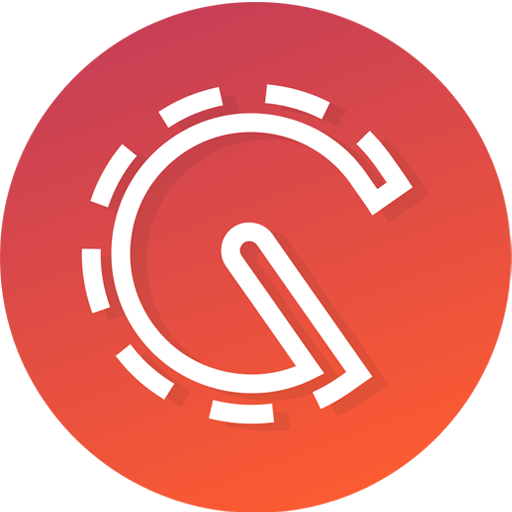
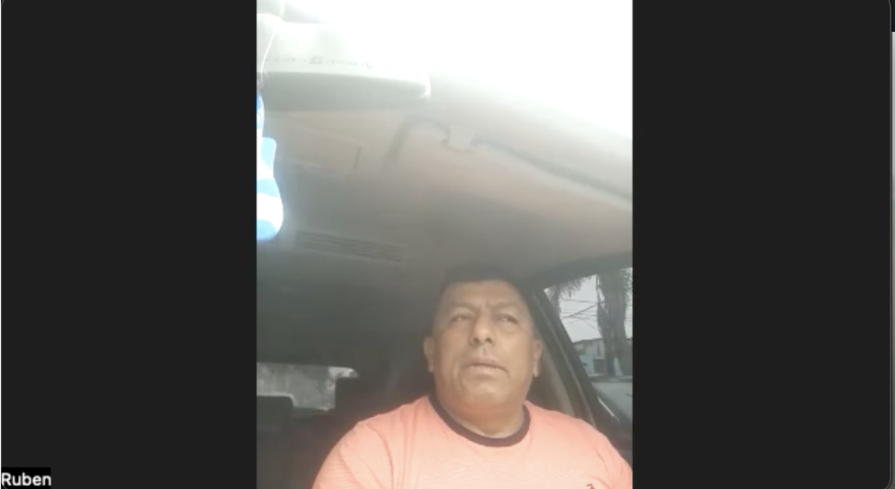

<h1 style="text-align: center;"> Informe del Trabajo Final </h1>
<h3 style="text-align: center;"> Universidad Peruana de Ciencias Aplicadas </h3>

<h5 style="text-align: center"> Ingeniería de Software </h5>

<h5 style="text-align: center"> Desarrollo de Aplicaciones Open Source - SW57 </h5>

<h5 style="text-align: center"> Docente: Angel Augusto Velasquez Nuñez </h5>

<h5 style="text-align: center"> Startup: DynoWare </h5>

<h5 style="text-align: center"> Producto: Greenhouse </h5>

## Team members:

|              Nombre              |   Código   |
| :------------------------------: | :--------: |
| Boronda Heidinger, Astrid Jimena | U202215823 |
|    Cortez Flores, Ely Rivaldo    | U202215313 |
| Ramos Argüelles, Alexandra Belen | U202215164 |
|    Silva Morales, Renzo Cesar    | U20221c362 |
| Quiroz Zambrano, Fabrizio Javier | U202213406 |

<h5 style="text-align: center"> Ciclo 2024-02 </h5>

## Registro de versiones del informe

| Versión |   Fecha    |                 Autor                 | Descripción de modificación                                                                                                                                     |
| :-----: | :--------: | :-----------------------------------: | --------------------------------------------------------------------------------------------------------------------------------------------------------------- |
|   1.0   | 15/08/2024 | Boronda, Cortez, Ramos, Silva, Quiroz | Creación del documento de trabajo en formato markdown                                                                                                           |
|   1.1   | 20/08/2024 | Boronda, Cortez, Ramos, Silva, Quiroz | Redacción del startup profile y solution profile, delimitación de segmentos objetivo, redacción de preguntas para el diseño de entrevistas                      |
|   1.2   | 23/08/2024 | Boronda, Cortez, Ramos, Silva, Quiroz | Elaboración y registro de entrevistas a segmentos objetivo, análisis de entrevistas                                                                             |
|   1.3   | 25/08/2024 | Boronda, Cortez, Ramos, Silva, Quiroz | Elaboración de user personas, impact mapping, as-is y to-be                                                                                                     |
|   1.4   | 26/08/2024 | Boronda, Cortez, Ramos, Silva, Quiroz | Elaboración de user stories, product backlog                                                                                                                    |
|   1.5   | 28/08/2024 | Boronda, Cortez, Ramos, Silva, Quiroz | Elaboración de prototipos de wireframes y mockups                                                                                                               |
|   1.6   | 31/08/2024 | Boronda, Cortez, Ramos, Silva, Quiroz | Redacción de style guidelines e information architecture                                                                                                        |
|   1.7   | 03/09/2024 | Boronda, Cortez, Ramos, Silva, Quiroz | Elaboración de diagrama de base de datos, diagrama de clases, diccionario de clases, diagramas de contenedores, diagramas de contexto, diagramas de componentes |
|   1.8   | 03/09/2024 | Boronda, Cortez, Ramos, Silva, Quiroz | Registro de evidencias del Sprint 1                                                                                                                             |
|   1.9   | 04/09/2024 | Boronda, Cortez, Ramos, Silva, Quiroz | Rediseño de mockups. Elaboración de wireflows y user-flows                                                                                                      |
|  1.10   | 07/09/2024 | Boronda, Cortez, Ramos, Silva, Quiroz | Redacción de software configuration management y conclusiones                                                                                                   |
|   2.1   | 22/09/2024 |                Nombre                 | Redacción de Collaboration Insights                                                                                                                             |

## Project Report Collaboration Insights

URL del repositorio para el reporte del proyecto: https://github.com/upc-pre-202402-si729-sw57-dynoware/CargoSafe-report

**TB1**

Para el desarrollo del informe perteneciente a la entrega TB1, se dividió la implementación de secciones de la siguiente forma para cada integrante del equipo:

| Integrante      | Tareas Asignadas                                                                                                                                                                                                                    |
| --------------- | ----------------------------------------------------------------------------------------------------------------------------------------------------------------------------------------------------------------------------------- |
| Ely Cortez      | Diseño de entrevistas. Diagrama de clases. Diagrama de contexto, componentes y contenedores. User Personas. Information Architecture. User Stories. Diagrama de base de datos.                                                      |
| Fabrizio Quiroz | Diseño de mockups y wireframes. Descripción de user flows. Capítulo V, Software Development Environment Configuration, Source Code Management, Style Guide & Conventions. User Stories. Product Backlog                             |
| Nombre1         | Impact Mapping, registro y análisis de entrevistas. User Task Matrix. As-Is To-be Scenarios. Empathy Mapping. Technical User Stories. User Stories. Product Backlog. Bibliografía.                                                  |
| Nombre1         | Antecedentes y problemática 5W y 2H. Lean UX Process, Problem Statement, Assumptions e Hypothesis statements. Lean UX Canvas. Segmentos Objetivos. Análisis de competidores. Diseño de entrevistas. Conclusiones y recomendaciones. |
| Nombre1         | General Style Guidelines. Landing Page, Services & Applications implementation. Software Deployment Configuration.                                                                                                                  |

El proceso de colaboración en el informe se realizó mediante commits constantes al repositorio de la organización DynoWare.

**Github Collaboration Insights**

Github también presenta un timeline de las ramas principales y los procesos de merge a los que se han sometido. Todas las ramas se crearon tomando en cuenta el diseño de GitFlow para una buena organización cuando se usa un software de control de versiones.

Los integrantes son:

- Astrid Boronda (AstridBH)
- Alexandra Ramos (AleRamosA)
- Ely Cortez (rivacortez)
- Fabrizio Quiroz (Relycloud)
- Renzo Silva (rrenzosilva)

Se explican las ramas más prominentes:

**main**: Es representada por el color negro. Se trata de la rama principal del proyecto y se actualiza para cada entregable.
**develop**: Es representada por el color azul. Se trata de la rama principal para el proceso del desarrollo del proyecto.
**feature-product-design**: Es representado por el color verde. Incluye el contenido de user flows y wireframes.
**feature-sprint1**: Es representada por el color amarillo. Esta rama incluye los artefactos relacionados al sprint 1 en el informe.

Los siguientes gráficos representan analíticos de commits en el repositorio del informe. En los gráficos se incluye la cantidad de lineas de texto añadidas por cada integrante del equipo.

**TB1**

El siguiente gráfico incluye la cantidad de commits realizados en la semana con más actividad durante el desarrollo del informe.

**TB1**

## Student Outcomes

| Criterio especifico                                                                                                                                                                  | Acciones realizadas                                                                                                                                                                                                                                                                                                                                                                                                                                                                                                                                                                                                                                                                                                                                                                                                                                                                                                                                                                                                                                                                                                                                                                                                                                                                                                                                                                                                                                                                                                                                                                                                                                                                                                                                                    | Conclusiones                                                                                                                                                                                                                                                                                                                                                                                                                                                                                                                                                                                                                                                                                                                                                                                                                                                                                                                                                                                                                                                                                                                                                                                                                                                                                                                                                                                                                                                                                                                                                                                                            |
| ------------------------------------------------------------------------------------------------------------------------------------------------------------------------------------ | :--------------------------------------------------------------------------------------------------------------------------------------------------------------------------------------------------------------------------------------------------------------------------------------------------------------------------------------------------------------------------------------------------------------------------------------------------------------------------------------------------------------------------------------------------------------------------------------------------------------------------------------------------------------------------------------------------------------------------------------------------------------------------------------------------------------------------------------------------------------------------------------------------------------------------------------------------------------------------------------------------------------------------------------------------------------------------------------------------------------------------------------------------------------------------------------------------------------------------------------------------------------------------------------------------------------------------------------------------------------------------------------------------------------------------------------------------------------------------------------------------------------------------------------------------------------------------------------------------------------------------------------------------------------------------------------------------------------------------------------------------------------------- | ----------------------------------------------------------------------------------------------------------------------------------------------------------------------------------------------------------------------------------------------------------------------------------------------------------------------------------------------------------------------------------------------------------------------------------------------------------------------------------------------------------------------------------------------------------------------------------------------------------------------------------------------------------------------------------------------------------------------------------------------------------------------------------------------------------------------------------------------------------------------------------------------------------------------------------------------------------------------------------------------------------------------------------------------------------------------------------------------------------------------------------------------------------------------------------------------------------------------------------------------------------------------------------------------------------------------------------------------------------------------------------------------------------------------------------------------------------------------------------------------------------------------------------------------------------------------------------------------------------------------- |
| Comunica en forma escrita ideas y/o resultados con objetividad a público de diferentes especialidades y niveles jerarquicos, en el marco del desarrollo de un proyecto en ingeniería | **Astrid Boronda**   TB1: En esta entrega se realizaron los diagramas C4, diagramas involucrados en el proceso de DDD o Domain Driven Design. Una característica de esta metodología es el uso del lenguaje ubicuo que permite a todos los stakeholders internos y externos del proyecto entender detalles técnicos a un alto nivel mediante la visualización de los diagramas.       **Ely Cortez**   TB1: Realizó la seccion de header en el landing page, además de su correspondiente codigo en javascript para cumplir funcionalidades. Adicionalmente se encargo de documentar los commits realizados por el equipo.         **Alexandra Ramos**   TB1: Para el trabajo se hizo uso de github para documentar el trabajo de modo que se aprendió a utilizar conventional commits y gitflow de modo que se pueda tener una correcta comunicación escrita en lo que corresponde a la documentación del proyecto, además de aprender a utiizar el lenguaje markdown para comunicarlo mediante github en un archivo README.md         **Renzo Silva**   TB1: En el informe se comunicaron las herramientas a utilizar, su utilidad y las convenciones típicas, esto con el objetivo de documentar el proceso de elaboración y de explicar a un público ajeno al entorno de desarrollo de software los pasos necesarios para diseñar a la aplicación.       **Fabrizio Quiroz**   TB1: Se llevó a cabo el proceso de entrevistas con los segmentos objetivos para realizar el proceso de _requirements elicitation_, se comunicó la propuesta de solución a los clientes esperados del proyecto y se dirigió el diseño de la solución a una opción que cumple con los requisitos solicitados.       | **Astrid Boronda**   TB1: Se llevó a cabo el proceso de entrevistas con los segmentos objetivos para realizar el proceso de _requirements elicitation_, se comunicó la propuesta de solución a los clientes esperados del proyecto y se dirigió el diseño de la solución a una opción que cumple con los requisitos solicitados.         **Ely Cortez**   TB1: Encargado de realizar la sección de sprint donde se incluye el sprint backlog y sprint planning. De la mismas forma trabajo en el figma diseñando la landing page y su versión responsive al igual que la versión responsive de la aplicación web.        **Alexandra Ramos**   TB1: A lo hora de realizar el trabajo se tuvo que mantener un constate contacto con nuestros segmento objetivo para poder delimitar correctamente nuestra solución, asímismo mantener una buena comunicación y organización mediante reuniones.         **Renzo Silva**   TB1: Para culminar la entrega de esta primera versión del trabajo final, resultó necesario realizar exposiciones grabadas dentro de las cuales se expresan los requisitos del proyecto, cómo estos fueron implementados y cuál fue el ciclo de vida del desarrollo del software a elaborar.       **Fabrizio Quiroz**   TB1: Para culminar la entrega de esta primera versión del trabajo final, resultó necesario realizar exposiciones grabadas dentro de las cuales se expresan los requisitos del proyecto, cómo estos fueron implementados y cuál fue el ciclo de vida del desarrollo del software a elaborar.       |

## Contenido

1. [**Capítulo I: Introducción.**](#1.)  
   1.1. [Startup Profile.](#1.1.)  
   1.1.1. [Descripción del startup.](#1.1.1.) 
   1.1.2.[Perfiles de los integrantes del equipo.](#1.1.2.) 
   1.2. [Solution Profile.](#1.2.) 
   1.2.1. [Antecedentes y Problemática.](#1.2.1.) 
   1.2.2. [Lean UX Process.](#1.2.2.) 
   1.2.3. [Lean UX Problem Statements.](#1.2.3.) 
   1.2.4. [Lean UX Assumptions.](#1.2.4.) 
   1.2.5. [Lean UX Hypothesis Statements.](#1.2.5.) 
   1.2.6. [Lean UX Canvas.](#1.2.5.) 
   1.3. [Segmentos objetivo.](#1.2.6.) 
2. [**Capítulo II: Requirements Elicitation & Analysis.**](#2.) 
   2.1. [Competidores.](#2.1.) 
   2.1.1. [Análisis competitivo.](#2.1.1.) 
   2.1.2. [Estrategias y tácticas frente a competidores.](#2.1.2.) 
   2.2. [Entrevistas.](#2.2.) 
   2.2.1. [Diseño de entrevistas.](#2.2.1.) 
   2.2.2. [Registro de entrevistas.](#2.2.2.) 
   2.2.3. [Análisis de entrevistas.](#2.2.3.) 
   2.3. [Needfinding.](#2.3.) 
   2.3.1. [User Personas.](#2.3.1.) 
   2.3.2. [User Task Matrix.](#2.3.2.) 
   2.3.3. [User Journey Mapping.](#2.3.3.) 
   2.3.4. [Empathy Mapping.](#2.3.4.) 
   2.3.5. [As-is Scenario Mapping.](#2.3.5.) 
3. [**Capítulo III: Requirements Specification.**](#3.) 
   4.1. [To-Be Scenario Mapping.](#3.1.) 
   4.2. [User Stories.](#3.2.) 
   4.3. [Impact Mapping.](#3.3.) 
   4.4. [Product Backlog.](#3.4.) 
4. [**Capítulo IV: Product Design.**](#4.) 
   4.1. [Style Guidelines.](#4.1.) 
   4.1.1. [General Style Guidelines.](#4.1.1.) 
   4.1.2. [Web Style Guidelines.](#4.1.2.) 
   4.2. [Information Architecture.](#4.2.) 
   4.2.1. [Organization Systems.](#4.2.1.) 
   4.2.2. [Labeling Systems.](#4.2.2.) 
   4.2.3. [SEO Tags and Meta Tags](#4.2.3.) 
   4.2.4. [Searching Systems.](#4.2.4.) 
   4.2.5. [Navigation Systems.](#4.2.5.) 
   4.3. [Landing Page UI Design.](#4.3.) 
   4.3.1. [Landing Page Wireframe.](#4.3.1.) 
   4.3.2. [Landing Page Mock-up.](#4.3.2.) 
   4.4. [Web Applications UX/UI Design.](#4.4.) 
   4.4.1. [Web Applications Wireframes.](#4.4.1.) 
   4.4.2. [Web Applications Wireflow Diagrams.](#4.4.2.) 
   4.4.3. [Web Applications Mock-ups.](#4.4.3.) 
   4.4.4. [Web Applications User Flow Diagrams.](#4.4.4.) 
   4.5. [Web Applications Prototyping.](#4.5.) 
   4.6. [Domain-Driven Software Architecture.](#4.6.) 
   4.6.1. [Software Architecture Context Diagram.](#4.6.1.) 
   4.6.2. [Software Architecture Container Diagrams.](#4.6.2.) 
   4.6.3. [Software Architecture Components Diagrams.](#4.6.3.) 
   4.7. [Software Object-Oriented Design.](#4.7.) 
   4.7.1. [Class Diagrams.](#4.7.1.) 
   4.7.2. [Class Dictionary.](#4.7.2.) 
   4.8. [Database Design.](#4.8.) 
   4.8.1. [Database Diagram.](#4.8.1.) 
5. [**Capítulo V: Product Implementation, Validation & Deployment.**](#5.) 
   5.1. [Software Configuration Management.](#5.1.) 
   5.1.1. [Software Development Environment Configuration.](#5.1.1.) 
   5.1.2. [Source Code Management.](#5.1.2.) 
   5.1.3. [Source Code Style Guide & Conventions.](#5.1.3.) 
   5.1.4. [Software Deployment Configuration.](#5.1.4.) 
   5.2. [Landing Page, Services & Applications Implementation.](#5.2.) 
   5.2.1. [Sprint 1.](#5.2.1.) 
   5.2.1.1. [Sprint Planning 1.](#5.2.1.1.) 
   5.2.1.2. [Sprint Backlog 1.](#5.2.1.2.) 
   5.2.1.3. [Development Evidence for Sprint Review.](#5.2.1.3.) 
   5.2.1.4. [Testing Suite Evidence for Sprint Review.](#5.2.1.4.) 
   5.2.1.5. [Execution Evidence for Sprint Review.](#5.2.1.5.) 
   5.2.1.6. [Services Documentation Evidence for Sprint Review.](#5.2.1.6.) 
   5.2.1.7. [Software Deployment Evidence for Sprint Review.](#5.2.1.7.) 
   5.2.1.8. [Team Collaboration Insights during Sprint.](#5.2.1.8.) 
6. [**Conclusiones.**](#6.) 
7. [**Bibliografía.**](#7.) 
8. [**Anexos.**](#8.) 

<h2> Capítulo II: Requirements Elicitation & Analysis.</h2>

<h3> 2.1. Competidores.</h3>

<h4> 2.1.1. Análisis competitivo.</h4>

El análisis competitivo es una herramienta esencial debido a su relevancia en la toma de decisiones estratégicas, la identificación de oportunidades y amenazas, y la creación de ventajas competitivas sostenibles en el mercado. Por tales motivos, ayuda a las empresas a mantenerse ágiles y a tomar decisiones informadas en un entorno empresarial de constante cambio. A continuación, se exhibe la incorporación de esta herramienta dentro del desarrollo del proyecto y la examinación de los competidores:

<html>
<head>
    <title>Tabla HTML</title>
    
</head>
<body>
    <table >
        <tr>
			<td colspan="6">Competitive Analysis Landscape</td>
		</tr>
		<tr>
			<td colspan="2" rowspan="2">¿Por qué llevar acabo este análisis?</td>
			<td colspan="4">¿Quiénes son nuestros principales competidores?</td>
		</tr>
		<tr>
			<td colspan="4">Gracias al análisis de la competencia perteneciente al mercado, se logra comprender el entorno competitivo en el que operará nuestro producto. Permite identificar a nuestros competidores y tener en cuenta todo lo que los caracteriza como empresa actualmente. De esa forma, buscar destacar para diferenciarnos de la mejor forma.</td>
		</tr>
		<tr>
			<td colspan="2" rowspan="2">Startup y competidores</td>
			<td> CargoSafe </td>
            <td> GoCargo </td>
            <td> Convoy </td>
            <td> Loadsmart </td>
		</tr>
        <tr>
			<td></td>
            <td></td> 
            <td></td>  
            <td></td> 
		</tr>
        <tr>
            <td rowspan="2">PERFIL</td>
            <td class="sub">Overview</td>
            <td>Plataforma que se encarga del análisis de la carga y seguimiento del proceso de transporte.</td>
            <td>Facilita a los usuarios la gestión del transporte de carga al permitir el fácil alcance de comunicación con generadores de carga interesados en el transporte de su mercancía.</td>
            <td>Ofrece servicios de transporte de carga que permite la optimización de rutas e incluso la reducción de costos para los usuarios.</td>
            <td>Se encarga de que la transportación sea más eficiente y menos complicada insertando tecnología a su servicio para la automatización de los procesos de transporte.</td>      
        </tr>
        <tr>
            <td class="sub">Ventaja competitiva ¿Qué valor ofrece a los clientes?</td>
            <td>Ofrece una solución centrada principalmente para ofrecer un servicio transparente y seguro, abordando la garantía y seguimiento del proceso de transporte de la carga, considerando el estado en el que llega para la satisfacción del cliente.</td>
            <td>Ofrece una solución efectiva para los transportes de cargas, lo que da un valor significativo a los clientes. Además, cuentan con tecnología, lo que significa que ofrece una experiencia de usuario moderna capaz de optimizar el proceso de selección de transporte y envío de carga.</td>
            <td>La aplicación se destaca por maximizar las ganancias al poner solicitudes de carga de mercancías directamente al alcance de los transportistas. Además, simplifica las operaciones al reducir los costos operativos, lo que resulta en un aumento significativo de los beneficios.</td>
            <td>Ofrece el mejor servicio de su clase respaldado a través de equipos dedicados con encontrar la combinación óptima de servicio, precio y calidad. Destacan por su cotización automática de los fletes, y además de contar con operadores más confiables y seguras.</td>      
        </tr>
        <tr>
            <td rowspan="2" class="sub">PERFIL DEL MARKETING</td>
            <td class="sub" >Mercado Objetivo</td>
            <td>Personas generadoras de carga que necesitan transportar su carga.</td>
            <td>Personas generadoras de carga que necesitan transportar su carga.</td>
            <td>Personas generadoras de carga que necesitan transportar su carga.</td>
            <td>Personas generadoras de carga que necesitan transportar su carga.</td>
        </tr>
        <tr>
            <td class="sub">Estrategias de Marketing</td>
            <td> Seguridad, marketing digital, transparencia, seguridad, confianza</td>
            <td>Marketing digital, confianza, disponibilidad.</td>
            <td>Tecnología incrustada en sus operaciones, mitigación de riesgos, visibilidad.</td>
            <td>Contratos confiables, marketing digital, herramientas digitales apoyadas en las soluciones logísticas.</td>
        </tr>
        <tr>
            <td rowspan="3" class="sub">PERFIL DEL PRODUCTO</td>
            <td class="sub">Productos & Servicios</td>
            <td>
                <ul>
                    <li>Plataforma que muestre un análisis de la carga</li>
                    <li>Seguimiento de la carga</li>
                    <li>Control(peso, temperatura, rutas)</li>
                </ul>
            </td>
            <td>
                <ul>
                    <li>Transporte especializado</li>
                    <li>Seguimiento y monitoreo en tiempo real</li>
                    <li>Reservas online y cotización</li>
                </ul>
            </td>
            <td>
                <ul>
                    <li>Plataforma para descubrimiento de carga</li>
                    <li>Automatización del proceso de reserva</li>
                    <li>Administración de documentos digitales</li>
                </ul>
            </td>
            <td> 
            <ul>
                    <li>Software de gestión de camiones</li>
                    <li>Tableros de carga</li>
                    <li>Servicios de flota privada</li>
                </ul>
            </td>
        </tr>
        <tr>
            <td class="sub">Precios & Costos</td>
            <td>Planes (Estándar a S/.150 al mes y Premium S/.650 al mes)</td>
            <td>Cobro de comisión por el uso de la plataforma.</td>
            <td>Gratuito, no hay cuotas de inscripción ni pagos mensuales.</td>
            <td>Plataforma en línea gratuita.</td>
        </tr>
        <tr>
            <td class="sub">Canales de distribución (web/móvil)</td>
            <td>Web y móvil</td>
            <td>Web y móvil</td>
            <td>Web y móvil</td>
            <td>Web y móvil</td>        
        </tr>
        <tr>
            <td rowspan="4" class="sub">ANÁLISIS SWOT</td>
            <td class="sub">Fortalezas</td>
            <td>Transparencia al proporcionar al cliente visibilidad de sus envíos en todo momento.</td>
            <td>Tiene una red de transportistas confiables, asegurando la seguridad de su servicio que ofrecen y la calidad de las entregas.</td>
            <td>Utiliza diversa tecnología, incluida inteligencia artificial para mejorar su eficiencia operativa.</td>
            <td>Precios dinámicos en tiempo real que pueden adecuarse a la demanda, dando al cliente una mejor perspectiva.</td>
        </tr>
        <tr>
            <td class="sub">Debilidades</td>
            <td>Fidelización de los clientes frente a la demás competencia que ofrecen servicios similares.</td>
            <td>El mantenimiento de la aplicación frente a los costos operativos resulta costoso para su margen de ganancias.</td>
            <td>Competencia con las diferentes plataformas digitales establecidas en el mercado que ofrecen servicios similares.</td>
            <td>La implementación y mantenimiento de nuevas tecnologías a largo plazo pueden resultar costosas.</td>  
        </tr>
        <tr>
            <td class="sub">Oportunidades</td>
            <td>Crecimiento enfocado en las empresas pequeñas para proporcionar soluciones accesibles.</td>
            <td>Formación de alianzas con otros proveedores o aliados estratégicos que fortalezcan la posición de la empresa.</td>
            <td>Expandir sus operaciones a nivel internacional permitiendo un mayor alcance de clientes.</td>
            <td>Adopción de la inteligencia artificial para mejorar los servicios como la optimización de rutas, siendo más eficiente.</td> 
        </tr>
        <tr>
            <td class="sub">Amenazas</td>
            <td>Dependencia de clientela que puede impactar significativamente en los ingresos de la empresa ante cualquier pérdida de los mismos.</td>
            <td>El poco alcance que tienen en redes sociales resultaría contraproducente frente a su competencia.</td>
            <td>Innovaciones tecnológicas que significaron cambios drásticos en el panorama de la aplicación.</td>
            <td>La escasez de conductores está siendo un obstáculo significativo para incumplir la demanda de transportes, y por ende, la demanda del mismo servicio.</td>          
        </tr>
    </table>
</body>
</html>

<h4> 2.1.2. Estrategias y tácticas frente a competidores.</h4>

En base al análisis competitivo efectuado anticipadamente, se logró identificar con exactitud las fortalezas, oportunidades, debilidades y amenazas destacadas de los competidores. Dicha información resulta ser clave para trazar estrategias y tácticas de superación hacia la competencia, cuando el servicio entre al mercado (lanzamiento rentable). A continuación, se brindará una serie de estrategias y tácticas trazadas para alcanzar esta meta:

- **Atención al cliente directa:** Consideramos importante responder las preguntas que los usuarios puedan tener de la aplicación, siendo que usaremos chatbots para ello, además de contar con un servicio de llamadas para consultas personalizadas.

- **Valor agregado para los servicios:** La aplicación al tener servicios similares a los de su competencia, tendremos en cuenta ello para modificar y mejorar ciertos aspectos tanto de intuitividad como de procesamiento para facilitar su uso a los usuarios.

- **Mejoras constantes:** Estaremos abiertos a escuchar las sugerencias que puedan mejorar la aplicación y priorizar el desarrollo de los servicios que puedan satisfacer las necesidades del cliente.

- **Interfaz intuitiva:** Ofrecer una construcción de interfaz fácil de entender para nuestros segmentos objetivos, comprendiendo el funcionamiento de la plataforma y acceder a las funciones sin problema.

- **Procesos simples:** Simplificar los procesos que ofrecemos con tal que no sea muy complicado de realizar.

<h3> 2.2. Entrevistas.</h3>

La sección abarca el proceso de investigación de nuestros segmentos objetivos mediante la recolección de información en base a entrevistas.

<h4>2.2.1. Diseño de entrevistas</h4>

Las entrevistas nos permitirán conocer más sobre nuestros segmentos objetivos, además de obtener información relevante para nuestra aplicación:

**1. Preguntas iniciales:**

- ¿Cómo te llamas?
- ¿Qué edad tienes?
- ¿Dónde vives?
- ¿Cuál es tu profesión?

**2. Preguntas secundarias:**
**Segmento objetivo: Transportistas**

- ¿Qué problemas encuentras con mayor frecuencia en la gestión de tus cargas?
- ¿Cuáles son las dificultades que atraviesan al aceptar solicitudes de carga?
- ¿Qué información necesitas saber sobre un cliente para aceptar un trabajo de transporte?
- ¿Cómo miden y monitorean la satisfacción del cliente durante el proceso de envío cuando el cliente está utilizando su servicio de transporte?
- ¿Consideras que es importante conocer las condiciones en las que se encuentra la carga antes de realizar un transporte? ¿Por qué?
- ¿Qué es lo que te gustaría de una plataforma que pueda organizar tus transportes?
- ¿Cómo asegurar la seguridad de la carga durante el transporte?
- ¿Qué desafíos enfrenta durante el transporte de carga y cuál es su impacto en la entrega?
- ¿Qué tan importante es para ti la facilidad de uso de una aplicación?
- ¿Qué aspectos podrías recomendar?
- ¿Cómo gestionan la comunicación con los conductores y otros miembros del equipo durante el transporte?

**Segmento objetivo: Empresarios**

- ¿Qué tan difícil te resulta encontrar algún transportista que pueda transportar tu carga?
- ¿Qué factores se deberían tomar en cuenta para evaluar la confiabilidad de un transportista?
- ¿Qué aspectos de seguridad te preocupan al contratar servicios de transporte?
- ¿Cómo gestionas y verificas actualmente la llegada de tus pedidos al utilizar un servicio de transporte o carga?
- ¿Cuáles han sido los principales inconvenientes que ha enfrentado en su experiencia como usuario de un servicio de transporte?
- ¿Considera que el seguimiento de su pedido en tiempo real a través de una aplicación móvil permitirá gestionar el tiempo de llegada y mejorar la transparencia del proceso?
- ¿Consideraría óptimo que se calcule el peso de la carga antes y después del envío, especialmente para asegurar la transparencia y garantizar que todo llegue en las mismas condiciones en que fue enviado?
- Según su experiencia como usuario de servicios de transporte, ¿qué funcionalidades le gustaría que incluyera la aplicación?
- ¿Utilizará alguna aplicación que contenga esta funcionalidad principalmente?

<h4>2.2.2. Registro de entrevistas</h4>

**Segmento objetivo: Transportistas**

**Entrevista 1:**
**Entrevistado:**

- **Datos del entrevistado**  
  **Nombres:** Ruben Alcides 
  **Apellidos:** Roman Varga  
  **Edad:** 49 años  
  **Profesión:** Transportista y mayorista  
- **Acerca de la entrevista:**

**Duración:** 4:51 minutos 
**Inicio de de la entrevista:** 01:00  
**Link:** [https://upcedupe-my.sharepoint.com/:v:/g/personal/u202215823_upc_edu_pe/EYs3EV4Xaf1KoFMRKegrgJQBJsRr1I4zWq_1GgTBj6SjHg?nav=eyJyZWZlcnJhbEluZm8iOnsicmVmZXJyYWxBcHAiOiJPbmVEcml2ZUZvckJ1c2luZXNzIiwicmVmZXJyYWxBcHBQbGF0Zm9ybSI6IldlYiIsInJlZmVycmFsTW9kZSI6InZpZXciLCJyZWZlcnJhbFZpZXciOiJNeUZpbGVzTGlua0NvcHkifX0&e=twMEtL](https://upcedupe-my.sharepoint.com/:v:/g/personal/u202215823_upc_edu_pe/EYs3EV4Xaf1KoFMRKegrgJQBJsRr1I4zWq_1GgTBj6SjHg?nav=eyJyZWZlcnJhbEluZm8iOnsicmVmZXJyYWxBcHAiOiJPbmVEcml2ZUZvckJ1c2luZXNzIiwicmVmZXJyYWxBcHBQbGF0Zm9ybSI6IldlYiIsInJlZmVycmFsTW9kZSI6InZpZXciLCJyZWZlcnJhbFZpZXciOiJNeUZpbGVzTGlua0NvcHkifX0&e=twMEtL) 
**Resumen de la entrevista:**

Ruben menciona un problema que últimamente lo aqueja, se trata de la poca demanda de carga, que a diferencia de algunos años se ofrecía el transporte de carga de toneladas era más seguido. Menciona que algunos problemas con solicitudes de carga se deben a la falta de información sobre recojo, pesaje y tamaño de la mercadería que dificulta al transporte. Considera importante saber el tipo de carga  porque así se adecua el camión para su transporte seguro. Ruben dice que para impartir confianza con el cliente, se mantiene en comunicación para avisar al inicio y pocas horas de llegada de la mercadería. Considera que se debe garantizar el buen estado de la carga al entregarla en igualdad de condiciones. Para él, las plataformas son complicadas, y considera que comparte este pensamiento con otros transportistas, aun así reconoce que una aplicación que ayude con el pesaje, el pago, calcule la ruta son opciones interesantes para que lo puedan ayudar siendo ese caso que mencione que lo mejor sería si las plataforma fuera simple y son tantos procesos a realizar. Según dice, una implementación que se estuvo haciendo hace poco a los camiones fue agregar un gps adicional para el monitoreo del punto de trayectoria hacia el destino, esto porque pueden ocurrir varias situaciones, entre accidentes, fallos del camión, factor climatológico e incluso que el transportista se enferme, que desafían el transporte de carga, y por ende, pueda retrasarse. Recomiendo aplicaciones como Waze o Atu Sit para el transporte, recomendando algunas funciones de estas apps.

**Entrevista 2:**
**Entrevistado:**

- **Datos del entrevistado**  
  **Nombres:** Ruben Dario  
  **Apellidos:** Boronda Meza  
  **Edad:** 52  
  **Profesión:** Chofer  
- **Acerca de la entrevista:**

**Duración:** 4:53 minutos  
**Inicio de de la entrevista:** 0:15  
**Link:** [https://upcedupe-my.sharepoint.com/:v:/g/personal/u202215823_upc_edu_pe/EZ4hfPktnqRHoRzmLkBxtzIBmzkcTbxMN139kkbYTpCOuw?nav=eyJyZWZlcnJhbEluZm8iOnsicmVmZXJyYWxBcHAiOiJPbmVEcml2ZUZvckJ1c2luZXNzIiwicmVmZXJyYWxBcHBQbGF0Zm9ybSI6IldlYiIsInJlZmVycmFsTW9kZSI6InZpZXciLCJyZWZlcnJhbFZpZXciOiJNeUZpbGVzTGlua0NvcHkifX0&e=NObti8](https://upcedupe-my.sharepoint.com/:v:/g/personal/u202215823_upc_edu_pe/EZ4hfPktnqRHoRzmLkBxtzIBmzkcTbxMN139kkbYTpCOuw?nav=eyJyZWZlcnJhbEluZm8iOnsicmVmZXJyYWxBcHAiOiJPbmVEcml2ZUZvckJ1c2luZXNzIiwicmVmZXJyYWxBcHBQbGF0Zm9ybSI6IldlYiIsInJlZmVycmFsTW9kZSI6InZpZXciLCJyZWZlcnJhbFZpZXciOiJNeUZpbGVzTGlua0NvcHkifX0&e=NObti8)  
**Resumen de la entrevista:**

Durante la entrevista, el señor Boronda dijo que existen problemas frecuentes con la vía que toma, la carretera central, ya que suele estar saturada por el tránsito de varios vehículos. Menciona que para saber si aceptar un trabajo de carga lo primero que hace es verificar en la Sunat y Sunarp si los documentos de la persona están en regla, permitiendo tener confianza y saber si se tratara de un buen cliente. Afirma que no tuvo problemas con sus cliente, esto porque, en lo posible, hace bien su trabajo al entregar la carga en su debido tiempo. Menciona que es importante saber el tipo de carga a transportar porque si es perecible, es importante verificar sus condiciones antes de la carga, e incluso tener mucho cuidado con el tema de la temperatura, siendo esta carga con la que más cuidado tiene a diferencia de otro como fierro o cemento. Le gustaría una plataforma que pueda verificar principalmente su viaje con un GPS frente a posibles asaltos que ocurren en la carretera porque nadie sabe su ubicación una vez sale de Lima. Se cierra un poco a la idea de usar una aplicación pero que si seria utiliza para la organización de sus transportes.

**Entrevista 3:**
**Entrevistado:**

- **Datos del entrevistado**  
  **Nombres:** Félix  
  **Apellidos:** Inga Chiroque  
  **Edad:** 50 años  
  **Profesión:** Transportista  
- **Acerca de la entrevista:**

**Duración:** 04:20 minutos 
**Inicio de de la entrevista:** 00:01  
**Link:** [https://drive.google.com/file/d/18IPGicIZu4bbr0URBhD8VZdW5XIMbkoM/view](https://drive.google.com/file/d/18IPGicIZu4bbr0URBhD8VZdW5XIMbkoM/view) 

**Resumen de la entrevista:**

En la entrevista, el señor Félix Inga menciona que los problemas más frecuentes que tiene con mayor frecuencia son debido al tráfico vehicular, dando énfasis en la congestión vehicular en la ciudad. También menciona que suele tener problemas cuando el peso no es el exacto dado por el cliente. Además menciona que es importante conocer las condiciones de la carga, ya que esto permite definir el tipo de vehículo a usar y tomar decisiones sobre cualquier requisito especial que requiera el cargamento. Por otro lado, menciona que le gustaría que la plataforma ofrezca recomendaciones de rutas dependiendo del cargamento. Sobre la seguridad, nos cuenta que las medida que toma son de acuerdo al tipo de cargamento, pudiendo ser inflamable o frágil. Además, resalta que los derrumbes que suelen haber en las carreteras tienen un impacto negativo en la velocidad de la entrega del cargamento. Asimismo, menciona que la facilidad de uso de una aplicación debe ser primordial, ya que no se encuentra muy familiarizado con la tecnología.

**Segmento objetivo: Empresarios**

**Entrevista 1:**
**Entrevistado:**

- **Datos del entrevistado**  
  **Nombres:** Melany Milagros  
  **Apellidos:** Ramos Argüelles  
  **Edad:** 27 años 
  **Profesión:** Ingeniera de Software y empresaria independiente  
- **Acerca de la entrevista:**

**Duración:** 5:00 minutos  
**Inicio de de la entrevista:** 0:01  
**Link:** [https://upcedupe-my.sharepoint.com/personal/u202215164_upc_edu_pe/\_layouts/15/stream.aspx?id=%2Fpersonal%2Fu202215164%5Fupc%5Fedu%5Fpe%2FDocuments%2FEntrevista%20segmento%20objetivo%20empresarios%2Emp4&referrer=StreamWebApp%2EWeb&referrerScenario=AddressBarCopied%2Eview%2E90b5d2bd%2D2500%2D4ff1%2D863b%2D372292f050fd](https://upcedupe-my.sharepoint.com/personal/u202215164_upc_edu_pe/_layouts/15/stream.aspx?id=%2Fpersonal%2Fu202215164%5Fupc%5Fedu%5Fpe%2FDocuments%2FEntrevista%20segmento%20objetivo%20empresarios%2Emp4&referrer=StreamWebApp%2EWeb&referrerScenario=AddressBarCopied%2Eview%2E90b5d2bd%2D2500%2D4ff1%2D863b%2D372292f050fd) 

**Resumen de la entrevista:**

Durante la entrevista conocimos a Melany Ramos. Ella tiene un negocio de postres y entrega de catering por delivery. Nos comenta que cuenta con personas conocidas que le brindan la ayuda para transportar sus productos. Sin embargo, no siempre puede recurrir a sus servicios por la falta de disponibilidad, lo que desencadena una preocupación y carga laboral. Los aspectos que ella toma en cuenta al contratar un servicio de transporte es que los transportistas sean recomendados por conocidos y, de tratarse de una aplicación prefiere ver un filtro previo de multas, registro penal o recomendaciones como puntuación por el servicio. La señorita Ramos nos comenta que dentro de los principales problemas que ha tenido con transportes es que no llegan completos o en algunos casos llegan en mal estado. Lo que se espera de un servicio de transporte es que los productos que están siendo enviados lleguen correctamente al cliente que realizó el pedido y, al hacer un pedido de insumos, que estos lleguen en estado óptimo para su uso. 
Por último, nos contó al respecto de experiencias con otras aplicaciones de transporte como inDrive con la que tuvo algunos inconvenientes. Por ello, necesita un servicio confiable y seguro que garantice la entrega y envíos de sus pedidos.

  

**Entrevista 2:**
**Entrevistado:**

- **Datos del entrevistado**
  **Nombres:** Rubi Jael  
  **Apellidos:** Pinta Alves  
  **Edad:** 28 años 
  **Profesión:** Comerciante mayorista de prendas  
- **Acerca de la entrevista:**

**Duración:** 4:51 minutos  
**Inicio de de la entrevista:** 0:01  
**Link:** [https://drive.google.com/file/d/1dUL3xqWL-pjfEYeyQV1UhdcdHCnLFiUv/view](https://drive.google.com/file/d/1dUL3xqWL-pjfEYeyQV1UhdcdHCnLFiUv/view)  
**Resumen de la entrevista:**

Acerca de la entrevista: Jael Pinta se dedica a la venta mayorista de prendas al interior del país. Ella menciona que su principal preocupación es la seguridad de sus envíos, ya que, en algunas ocasiones, los pedidos no llegan completos o en las condiciones en que fueron enviados. Esto le  genera desconfianza sobre algunas empresas transportistas. Además, agrega que la comunicación prolongada suele realizarse por medios clásicos, lo cual resulta tedioso y provoca pérdida de tiempo al gestionar y controlar el trayecto de los envíos. También señala que algunos transportistas mezclan todos los productos enviados, lo que ocasiona inconvenientes en el manejo adecuado de las prendas.

\*Entrevista 3:\*\*
**Entrevistado:**

- **Datos del entrevistado**
  **Nombres:** Martin Glicerio  
  **Apellidos:** Quiroz Villanueva  
  **Edad:** 44 años 
  **Profesión:** Empresario de construcción obras  
- **Acerca de la entrevista:**

**Duración:** 4:51 minutos  
**Inicio de de la entrevista:** 0:01  
**Link:** [https://drive.google.com/file/d/19fzmZ-l5aFzgck_1V5gZJwtUqmaTHwn6/view](https://drive.google.com/file/d/19fzmZ-l5aFzgck_1V5gZJwtUqmaTHwn6/view)  
**Resumen de la entrevista:**

Martin se dedica a las construcciones de obras, menciona que para él es muy importante el transporte de los materiales como los ladrillos para las obras ya que estos suelen llegar rotos o no en la cantidad esperada. Esto le genera estrés y pérdida de tiempo al gestionar las obras.

<h4>2.2.3. Análisis de entrevistas</h4>

**Segmento Objetivo: Transportistas**
**Características del segmento:**

- Personas de 30 a 55 años tanto mujeres como hombres.
- Su ocupación principal es de transportistas.
- Tienen conocimientos básicos en el uso de aplicaciones web.
- Personas que se sientan dispuestas al uso de un servicio que pueda ayudarlo con el transporte de carga.
- Mencionan problemas como el tipo de carga debido a que sus camiones pueden no ser los adecuados para transportarlos.
- Quieren comunicarse con clientes conociendo información básica que les brinde confianza y seguridad antes de aceptar el servicio.
- Saben que es necesario conocer sobre la carga que van a transportar para saber cómo tratarlas antes y durante el transporte.
- Problemas como derrumbes, accidentes y el clima como factores que pueden retrasar el transporte de mercadería
- Consideran importante el uso del GPS para un mejor monitoreo del viaje.
- Consideran el uso de aplicaciones que ayuden en su transporte, pero no los usan por completo por sentir que son complicados de usar.

**Segmento Objetivo: Empresarios**
**Características del segmento:**

- Personas de 25 a 50 años tanto mujeres como hombres
- No tiene alguna ocupación definida principalmente, pueden tener ocupaciones diferentes, como el caso de nuestros entrevistados que son un ingeniero de software, un ingeniero civil y un comerciante.
- Tienen conocimientos básicos en el empleo de aplicaciones web.
- Toman en cuenta las recomendaciones de sus cercanos para confiar en algunos transportistas.
- Consideran que el servicio de transporte entrega el producto en buenas condiciones y al tiempo que lo necesiten.
- Les agrada la idea del monitoreo de su mercadería porque les ayudaría a sentirse más seguros con su entrega y saber del tiempo que llegaría al destino.
- Creen importante brindar información detallada y relevante del remitente para un mejor conocimiento
- Estarían dispuestos a usar una aplicación que facilite el servicio de transporte de carga porque servirá mucho para la comunicación y su propia tranquilidad.

<h3>2.3. Needfinding</h3>

<h4>2.3.1. User Personas</h4>

**Segmento Objetivo: Transportistas**

Enlace: [https://upcedupe-my.sharepoint.com/:i:/g/personal/u202215823_upc_edu_pe/ERJ0mrauDQxOjD-in1SsGzIBKPfER3TcIbiVne3YBq8c_Q?e=kQMyyK](https://upcedupe-my.sharepoint.com/:i:/g/personal/u202215823_upc_edu_pe/ERJ0mrauDQxOjD-in1SsGzIBKPfER3TcIbiVne3YBq8c_Q?e=kQMyyK)

**Segmento Objetivo: Empresarios**

Enlace: [https://upcedupe-my.sharepoint.com/:i:/g/personal/u202215823_upc_edu_pe/EQcau_6MA8ZFvT_bmJlYWGIB8oKPGvZ3xmBlWlkTiBwlkw?e=s4qQez](https://upcedupe-my.sharepoint.com/:i:/g/personal/u202215823_upc_edu_pe/EQcau_6MA8ZFvT_bmJlYWGIB8oKPGvZ3xmBlWlkTiBwlkw?e=s4qQez)

<h4>2.3.2. User Task Matrix</h4>

**Segmento Objetivo: Transportistas**

<table>
	<tbody>
		<tr>
			<td colspan="2" rowspan="2"><b>User Task</b></td>
			<td colspan="2"><b>Transportistas</b></td>
		</tr>
		<tr>
			<td><b>Frecuencia</b></td>
			<td><b>Importancia</b></td>
		</tr>
		<tr>
			<td colspan="2">Asegurar la entrega puntual de la mercancía</td>
			<td>Siempre</td>
			<td>Alta</td>
		</tr>
		<tr>
			<td colspan="2">Buscar algún proveedor que necesite transporte de carga</td>
			<td>Siempre</td>
			<td>Alta</td>
		</tr>
		<tr>
			<td colspan="2">Seguimiento del estado y la ubicación de una carga</td>
			<td>Algunas veces</td>
			<td>Media</td>
		</tr>
		<tr>
			<td colspan="2">Garantizar la seguridad de la mercancía</td>
			<td>Siempre</td>
			<td>Alta</td>
		</tr>
		<tr>
			<td colspan="2">Monitorear y gestionar la eficiencia de los transportistas</td>
			<td>Algunas veces</td>
			<td>Media</td>
		</tr>
		<tr>
			<td colspan="2">Facilitar la comunicación con los clientes durante el contrato del servicio</td>
			<td>Siempre</td>
			<td>Medio</td>
		</tr>
		<tr>
			<td colspan="2">Realizar un análisis preventivo sobre la mercancía a transportar</td>
			<td>Siempre</td>
			<td>Alta</td>
		</tr>
	</tbody>
</table>

**Tareas destacadas:**

Asegurar la entrega puntual de la mercancía, buscar proveedores de transporte de carga, garantizar la seguridad de la mercancía y realizar un análisis preventivo sobre lo que se va a transportar son tareas críticas, y tienen una implicancia central en el diseño de la plataforma. Estas actividades son fundamentales para los transportistas, ya que impactan directamente en la eficiencia y seguridad de sus servicios. Según el análisis, las tareas de este segmento se centran en la búsqueda y gestión de la mercancía, por lo que es clave centralizar estas funciones en la plataforma. Ofrecer un enfoque integrado y diferente en estas áreas proporcionará un valor superior respecto a otras plataformas.

 

**Segmento Objetivo: Empresarios**

<table>
	<tbody>
		<tr>
			<td colspan="2" rowspan="2"><b>User Task</b></td>
			<td colspan="2"><b>Empresarios</b></td>
		</tr>
		<tr>
			<td><b>Frecuencia</b></td>
			<td><b>Importancia</b></td>
		</tr>
		<tr>
			<td colspan="2">Elegir un transportista adecuado</td>
			<td>Siempre</td>
			<td>Alta</td>
		</tr>
		<tr>
			<td colspan="2">Seguimiento del estado y la ubicación de una carga</td>
			<td>Siempre</td>
			<td>Alta</td>
		</tr>
		<tr>
			<td colspan="2">Coordinar la entrega de la mercancía</td>
			<td>Siempre</td>
			<td>Alta</td>
		</tr>
		<tr>
			<td colspan="2">Comunicación con el transportista ante algún problema que surja</td>
			<td>Algunas veces</td>
			<td>Media</td>
		</tr>
		<tr>
			<td colspan="2">Asegurar el cumplimiento de los tiempos de entrega</td>
			<td>Siempre</td>
			<td>Alta</td>
		</tr>
		<tr>
			<td colspan="2">Monitorear la calidad del servicio de transporte</td>
			<td>Siempre</td>
			<td>Media</td>
		</tr>
		<tr>
			<td colspan="2">Controlar los registros de gastos asociados a una entrega realizada</td>
			<td>Algunas veces</td>
			<td>Media</td>
		</tr>
	</tbody>
</table>

**Tareas destacadas:**

Elegir un transportista adecuado, realizar el seguimiento del estado y la ubicación de la carga, coordinar la entrega de la mercancía y asegurar el cumplimiento de los tiempos de entrega son tareas fundamentales para los empresarios. Estas acciones se centran en la selección precisa del transportista y la gestión eficiente de la información clave de la mercancía. Para mejorar la experiencia del usuario, es crucial diseñar una interfaz intuitiva y optimizada que facilite la realización de estas tareas. Esto no solo incrementará la satisfacción de los usuarios, sino que también contribuirá a una mayor retención y a generar recomendaciones del servicio.

<h4>2.3.3. User Journey Mapping</h4>

En esta parte, describimos el recorrido de los user personas al interactuar desde el inicio hasta la finalización de una tarea. Este proceso permite identificar los puntos clave de interacción, las emociones, desafíos y oportunidades de mejora en cada fase de la experiencia del usuario.

 

**User Journey Mapping: Transportista**

Enlace: [https://upcedupe-my.sharepoint.com/:i:/g/personal/u202215823_upc_edu_pe/ETKzfXU8jZtJtF3NlV91BvEByPc9DLx6CNSHTnQPhRrvwQ?e=85v1dF](https://upcedupe-my.sharepoint.com/:i:/g/personal/u202215823_upc_edu_pe/ETKzfXU8jZtJtF3NlV91BvEByPc9DLx6CNSHTnQPhRrvwQ?e=85v1dF)

**User Journey Mapping: Empresario**

Enlace: [https://upcedupe-my.sharepoint.com/:i:/g/personal/u202215823_upc_edu_pe/EeuLpjmq_mxKtCH3nWRP0RABDyVmjgSkVfqxig9lTmuOhA?e=sIrumH](https://upcedupe-my.sharepoint.com/:i:/g/personal/u202215823_upc_edu_pe/EeuLpjmq_mxKtCH3nWRP0RABDyVmjgSkVfqxig9lTmuOhA?e=sIrumH)

<h4>2.3.4. Empathy Mapping</h4>

Se presentarán los empathy mapping realizados según los user persona, esto permtirá las necesidades, pensamientos, sentimientos, motivaciones y deseos dentro de los 2 segmentos objetivos planteados en este proyecto. Nos ayudará a ofrecer una solución más efectiva que este relacionado con lo que el cliente quiere y necesita. 

 

**User Journey Mapping: Transportista**

Enlace: [https://upcedupe-my.sharepoint.com/:i:/g/personal/u202215823_upc_edu_pe/EXbEpNNm6bdHg9x-5yPG9kIBEKGzTB6Czk86Uw1B5MyX8g?e=g04Q6d](https://upcedupe-my.sharepoint.com/:i:/g/personal/u202215823_upc_edu_pe/EXbEpNNm6bdHg9x-5yPG9kIBEKGzTB6Czk86Uw1B5MyX8g?e=g04Q6d)

**User Journey Mapping: Empresario**

Enlace: [https://upcedupe-my.sharepoint.com/:i:/g/personal/u202215823_upc_edu_pe/ESkzoIurwdJMilx6Aus0GwsB73gUFta3oOg6wOPKZEXDEA?e=GN136E](https://upcedupe-my.sharepoint.com/:i:/g/personal/u202215823_upc_edu_pe/ESkzoIurwdJMilx6Aus0GwsB73gUFta3oOg6wOPKZEXDEA?e=GN136E)

<h4>2.3.5. As-is Scenario Mapping</h4>

**As-is scenario Mapping :** Transportista  
**Enlace:** [https://miro.com/app/board/uXjVKh0GjXQ=/?share_link_id=541240251838](https://miro.com/app/board/uXjVKh0GjXQ=/?share_link_id=541240251838) 
**Brainstorm:**

**Identify the highs and lows:**

**Positive Areas:**

- Utilizar plataformas de anuncios de contactos para encontrar cargas disponibles.
- Mantener contacto con el empresario para informar el progreso.
- Revisar los documentos de entrega y los firma para confirmar la recepción.

**Negative Areas**

- Preocupación por la seguridad de la mercancía en ruta.
- Frustración si hay demoras en la descarga o problemas con la mercancía.

**Blank Areas**

- Evaluar y compara diferentes ofertas existentes.
- ¿Cómo puedo evitar retrasos con el tiempo durante el camino?

**As-is scenario Mapping :** Empresario  
**Enlace:** [https://miro.com/app/board/uXjVKh0GjXQ=/?share_link_id=541240251838](https://miro.com/app/board/uXjVKh0GjXQ=/?share_link_id=541240251838)  
**Brainstorm:**

**Identify the highs and lows:**

**Positive Areas:**

- Consulta plataformas o agencias para encontrar el transporte adecuado.
- Monitorea el progreso del envío.
- Recibe informes del transportista sobre cualquier incidencia durante el transporte.

**Negative Areas**

- Preocupación por la posible reacción de sus clientes si hay retrasos.
- Estrés si hay algún daño o retraso en la entrega.

**Blank Areas**

- ¿Debería negociar mejores términos o buscar a otro proveedor?

<h3>2.4. Ubiquitous Language</h3>

- Shipper (Transportista): Persona perteneciente a una empresa que transporta mercancías desde el origen hasta el destino.
- Business Owner (Empresario): Cliente que necesita transportar su mercancía. Principalmente reserva el transporte, alista la carga y monitorea el proceso de envío.
- Shipment (Envío): La mercancía que necesita ser transportada.
- Load (carga): Asignación de la mercancía a un transportista en un viaje.
- Delivery (Entrega): El proceso de transferir la carga desde el origen hasta el destino.
- Trip (Viaje): El recorrido que realiza el transportista desde el lugar de recogida hasta el destino de entrega, posiblemente con varias paradas o rutas.
- Pick-up Location (Lugar de recogida): El lugar donde el transportista recoge la mercancía.
- Drop-off Location (Lugar de entrega): El destino final donde se entregan los bienes al destinatario.
- Reserve (Reservar envío): El proceso que sigue el remitente para crear una solicitud de envío, especificando detalles como los lugares de recogida y entrega, tipo de carga y plazo de entrega.
- Assign Transporter (Asignar transportista): La acción que toma el remitente para seleccionar a un transportista o carrier específico para manejar un envío.
- Dispatch (Despacho): El proceso de enviar a un transportista al lugar de recogida para recoger un envío.
- Payment (Pago): El flujo de fondos del remitente al transportista, generalmente después de que se completa una entrega.

* Cargo Volume (Volumen de carga): La cantidad de espacio que ocupa el envío, generalmente medida en metros cúbicos.
* Vehicle (Vehículo): El camión, furgoneta u otro medio de transporte utilizado por el transportista para llevar la carga.
* Cargo Type (Tipo de carga): La clasificación de los bienes que se están transportando, como carga perecibles, materiales peligrosos o artículos frágiles.
* Dashboard (Panel de control): La interfaz central donde tanto remitentes como transportistas pueden ver los envíos activos, rastrear la carga y gestionar sus tareas.
* Update Delivery Status (Actualizar estado de entrega): La capacidad para que los transportistas marquen un envío como "En tránsito", "Retrasado" o "Entregado".
